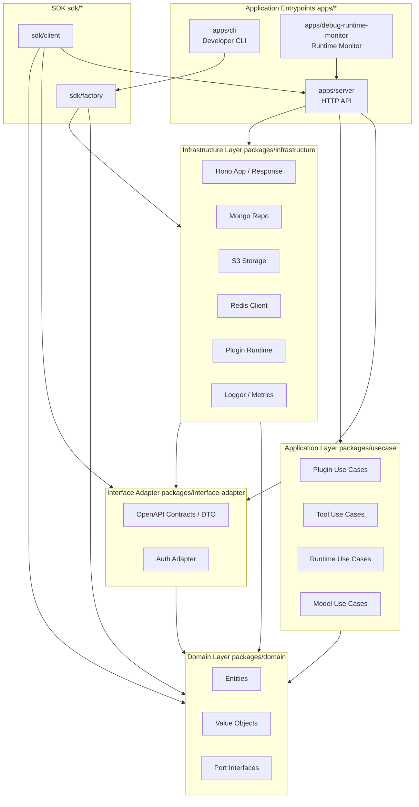
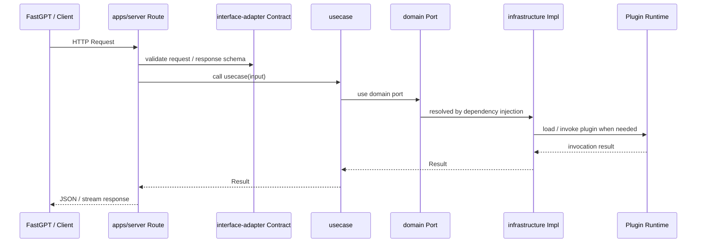

# Architecture

Language: [简体中文](./architecture.zh.md) | [English](./architecture.md)

This project is designed with Clean Architecture and DDD, or Domain-Driven Design, as references.

The overall architecture follows DIP, the Dependency Inversion Principle: the domain layer defines ports, outer modules provide implementations, and the composition root performs dependency injection.

The monorepo is organized with pnpm workspace.

## Directory Tree

```text
fastgpt-plugin/
├── apps/
│   ├── cli/                    # CLI for plugin development, build, packaging, and debugging
│   ├── server/                 # FastGPT Plugin HTTP service
│   └── debug-runtime-monitor/  # Local runtime monitoring and debugging panel
├── packages/
│   ├── domain/                 # Domain entities, value objects, and port definitions
│   ├── usecase/                # Application use cases that orchestrate domain objects and ports
│   ├── interface-adapter/      # HTTP contracts, DTOs, and auth adapters
│   ├── infrastructure/         # Hono, Mongo, S3, Redis, runtime, logging, metrics, and other implementations
│   └── shared/                 # Cross-layer pure utilities
├── sdk/
│   ├── client/                 # Client SDK for calling the FastGPT Plugin service
│   └── factory/                # Plugin author SDK for declaring plugins, tools, and runtime channels
├── test/                       # Cross-package test utilities and fixtures
├── docs/                       # Project documentation
├── scripts/                    # Project scripts
├── pnpm-workspace.yaml         # Workspace and catalog version declarations
├── tsconfig.json               # Global TypeScript config and path aliases
└── vitest.config.ts            # Global test config
```

## Layered Architecture



Core dependency direction:

- `domain` defines business concepts and ports. It is the innermost layer and does not depend on application entrypoints or infrastructure.
- `usecase` orchestrates business flows and depends on `domain` entities, value objects, and ports.
- `interface-adapter` defines HTTP contracts, DTOs, and auth inputs/outputs. It converts external protocols into structures the application can understand.
- `infrastructure` implements ports and runtime capabilities, including the HTTP framework, database, object storage, Redis, plugin runtime, logging, and metrics.
- `apps/*` are composition roots that assemble dependencies, register routes, start processes, or provide development commands.
- `sdk/*` is published for external users and currently reuses internal contracts, domain types, and part of the runtime channel implementation.

## Domain Layer

`packages/domain` stores stable business models:

- `entities/`: core entities such as plugins, tools, models, datasets, and workflows.
- `value-objects/`: immutable business values such as `Result`, errors, permissions, streaming responses, and i18n strings.
- `ports/`: port interfaces for repositories, file storage, URL file fetching, plugin runtime, tool invocation, and more.

Ports are defined in the domain layer, and concrete implementations live in `infrastructure`. Use cases depend only on ports, making it easy to replace Mongo, S3, runtime drivers, or external file-fetching policies.

## Application Layer

`packages/usecase` splits use cases by business capability:

- `plugin/`: plugin upload, install, confirm, delete, configuration read/write, version list, tag list, active plugin replacement, and more.
- `tool/`: tool list, tool detail, and tool execution.
- `model/`: model list and model providers.
- `runtime/`: runtime metrics snapshots.

Use cases usually follow `makeXxxUC(deps) => async (input) => Result<output>`. Dependencies are injected through parameters, input and output types are explicit, and errors are returned through the `Result` value object.

## Interface Adapter Layer

`packages/interface-adapter` owns external protocol boundaries:

- `contracts/route/`: HTTP API contracts organized by resource.
- `contracts/dto/`: request and response DTOs.
- `auth/`: auth token parsing and validation adapters.
- `http/`: HTTP-related base types.

Server routes register OpenAPI contracts from these definitions and call use cases inside handlers.

## Infrastructure Layer

`packages/infrastructure` provides replaceable technical implementations:

- `hono/`: Hono app, unified responses, error and 404 hooks, and middleware.
- `storage/mongo/`: Mongo connection and model definitions.
- `storage/s3/`: S3 client and object storage capabilities.
- `redis/`: Redis client.
- `file-storage/`, `file-ttl/`: local and remote file storage plus temporary-file cleanup.
- `plugin/`: plugin repository, `.pkg` parsing, invocation, runtime management, and drivers.
- `logger/`, `metrics/`: logging and OpenTelemetry metrics.
- `utils/secure/`: security utilities such as SSRF protection.

`apps/server/src/deps.ts` is part of the server composition root. It creates Mongo, S3, Redis, file storage, plugin repositories, runtime managers, and tool managers, then injects them into routes.

## Application Entrypoints

### Server

`apps/server/main.ts` starts the service:

1. Initialize logger and metrics.
2. Create route dependencies.
3. Register model, plugin, runtime, tool, and workflow routes.
4. Initialize proxy, database, runtime, and other infrastructure.
5. Listen on `env.PORT` with Hono Node Server.
6. Handle `SIGTERM` and `SIGINT`, closing the HTTP server, metrics, and logger.

### CLI

`apps/cli` targets plugin developers and provides create, check, build, pack, debug, and related commands. The CLI also contains plugin templates and Codex skills for generating plugin projects that follow the current package protocol.

### Debug Runtime Monitor

`apps/debug-runtime-monitor` is a Vite app for observing plugin runtime state and Connection Gateway metrics locally. It can read runtime service metrics from `apps/server` or gateway metrics from `apps/connection-gateway` and does not carry core business logic.

## SDK

- `sdk/client`: for FastGPT or other callers. It wraps FastGPT Plugin service requests, transport, and tool streaming responses.
- `sdk/factory`: for plugin authors. It provides plugin manifest, tool factory, invoke client, runtime channel, and related declaration capabilities.

SDK packages are published independently. The `apps/server` build first builds `sdk/factory` to ensure the types and artifacts required for loading plugins at runtime are available.

## Request Flow



For plugin installation:

1. `apps/server/src/routes/plugin.route.ts` receives the request and validates DTOs.
2. The route creates `makePluginInstallUC`.
3. The use case downloads the plugin package through `URLFileFetcherPort`.
4. The use case saves the temporary file through `LocalFileStoragePort`.
5. The use case parses the `.pkg` or plugin packages inside a zip through `PluginPKGFilePort`.
6. The use case writes plugin metadata and files through `PluginRepoPort`.
7. If the plugin type is tool, the use case registers it with `PluginRuntimeManagerPort`.

## Dependency Injection Conventions

When adding a business capability, prefer the existing pattern:

1. Define required ports in `domain/ports`.
2. Write business orchestration in `usecase` and depend on port types.
3. Implement ports in `infrastructure`.
4. Define HTTP DTOs and OpenAPI contracts in `interface-adapter/contracts`.
5. Register routes in `apps/server/src/routes` and call use cases.
6. Assemble concrete implementations in `apps/server/src/deps.ts`.

This keeps core business logic decoupled from frameworks, databases, and runtime drivers.

## Path Aliases

The root `tsconfig.json` defines the main path aliases:

```text
@domain/*              -> packages/domain/src/*
@usecase/*             -> packages/usecase/src/*
@shared/*              -> packages/shared/src/*
@interface-adapter/*   -> packages/interface-adapter/src/*
@infrastructure/*      -> packages/infrastructure/src/*
@fastgpt-plugin/cli/*  -> apps/cli/src/*
@fastgpt-plugin/sdk-*  -> sdk/*/src/*
```

Prefer these aliases in code to express layer boundaries and reduce deep relative paths.

## Test Strategy

Current tests are distributed near affected modules by risk:

- `*.spec.ts` / `*.test.ts`: close to tested code, covering use cases, CLI commands, builds, DTOs, response utilities, security utilities, URL fetchers, and more.
- `test/fixtures/`: cross-package fixtures for plugins, tools, tool suites, and related cases.
- Root `vitest.config.ts`: unified test entry.

Suggested tests for new capabilities:

- Use unit tests for domain value objects and pure functions.
- Use mock ports in usecase tests to verify business branches and error returns.
- Isolate external IO in infrastructure tests and cover serialization, error mapping, and security limits.
- Cover DTO validation, status codes, and response shapes in route tests.

## Extension Principles

- Keep `domain` and `usecase` independent from infrastructure details such as Hono, Mongo, S3, and Redis.
- When adding plugin types, update modeling in domain entities, package protocol parsing, runtime registration, and API contracts together.
- When adding runtime drivers, implement `PluginRuntimeManagerPort` and switch assembly in `deps.ts`.
- When adding storage backends, implement the corresponding file storage or repo port while keeping use cases unchanged.
- When changing public SDKs, CLIs, HTTP APIs, or the `.pkg` package protocol, consider backward compatibility and update the upgrade docs.
