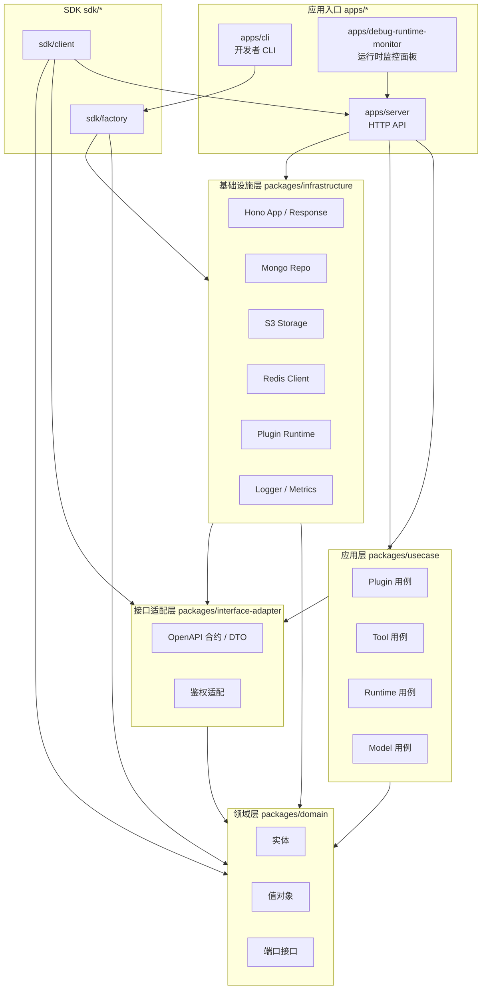
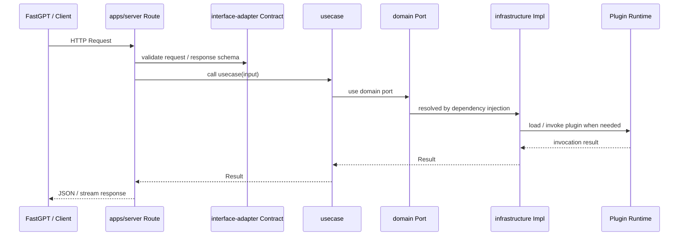

# 项目架构

语言：[简体中文](./architecture.zh.md) | [English](./architecture.md)

本项目架构参考 Clean Architecture （整洁架构）和 DDD（Domain-Driven Design, 领域驱动设计）进行设计。

项目整体遵循 DIP（Dependency Inversion Principle, 依赖反转原则）：领域层定义端口，外层模块提供实现，并通过组合根完成依赖注入。

使用 pnpm workspace 组织 monorepo。

## 目录树

```text
fastgpt-plugin/
├── apps/
│   ├── cli/                    # 插件开发、构建、打包、调试命令行
│   ├── server/                 # FastGPT Plugin HTTP 服务
│   └── debug-runtime-monitor/  # 本地运行时监控调试面板
├── packages/
│   ├── domain/                 # 领域实体、值对象、端口定义
│   ├── usecase/                # 应用用例，编排领域对象与端口
│   ├── interface-adapter/      # HTTP 合约、DTO、鉴权适配
│   ├── infrastructure/         # Hono、Mongo、S3、Redis、运行时、日志、指标等实现
│   └── shared/                 # 跨层复用的纯工具函数
├── sdk/
│   ├── client/                 # 调用 FastGPT Plugin 服务的客户端 SDK
│   └── factory/                # 插件作者侧 SDK，用于声明插件、工具和运行时通道
├── test/                       # 跨包测试工具与 fixtures
├── docs/                       # 项目文档
├── scripts/                    # 项目脚本
├── pnpm-workspace.yaml         # workspace 与 catalog 版本声明
├── tsconfig.json               # 全局 TypeScript 配置与路径别名
└── vitest.config.ts            # 全局测试配置
```

## 分层架构



核心依赖方向：

- `domain` 定义业务概念和端口，是最内层，不依赖应用入口和基础设施。
- `usecase` 负责编排业务流程，依赖 `domain` 的实体、值对象和端口。
- `interface-adapter` 定义 HTTP 合约、DTO、鉴权输入输出，负责把外部协议转换为应用可理解的数据结构。
- `infrastructure` 实现端口和运行环境能力，包括 HTTP 框架、数据库、对象存储、Redis、插件运行时、日志与指标。
- `apps/*` 是组合根，负责装配依赖、注册路由、启动进程或提供开发命令。
- `sdk/*` 面向外部使用者发布，目前会复用项目内的合约、领域类型和部分运行时通道实现。

## 领域层

`packages/domain` 保存稳定的业务模型：

- `entities/`：插件、工具、模型、数据集、工作流等核心实体。
- `value-objects/`：`Result`、错误、权限、流式响应、国际化字符串等不可变业务值。
- `ports/`：仓储、文件存储、URL 文件获取、插件运行时、工具调用等端口接口。

端口由领域层定义，具体实现放在 `infrastructure`。用例只依赖端口，便于替换 Mongo、S3、运行时驱动或外部文件获取策略。

## 应用层

`packages/usecase` 按业务能力拆分用例：

- `plugin/`：插件上传、安装、确认、删除、配置读写、版本列表、标签列表、替换激活插件等。
- `tool/`：工具列表、工具详情、工具运行。
- `model/`：模型列表、模型供应商。
- `runtime/`：运行时指标快照。

用例通常采用 `makeXxxUC(deps) => async (input) => Result<output>` 的形式。依赖通过参数注入，输入输出保持显式类型，错误通过 `Result` 值对象返回。

## 接口适配层

`packages/interface-adapter` 负责外部协议边界：

- `contracts/route/`：按资源组织 HTTP API 合约。
- `contracts/dto/`：请求和响应 DTO。
- `auth/`：鉴权 token 解析与校验适配。
- `http/`：HTTP 相关基础类型。

Server 路由基于这些合约注册 OpenAPI，并在 handler 内调用 usecase。

## 基础设施层

`packages/infrastructure` 提供可替换的技术实现：

- `hono/`：Hono 应用、统一响应、错误与 404 hook、中间件。
- `storage/mongo/`：Mongo 连接和模型定义。
- `storage/s3/`：S3 客户端与对象存储能力。
- `redis/`：Redis 客户端。
- `file-storage/`、`file-ttl/`：本地与远程文件存储、临时文件清理。
- `plugin/`：插件仓储、`.pkg` 解析、调用、运行时管理与驱动。
- `logger/`、`metrics/`：日志与 OpenTelemetry 指标。
- `utils/secure/`：SSRF 等安全工具。

`apps/server/src/deps.ts` 是服务端组合根的一部分，集中创建 Mongo、S3、Redis、文件存储、插件仓储、运行时管理器和工具管理器，并注入到路由。

## 应用入口

### Server

`apps/server/main.ts` 完成服务启动：

1. 初始化 logger 与 metrics。
2. 创建路由依赖。
3. 注册 model、plugin、runtime、tool、workflow 路由。
4. 初始化代理、数据库、运行时等基础设施。
5. 通过 Hono Node Server 监听 `env.PORT`。
6. 处理 `SIGTERM` 和 `SIGINT`，关闭 HTTP server、metrics 和 logger。

### CLI

`apps/cli` 面向插件开发者，提供创建、检查、构建、打包、调试等命令。CLI 也包含插件模板和 Codex skill，便于生成符合当前包协议的插件项目。

### Debug Runtime Monitor

`apps/debug-runtime-monitor` 是 Vite 应用，用于本地观察插件运行时状态和 Connection Gateway 指标。它可以读取 `apps/server` 的 runtime service metrics，也可以读取 `apps/connection-gateway` 的 gateway metrics，不承载核心业务逻辑。

## SDK

- `sdk/client`：面向 FastGPT 或其他调用方，封装 FastGPT Plugin 服务请求、传输层和工具流式响应。
- `sdk/factory`：面向插件作者，提供插件 manifest、tool factory、invoke client、runtime channel 等声明能力。

SDK 独立发布，`apps/server` 构建时会先构建 `sdk/factory`，确保运行时加载插件所需类型和产物可用。

## 请求流



以插件安装为例：

1. `apps/server/src/routes/plugin.route.ts` 接收请求并校验 DTO。
2. route 创建 `makePluginInstallUC`。
3. usecase 通过 `URLFileFetcherPort` 下载插件包。
4. usecase 通过 `LocalFileStoragePort` 保存临时文件。
5. usecase 通过 `PluginPKGFilePort` 解析 `.pkg` 或 zip 内的插件包。
6. usecase 通过 `PluginRepoPort` 写入插件信息与文件。
7. 如果插件类型是 tool，usecase 通过 `PluginRuntimeManagerPort` 注册运行时。

## 依赖注入约定

新增业务能力时优先遵循现有模式：

1. 在 `domain/ports` 定义需要的端口。
2. 在 `usecase` 编写业务编排，依赖端口类型。
3. 在 `infrastructure` 实现端口。
4. 在 `interface-adapter/contracts` 定义 HTTP DTO 和 OpenAPI 合约。
5. 在 `apps/server/src/routes` 注册路由并调用 usecase。
6. 在 `apps/server/src/deps.ts` 装配具体实现。

这样可以保持核心业务逻辑与框架、数据库、运行时驱动解耦。

## 路径别名

根 `tsconfig.json` 定义了主要路径别名：

```text
@domain/*              -> packages/domain/src/*
@usecase/*             -> packages/usecase/src/*
@shared/*              -> packages/shared/src/*
@interface-adapter/*   -> packages/interface-adapter/src/*
@infrastructure/*      -> packages/infrastructure/src/*
@fastgpt-plugin/cli/*  -> apps/cli/src/*
@fastgpt-plugin/sdk-*  -> sdk/*/src/*
```

代码中优先使用这些别名表达层级边界，减少跨目录相对路径。

## 测试策略

当前测试按风险分布在各模块附近：

- `*.spec.ts` / `*.test.ts`：靠近被测代码，覆盖 usecase、CLI 命令、构建、DTO、响应工具、安全工具、URL fetcher 等。
- `test/fixtures/`：提供插件、工具、tool suite 等跨包测试 fixtures。
- 根目录 `vitest.config.ts`：统一测试入口。

新增能力的测试建议：

- 领域值对象和纯函数使用单元测试。
- usecase 使用 mock port 验证业务分支和错误返回。
- infrastructure 涉及外部服务时优先隔离 IO，覆盖序列化、错误映射和安全限制。
- 路由层覆盖 DTO 校验、状态码和响应结构。

## 扩展原则

- 保持 `domain` 和 `usecase` 不依赖 Hono、Mongo、S3、Redis 等基础设施细节。
- 新增插件类型时，从领域实体、包协议解析、运行时注册和 API 合约四个位置同步建模。
- 新增运行时驱动时，实现 `PluginRuntimeManagerPort`，并在 `deps.ts` 中切换装配。
- 新增存储后端时，实现对应 file storage 或 repo port，保持 usecase 不变。
- 修改公开 SDK、CLI、HTTP API 或 `.pkg` 包协议时，需要考虑向后兼容和升级文档。
