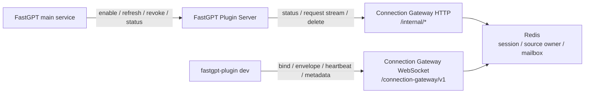
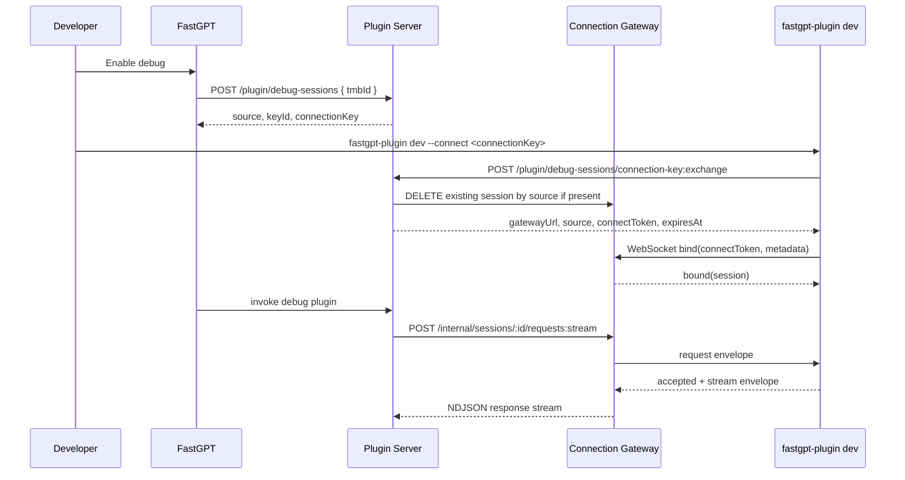

# Connection Gateway Design

Language: [简体中文](./connection-gateway-design.zh.md) | [English](./connection-gateway-design.md)

## Goal

Connection Gateway is the long-lived connection gateway for FastGPT-Plugin. The only implemented consumer today is plugin remote debugging: local `fastgpt-plugin dev` connects to Gateway through WebSocket, and FastGPT Plugin Server forwards plugin invocations to that connection through internal HTTP APIs.

Gateway owns connection lifecycle, session registration, request mailboxes, response streaming, owner leases, resource limits, and metrics. It does not authenticate FastGPT users, store plugin packages, store plugin configuration, or run production plugin workloads.

## Current Boundaries

- The only external long-lived connection protocol is WebSocket, with transport value `websocket`.
- HTTP APIs and WebSocket listener use separate ports: `CONNECTION_GATEWAY_PORT` for HTTP and `CONNECTION_GATEWAY_WS_PORT` for WebSocket upgrades.
- The WebSocket path is controlled by `CONNECTION_GATEWAY_WS_PATH`, defaulting to `/connection-gateway/v1`.
- Plugin Server calls Gateway internal HTTP APIs through `CONNECTION_GATEWAY_BASE_URL`.
- CLI connects to the exchange response `CONNECTION_GATEWAY_PUBLIC_URL`.
- `/internal/*` and `/metrics` require `CONNECTION_GATEWAY_AUTH_TOKEN` bearer auth.
- WebSocket bind uses a short-lived HMAC connect token. Gateway validates token claims and never sees the long-lived `connectionKey`.

## Components



## Core Model

### Connect Token

Plugin Server signs a short-lived connect token with `JWT_SECRET` in `POST /plugin/debug-sessions/connection-key:exchange`. Gateway validates the token during WebSocket bind:

- `transport` must be `websocket`.
- `capabilities` must include `gateway.bind`.
- `expiresAt` must be in the future.
- Signing uses `HmacConnectionGatewayToken`, with token header type `CGT`.

Plugin debug claims look like this:

```json
{
  "consumerType": "plugin-debug",
  "subject": "tmb_xxx",
  "sessionScope": {
    "userId": "tmb_xxx",
    "source": "debug:tmbId:tmb_xxx"
  },
  "transport": "websocket",
  "capabilities": ["gateway.bind", "invoke"],
  "issuedAt": 1760000000000,
  "expiresAt": 1760000300000
}
```

### Session

After WebSocket bind succeeds, Gateway creates a session in `ConnectionGatewayService.bindConnection()`. A session contains:

- `id`: Gateway session ID.
- `consumerType`: currently `plugin-debug`.
- `subject`: `tmbId` for plugin debug.
- `sessionScope.source` / `sessionScope.sources`: debug source keys used for lookup.
- `transport`: `websocket`.
- `capabilities`: for example `gateway.bind` and `invoke`.
- `ownerNodeId`: Gateway node that holds the WebSocket.
- `generation`: used to reject stale envelopes.
- `status`: `connected`, `closed`, and related lifecycle values.
- `expiresAt`: owner lease expiration time.
- `metadata`: local plugin metadata reported by CLI.

Gateway enforces a per-subject session budget and an active owner conflict check per source. A source can have only one active owner session at a time.

### Source

The stable plugin remote debug source format is:

```text
debug:tmbId:{tmbId}
```

Gateway treats source as a routing key. FastGPT main service and Plugin Server own `tmbId` authentication and resolution.

### Envelope

Gateway transfers business messages with `connection-gateway.v1` envelopes:

```ts
type ConnectionGatewayEnvelope = {
  protocol: 'connection-gateway.v1';
  sessionId: string;
  generation: number;
  requestId?: string;
  type: 'request' | 'response' | 'event' | 'stream';
  consumerType: string;
  capability?: string;
  traceId?: string;
  payload?: unknown;
  createdAt: number;
};
```

Gateway validates `sessionId`, `generation`, `consumerType`, session status, owner lease, and capability. Validation failures return explicit Gateway error codes, and callers should treat them as hard failures.

## WebSocket Protocol

WebSocket messages use `connection-gateway.ws.v1`:

```ts
type ClientMessage =
  | { protocol: 'connection-gateway.ws.v1'; type: 'bind'; requestId: string; token: string; metadata?: Record<string, unknown> }
  | { protocol: 'connection-gateway.ws.v1'; type: 'envelope'; envelope: ConnectionGatewayEnvelope }
  | { protocol: 'connection-gateway.ws.v1'; type: 'heartbeat'; ts: number }
  | { protocol: 'connection-gateway.ws.v1'; type: 'metadata'; requestId?: string; metadata: Record<string, unknown> };

type ServerMessage =
  | { protocol: 'connection-gateway.ws.v1'; type: 'bound'; requestId: string; session: ConnectionGatewaySession }
  | { protocol: 'connection-gateway.ws.v1'; type: 'envelope'; envelope: ConnectionGatewayEnvelope }
  | { protocol: 'connection-gateway.ws.v1'; type: 'heartbeat'; ts: number }
  | { protocol: 'connection-gateway.ws.v1'; type: 'error'; requestId?: string; code: string; message: string };
```

Connection flow:

1. CLI opens the WebSocket.
2. CLI sends `bind` with the short-lived connect token and local plugin metadata.
3. Gateway validates the token and creates a session.
4. Gateway returns `bound`.
5. Gateway starts a mailbox pump and sends request envelopes from Plugin Server to CLI.
6. CLI handles requests and writes `response` or `stream` envelopes back.
7. CLI sends `heartbeat` periodically, and Gateway renews the owner lease.
8. CLI sends `metadata` when local plugins are hot-reloaded, and Gateway updates session metadata.

The current WebSocket transport supports only non-fragmented text frames and limits each frame to `CONNECTION_GATEWAY_MAX_ENVELOPE_BYTES`.

## HTTP Internal API

HTTP APIs are exposed from `apps/connection-gateway/src/routes.ts`.

| API | Purpose |
| --- | --- |
| `GET /health` | Health check. |
| `GET /metrics` | Gateway metrics, bearer auth required. |
| `GET /internal/sessions/:sessionId/status` | Get status by session ID. |
| `GET /internal/sessions/by-source/:source/status` | Get latest session status by source. |
| `POST /internal/sessions/:sessionId/requests` | Publish a request envelope to the session mailbox and return accepted. |
| `POST /internal/sessions/:sessionId/requests:stream` | Publish a request envelope and stream response envelopes as NDJSON. |
| `PATCH /internal/sessions/:sessionId/metadata` | Update session metadata. |
| `DELETE /internal/sessions/:sessionId` | Delete a session and try to close the live WebSocket held by this Gateway process. |

`requests:stream` reads from a reply mailbox. It ends on terminal response, `stream.end`, or `stream.error`; timeout raises a Gateway request timeout.

## Redis Data

Gateway currently stores cross-process state in Redis:

- `connection-gateway:sessions:by-id:{sessionId}`: session JSON.
- `connection-gateway:sessions:by-subject:{subject}`: subject to session ID index.
- `connection-gateway:sessions:by-source:{source}`: source to session ID index.
- `connection-gateway:sessions:source-owner:{source}`: source owner lease.
- mailbox streams: session request mailbox and `reply:{sessionId}:{requestId}` reply mailbox.

Sessions and indexes use `CONNECTION_GATEWAY_SESSION_TTL_MS` as Redis TTL. Source owners use the remaining owner lease as TTL. Heartbeats call `renewOwnerLease()` to refresh the owner lease.

## Plugin Remote Debug Flow



Debug invocation is handled by `ConnectionGatewayDebugRuntimeManager`:

1. Find a Gateway session by source.
2. Require the session to exist with `consumerType=plugin-debug`, `status=connected`, and `ownerAlive=true`.
3. Publish a `plugin-debug.run` payload through `/requests:stream`.
4. Convert CLI `plugin-debug.accepted` and `plugin-debug.stream` envelopes into the tool invocation stream.

Debug plugin listing is handled by `DebugPluginRepoOverlay`:

1. Normal sources go directly to the Mongo plugin repo.
2. Debug sources read `pluginDebug.targets` from Gateway session metadata.
3. Mixed sources are split into debug sources and fallback sources, queried separately, and merged.

## Disconnect And Revoke

Plugin Server calls Gateway session deletion in these cases:

- Before connection key exchange, close any existing Gateway session for the same source.
- After key refresh, close the old Gateway session.
- On revoke, close the current Gateway session.

Gateway `DELETE /internal/sessions/:sessionId` first calls the current process-local `disconnectSession()`, then deletes Redis session state. The current code only holds WebSocket objects in the process that accepted them. In multi-replica deployments, delete requests should route to the session `ownerNodeId`, or callers should accept fail-closed behavior after the Redis session is removed.

When WebSocket closes naturally, Gateway updates session status to `closed`. If the status update fails, Gateway logs a warning; owner lease and Redis TTL will still make the session inactive later.

## Resource Limits

`ConnectionGatewayResourceLimiter` currently enforces:

- `CONNECTION_GATEWAY_MAX_CONNECTIONS`: maximum WebSocket connections in one Gateway process.
- `CONNECTION_GATEWAY_MAX_SESSIONS_PER_SUBJECT`: maximum active sessions per subject.
- `CONNECTION_GATEWAY_MAX_IN_FLIGHT_PER_SESSION`: maximum concurrent requests per session.
- `CONNECTION_GATEWAY_MAX_ENVELOPE_BYTES`: maximum bytes per envelope or WebSocket frame.

`CONNECTION_GATEWAY_SLOW_CONSUMER_BUFFER_BYTES` exists in configuration and metrics, but there is no dedicated slow-consumer disconnect policy yet.

## Environment Variables

Plugin Server uses:

| Environment variable | Description |
| --- | --- |
| `CONNECTION_GATEWAY_BASE_URL` | Gateway internal HTTP base URL for Plugin Server, default `http://localhost:3010`. |
| `CONNECTION_GATEWAY_PUBLIC_URL` | WebSocket URL returned to CLI, default `ws://localhost:3011/connection-gateway/v1`. |
| `CONNECTION_GATEWAY_AUTH_TOKEN` | Bearer token used by Plugin Server for Gateway internal HTTP APIs. |
| `CONNECTION_GATEWAY_DEBUG_REQUEST_TIMEOUT_MS` | Timeout while waiting for CLI responses during debug invocation. |

Gateway service uses:

| Environment variable | Description |
| --- | --- |
| `CONNECTION_GATEWAY_PORT` | HTTP API port, default `3010`. |
| `CONNECTION_GATEWAY_WS_PORT` | WebSocket port, default `3011`. |
| `CONNECTION_GATEWAY_WS_PATH` | WebSocket upgrade path, default `/connection-gateway/v1`. |
| `CONNECTION_GATEWAY_NODE_ID` | Gateway node ID; falls back to service instance ID. |
| `CONNECTION_GATEWAY_AUTH_TOKEN` | Secret used by Gateway to validate bearer token for `/internal/*` and `/metrics`. |
| `JWT_SECRET` | HMAC secret used by Gateway to validate WebSocket connect tokens; must match Plugin Server. |
| `REDIS_URL` | Redis URL used for Gateway sessions, source owners, and mailboxes. |
| `CONNECTION_GATEWAY_SESSION_TTL_MS` | TTL for sessions, indexes, and mailboxes. |
| `CONNECTION_GATEWAY_OWNER_LEASE_TTL_MS` | Owner lease duration. |
| `CONNECTION_GATEWAY_MAILBOX_MAXLEN` | Maximum mailbox length. |
| `CONNECTION_GATEWAY_MAILBOX_BLOCK_MS` | Mailbox blocking read duration. |
| `CONNECTION_GATEWAY_MAX_CONNECTIONS` | Maximum connections per Gateway process. |
| `CONNECTION_GATEWAY_MAX_SESSIONS_PER_SUBJECT` | Maximum sessions per subject. |
| `CONNECTION_GATEWAY_MAX_IN_FLIGHT_PER_SESSION` | Maximum concurrent requests per session. |
| `CONNECTION_GATEWAY_MAX_ENVELOPE_BYTES` | Maximum bytes per envelope or frame. |
| `CONNECTION_GATEWAY_SLOW_CONSUMER_BUFFER_BYTES` | Slow-consumer buffer threshold setting. |

Gateway and Plugin Server must share the same `JWT_SECRET`; otherwise connect token validation fails.

## Security Rules

- CLI receives only short-lived `connectToken`; it does not need `CONNECTION_GATEWAY_AUTH_TOKEN` or `JWT_SECRET`.
- Long-lived `connectionKey` is managed by Plugin Server. Gateway neither stores nor validates it.
- `connectionKey` is indexed by HMAC hash. Plaintext is returned only on creation or refresh.
- Debug source selection is fail-closed; a disconnected debug source never falls back to production `local-pool` or serverless runtime.
- Tokens, raw connection keys, and internal bearer tokens should not be logged.

## Relationship To Production Runtime

Connection Gateway is a debug connection layer. It only carries local development plugins under debug sources and does not change production plugin runtimes:

- `local-pool` remains the default production runtime for system plugins.
- Serverless runtime remains a reserved extension point.
- `CompositePluginRuntimeManager` selects `ConnectionGatewayDebugRuntimeManager` for debug sources, while normal invocations use `local-pool`.
- `DebugPluginRepoOverlay` reads Gateway metadata only for debug sources; normal plugins still come from the persistent repository.
