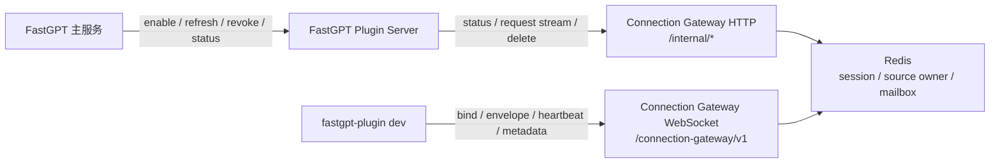
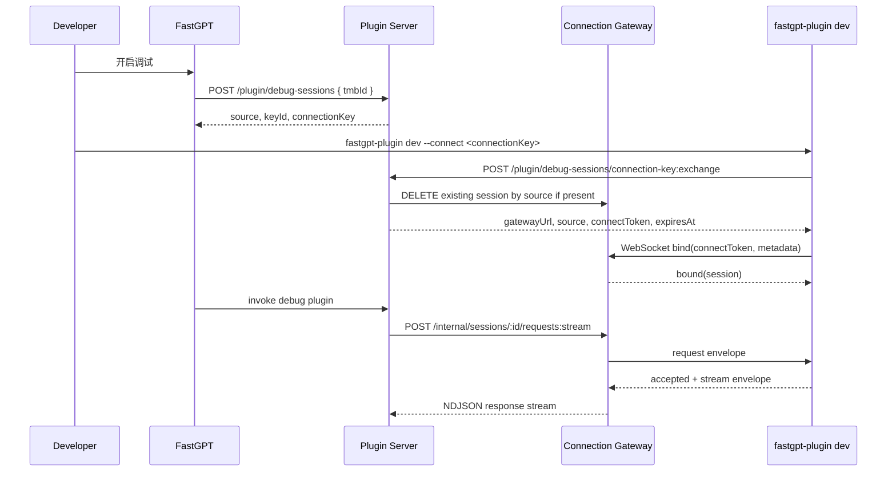

# Connection Gateway 设计文档

语言：[简体中文](./connection-gateway-design.zh.md) | [English](./connection-gateway-design.md)

## 目标

Connection Gateway 是 FastGPT-Plugin 的长连接网关。当前唯一落地的 consumer 是插件远程调试：本地 `fastgpt-plugin dev` 通过 WebSocket 接入 Gateway，FastGPT Plugin Server 通过内部 HTTP API 把插件调用转发到这条连接。

Gateway 负责长连接生命周期、会话注册、请求邮箱、响应流转、owner lease、资源限制和可观测指标。它不处理 FastGPT 用户鉴权，也不保存插件包、插件配置或生产运行时状态。

## 现行边界

- 外部长连接协议只有 WebSocket，传输层标识为 `websocket`。
- HTTP API 与 WebSocket listener 分端口启动：`CONNECTION_GATEWAY_PORT` 承载 HTTP，`CONNECTION_GATEWAY_WS_PORT` 承载 WebSocket upgrade。
- WebSocket 路径由 `CONNECTION_GATEWAY_WS_PATH` 控制，默认 `/connection-gateway/v1`。
- Plugin Server 使用 `CONNECTION_GATEWAY_BASE_URL` 调用 Gateway internal HTTP API。
- CLI 使用 exchange 返回的 `CONNECTION_GATEWAY_PUBLIC_URL` 建立 WebSocket。
- `/internal/*` 和 `/metrics` 使用 `CONNECTION_GATEWAY_AUTH_TOKEN` bearer 鉴权。
- WebSocket bind 使用短期 HMAC connect token，Gateway 校验 token claims，不接触长期 `connectionKey`。

## 组件关系



## 核心模型

### Connect Token

Plugin Server 在 `POST /plugin/debug-sessions/connection-key:exchange` 中用 `JWT_SECRET` 签发短期 connect token。Gateway bind 时校验 token：

- `transport` 必须是 `websocket`。
- `capabilities` 必须包含 `gateway.bind`。
- `expiresAt` 必须晚于当前时间。
- 签名使用 `HmacConnectionGatewayToken`，token header 类型为 `CGT`。

插件调试场景的 claims 形态：

```json
{
  "consumerType": "plugin-debug",
  "subject": "tmb_xxx",
  "sessionScope": {
    "userId": "tmb_xxx",
    "source": "debug:tmbId:tmb_xxx"
  },
  "transport": "websocket",
  "capabilities": ["gateway.bind", "invoke"],
  "issuedAt": 1760000000000,
  "expiresAt": 1760000300000
}
```

### Session

WebSocket bind 成功后，Gateway 在 `ConnectionGatewayService.bindConnection()` 中创建 session。session 包含：

- `id`：Gateway session ID。
- `consumerType`：当前为 `plugin-debug`。
- `subject`：调试场景使用 `tmbId`。
- `sessionScope.source` / `sessionScope.sources`：调试 source，用于按 source 查找连接。
- `transport`：`websocket`。
- `capabilities`：例如 `gateway.bind`、`invoke`。
- `ownerNodeId`：持有 WebSocket 的 Gateway 节点。
- `generation`：用于拒绝 stale envelope。
- `status`：`connected`、`closed` 等。
- `expiresAt`：owner lease 到期时间。
- `metadata`：CLI 上报的本地插件元数据。

Gateway 会按 `subject` 做 session 数限制，按 `source` 做活跃 owner 冲突检查。同一个活跃 source 同时只能被一个 session 持有。

### Source

插件远程调试 source 的稳定格式是：

```text
debug:tmbId:{tmbId}
```

Gateway 只把 source 当路由键。`tmbId` 的鉴权和解析由 FastGPT 主服务与 Plugin Server 控制。

### Envelope

Gateway 传输业务消息使用 `connection-gateway.v1` envelope：

```ts
type ConnectionGatewayEnvelope = {
  protocol: 'connection-gateway.v1';
  sessionId: string;
  generation: number;
  requestId?: string;
  type: 'request' | 'response' | 'event' | 'stream';
  consumerType: string;
  capability?: string;
  traceId?: string;
  payload?: unknown;
  createdAt: number;
};
```

Gateway 会校验 `sessionId`、`generation`、`consumerType`、session status、owner lease 和 capability。校验失败时返回明确的 Gateway 错误码，调用方应按失败处理。

## WebSocket 协议

WebSocket message 使用 `connection-gateway.ws.v1`：

```ts
type ClientMessage =
  | { protocol: 'connection-gateway.ws.v1'; type: 'bind'; requestId: string; token: string; metadata?: Record<string, unknown> }
  | { protocol: 'connection-gateway.ws.v1'; type: 'envelope'; envelope: ConnectionGatewayEnvelope }
  | { protocol: 'connection-gateway.ws.v1'; type: 'heartbeat'; ts: number }
  | { protocol: 'connection-gateway.ws.v1'; type: 'metadata'; requestId?: string; metadata: Record<string, unknown> };

type ServerMessage =
  | { protocol: 'connection-gateway.ws.v1'; type: 'bound'; requestId: string; session: ConnectionGatewaySession }
  | { protocol: 'connection-gateway.ws.v1'; type: 'envelope'; envelope: ConnectionGatewayEnvelope }
  | { protocol: 'connection-gateway.ws.v1'; type: 'heartbeat'; ts: number }
  | { protocol: 'connection-gateway.ws.v1'; type: 'error'; requestId?: string; code: string; message: string };
```

连接流程：

1. CLI 打开 WebSocket。
2. CLI 发送 `bind`，携带短期 connect token 和本地插件 metadata。
3. Gateway 校验 token 并创建 session。
4. Gateway 返回 `bound`。
5. Gateway 启动 mailbox pump，把 Plugin Server 发布到 session mailbox 的 request envelope 推送给 CLI。
6. CLI 处理请求后通过 `envelope` 回写 `response` 或 `stream`。
7. CLI 周期性发送 `heartbeat`，Gateway 续租 owner lease。
8. CLI 热更新本地插件时发送 `metadata`，Gateway 更新 session metadata。

当前 WebSocket transport 只支持非分片 text frame，并限制单帧大小为 `CONNECTION_GATEWAY_MAX_ENVELOPE_BYTES`。

## HTTP Internal API

HTTP API 由 `apps/connection-gateway/src/routes.ts` 暴露。

| API | 用途 |
| --- | --- |
| `GET /health` | 健康检查。 |
| `GET /metrics` | 获取 Gateway 指标，需要 bearer 鉴权。 |
| `GET /internal/sessions/:sessionId/status` | 按 session ID 查询状态。 |
| `GET /internal/sessions/by-source/:source/status` | 按 source 查询最新 session 状态。 |
| `POST /internal/sessions/:sessionId/requests` | 发布 request envelope 到 session mailbox，返回 accepted。 |
| `POST /internal/sessions/:sessionId/requests:stream` | 发布 request envelope，并以 NDJSON 流读取 response/stream envelope。 |
| `PATCH /internal/sessions/:sessionId/metadata` | 更新 session metadata。 |
| `DELETE /internal/sessions/:sessionId` | 删除 session，并尝试关闭本 Gateway 进程内的 live WebSocket。 |

`requests:stream` 使用 reply mailbox 读取响应。遇到终止响应、`stream.end` 或 `stream.error` 后结束；超时会抛出 Gateway request timeout。

## Redis 数据

Gateway 当前使用 Redis 保存跨进程状态：

- `connection-gateway:sessions:by-id:{sessionId}`：session JSON。
- `connection-gateway:sessions:by-subject:{subject}`：subject 到 session ID 的索引。
- `connection-gateway:sessions:by-source:{source}`：source 到 session ID 的索引。
- `connection-gateway:sessions:source-owner:{source}`：source owner lease。
- mailbox stream：session request mailbox 和 `reply:{sessionId}:{requestId}` reply mailbox。

session 与索引使用 `CONNECTION_GATEWAY_SESSION_TTL_MS` 作为 Redis TTL。source owner 使用 owner lease 剩余时间作为 TTL。heartbeat 会调用 `renewOwnerLease()` 刷新 owner lease。

## 插件远程调试主路径



调试插件的调用由 `ConnectionGatewayDebugRuntimeManager` 完成：

1. 通过 source 查询 Gateway session。
2. 要求 session 存在、`consumerType=plugin-debug`、`status=connected`、`ownerAlive=true`。
3. 通过 `/requests:stream` 发布 `plugin-debug.run` payload。
4. 把 CLI 返回的 `plugin-debug.accepted`、`plugin-debug.stream` 转成工具调用的流式结果。

调试插件列表由 `DebugPluginRepoOverlay` 完成：

1. 普通 source 直接走 Mongo plugin repo。
2. debug source 通过 Gateway status 读取 session metadata 中的 `pluginDebug.targets`。
3. 混合 source 会拆成 debug sources 与 fallback sources，分别查询后合并。

## 断连与撤销

Plugin Server 的 debug session route 会在这些场景调用 Gateway 删除 session：

- connection key exchange 前，关闭同 source 已存在的 Gateway session。
- refresh key 后，关闭旧 key 对应的 Gateway session。
- revoke 时，关闭当前 Gateway session。

Gateway 的 `DELETE /internal/sessions/:sessionId` 会先调用当前进程内的 `disconnectSession()`，再删除 Redis session。现行代码只持有本进程内 WebSocket 对象；多副本部署时，应让 delete 请求路由到 session 的 `ownerNodeId` 所在节点，或接受 Redis session 删除后后续调用 fail closed。

WebSocket 自然断开时，Gateway 会把 session status 更新为 `closed`。如果 status 更新失败，日志记录 warning，后续 owner lease 和 Redis TTL 会让 session 失活。

## 资源限制

`ConnectionGatewayResourceLimiter` 当前限制：

- `CONNECTION_GATEWAY_MAX_CONNECTIONS`：Gateway 进程内最大 WebSocket 连接数。
- `CONNECTION_GATEWAY_MAX_SESSIONS_PER_SUBJECT`：单 subject 最大活跃 session 数。
- `CONNECTION_GATEWAY_MAX_IN_FLIGHT_PER_SESSION`：单 session 同时处理的 request 数。
- `CONNECTION_GATEWAY_MAX_ENVELOPE_BYTES`：单个 envelope / WebSocket frame 最大字节数。

`CONNECTION_GATEWAY_SLOW_CONSUMER_BUFFER_BYTES` 已进入配置和指标模型，当前没有独立的慢 consumer 断开策略。

## 环境变量

Plugin Server 使用：

| 环境变量 | 说明 |
| --- | --- |
| `CONNECTION_GATEWAY_BASE_URL` | Plugin Server 调用 Gateway internal HTTP API 的地址；未配置时远程调试功能关闭。 |
| `CONNECTION_GATEWAY_PUBLIC_URL` | 返回给 CLI 的 WebSocket 地址，默认 `ws://localhost:3011/connection-gateway/v1`。 |
| `CONNECTION_GATEWAY_AUTH_TOKEN` | Plugin Server 调用 Gateway internal HTTP API 的 bearer token。 |
| `CONNECTION_GATEWAY_DEBUG_REQUEST_TIMEOUT_MS` | 调试调用等待 CLI 响应的超时时间。 |

Gateway 服务使用：

| 环境变量 | 说明 |
| --- | --- |
| `CONNECTION_GATEWAY_PORT` | HTTP API 端口，默认 `3010`。 |
| `CONNECTION_GATEWAY_WS_PORT` | WebSocket 端口，默认 `3011`。 |
| `CONNECTION_GATEWAY_WS_PATH` | WebSocket upgrade 路径，默认 `/connection-gateway/v1`。 |
| `CONNECTION_GATEWAY_NODE_ID` | Gateway 节点 ID；未配置时使用服务实例 ID。 |
| `CONNECTION_GATEWAY_AUTH_TOKEN` | Gateway 校验 `/internal/*` 和 `/metrics` bearer token 的密钥。 |
| `JWT_SECRET` | Gateway 校验 WebSocket connect token 的 HMAC secret，需要与 Plugin Server 一致。 |
| `REDIS_URL` | Gateway session、source owner 和 mailbox 使用的 Redis 地址。 |
| `CONNECTION_GATEWAY_SESSION_TTL_MS` | session、索引和 mailbox 的 TTL。 |
| `CONNECTION_GATEWAY_OWNER_LEASE_TTL_MS` | owner lease 时长。 |
| `CONNECTION_GATEWAY_MAILBOX_MAXLEN` | mailbox 最大长度。 |
| `CONNECTION_GATEWAY_MAILBOX_BLOCK_MS` | mailbox blocking read 时间。 |
| `CONNECTION_GATEWAY_MAX_CONNECTIONS` | 单 Gateway 进程最大连接数。 |
| `CONNECTION_GATEWAY_MAX_SESSIONS_PER_SUBJECT` | 单 subject 最大 session 数。 |
| `CONNECTION_GATEWAY_MAX_IN_FLIGHT_PER_SESSION` | 单 session 最大并发请求数。 |
| `CONNECTION_GATEWAY_MAX_ENVELOPE_BYTES` | 单 envelope / frame 最大字节数。 |
| `CONNECTION_GATEWAY_SLOW_CONSUMER_BUFFER_BYTES` | 慢 consumer 缓冲阈值配置。 |

Gateway 和 Plugin Server 必须共享同一个 `JWT_SECRET`，否则 connect token 无法校验。

## 安全约束

- CLI 只拿短期 `connectToken`，不需要 `CONNECTION_GATEWAY_AUTH_TOKEN` 或 `JWT_SECRET`。
- 长期 `connectionKey` 由 Plugin Server 管理；Gateway 不保存、不校验、不记录该 key。
- `connectionKey` 按 HMAC hash 建索引，明文只在创建或刷新时返回给上游。
- debug source 命中后按远程调试路径 fail closed；断连时不回退生产 `local-pool` 或 serverless runtime。
- token、raw connection key、内部 bearer token 不应进入日志。

## 与生产运行时的关系

Connection Gateway 是调试连接层。它只承载 debug source 下的本地开发插件，不改变生产插件运行时：

- `local-pool` 继续负责系统插件的默认生产调用。
- serverless runtime 仍是预留扩展。
- `CompositePluginRuntimeManager` 按 debug source 选择 `ConnectionGatewayDebugRuntimeManager`，普通调用走 `local-pool`。
- `DebugPluginRepoOverlay` 只在 debug source 下读取 Gateway metadata，普通插件仍来自持久化仓储。
