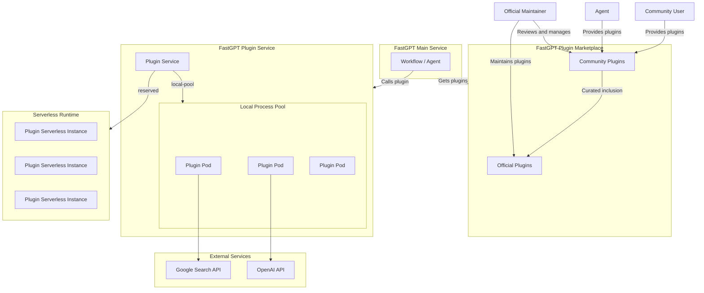

# FastGPT Plugin System Design

Language: [简体中文](./design.zh.md) | [English](./design.md)

## Introduction

FastGPT-Plugin v1.0.0 systematically refactors the plugin project so plugin installation, version management, runtime isolation, and operations configuration share one model. The main changes are:

1. Abstract the plugin package protocol and use the unified `.pkg` format to manage different plugin types, with extension points reserved for future plugin types.
2. Introduce the local process-pool runtime to isolate plugin execution in separate processes, improving stability, performance, and security boundaries.
3. Reserve extension points for a Serverless runtime that can later host user-uploaded custom plugins.
4. Decouple middleware dependencies of the plugin service from the FastGPT main service, reducing deployment and operations coupling.

## Terms

**Plugin**: an independent, reusable capability module that contains specific business logic. Plugins can have different types, such as tools, model presets, and dataset sources.

**Plugin package**: the packaged `.pkg` file for a plugin. All plugin types complete installation, updates, and management through plugin packages.

**Tool**: a plugin type that usually wraps third-party services, internal APIs, or local computation and can be called by workflows and Agents.

**Plugin Marketplace**: the centralized platform for managing plugins, where users can search, download, and install plugins.

**Runtime**: the backend implementation responsible for executing plugin code. The current default runtime is the local process pool. The Serverless runtime is reserved for future extension.

**Pod / worker node**: a single plugin child process in the local process pool. One plugin service can own multiple Pods, and each Pod can process concurrent requests according to configuration.

## FastGPT Plugin System Architecture

## FastGPT-Plugin Service

The FastGPT-Plugin service is responsible for plugin package management, runtime registration, plugin call forwarding, and system-level configuration. The FastGPT main service calls plugins through the plugin runtime interface, and the plugin service dispatches each call to the corresponding runtime.

FastGPT-Plugin supports multiple runtimes. The local process pool, `local-pool`, is enabled by default. The Serverless runtime keeps extension points in interfaces and data structures.

System plugins can be installed in two ways:

1. System-level installation: an administrator uploads a plugin or installs it from the Plugin Marketplace on the plugin management page. The plugin is visible to the whole system.
2. Team-level installation, not yet implemented: a team administrator or a member with plugin management permission uploads a plugin, and the plugin is visible only to that team.

After a plugin is installed, the service saves the plugin package file, parses plugin metadata, and registers the plugin with the runtime when it is enabled. Runtime configuration is saved per plugin. When no configuration record exists, defaults from environment variables are used.

## System-Level Plugin Management

System administrators, or root users, can manage system-level plugin status, secrets, and runtime parameters.

### Plugin Status Configuration

Plugins can have three statuses:

- Normal: the plugin is available for normal use.
- Pending offline: the plugin is marked for offline. Existing workflows continue to run, but the plugin can no longer be added to new workflows.
- Offline: the plugin cannot be used.

### System Secret Configuration

System-level plugins can configure "system secrets" that other users in the system can reuse when invoking the plugin. Secrets are hosted by the plugin service. Callers reference them through plugin configuration and never access plaintext secrets directly.

### Local Process Pool Parameters

Each tool plugin can configure four runtime parameters.

- Minimum worker nodes: default `0`. If set above `0`, worker nodes are warmed up when the plugin is registered or its configuration is updated, and the service tries to maintain at least this many Pods. This fits high-IO and cold-start-sensitive plugins.
- Maximum worker nodes: default `5`. When no Pod is available and the current Pod count has not reached the limit, the scheduler scales out. CPU-heavy plugins can raise this value to use multiple cores, while also considering host memory and `POOL_MAX_TOTAL_PODS`.
- Node timeout: default `120000ms`. This is the execution timeout for one plugin call inside a Pod and can be raised for long-running plugins.
- Maximum concurrent requests per node: default `10`. This is the maximum number of concurrent requests one Pod can process. High-IO and low-CPU plugins can raise it; CPU-heavy plugins should keep it lower.

### Local Process Pool Scheduling

`local-pool` manages Pods and request queues per plugin service. After a call enters a service, scheduling proceeds as follows:

1. Prefer an existing available Pod and dispatch the request immediately.
2. If no Pod is available and `pods + pendingPods < maxPods`, create a new Pod first and dispatch the current request after startup succeeds.
3. If `maxPods` has been reached, startup backoff is active, or a Pod cannot be created temporarily, the request enters a bounded queue.
4. When a Pod is released, startup succeeds, configuration is updated, or a crash is recovered, the queue continues to drain.
5. When queue length reaches `maxQueueSize`, new requests are rejected. Requests also fail after waiting longer than `queueTimeout`.

The queue is the backpressure mechanism after capacity is exhausted. Scale-out does not depend on the queue being full. `pendingPods` count toward capacity to prevent concurrent cold starts from exceeding `maxPods`.

### Environment Variables

Environment variables provide default runtime parameters and global limits:

| Environment variable | Description |
| --- | --- |
| `POOL_HEALTH_CHECK_INTERVAL` | Health check interval in milliseconds. The process pool checks registered plugin services at this interval. |
| `POOL_MAX_TOTAL_PODS` | Total limit for all plugin Pods in the current server process. This quota is checked during plugin registration and configuration updates. |
| `POOL_SERVICE_MIN_PODS` | Default minimum worker nodes for one plugin. |
| `POOL_SERVICE_MAX_PODS` | Default maximum worker nodes for one plugin. |
| `POOL_SERVICE_IDLE_TIMEOUT` | Pod idle recycle time in milliseconds. |
| `POOL_SERVICE_POD_TIMEOUT` | Execution timeout for one plugin call in milliseconds. |
| `POOL_SERVICE_MAX_CONCURRENT_REQUESTS_PER_POD` | Default maximum concurrent requests for one Pod. |
| `POOL_SERVICE_MAX_REQUESTS_PER_POD` | Maximum requests one Pod can process before replacement; this reduces memory leak risk from long-running processes. |
| `POOL_SERVICE_MAX_QUEUE_SIZE` | Maximum request queue capacity for one plugin service. New requests are rejected after this limit. |
| `POOL_SERVICE_QUEUE_TIMEOUT` | Maximum time a request can wait in queue for an available Pod, in milliseconds. |
| `POOL_SERVICE_STARTUP_RETRY_BASE_DELAY` | Base delay for exponential backoff after Pod startup timeout, in milliseconds. |
| `POOL_SERVICE_STARTUP_RETRY_MAX_DELAY` | Maximum delay for exponential backoff after Pod startup timeout, in milliseconds. |

Pod startup errors are recorded and classified. Consecutive non-timeout startup failures trigger startup circuit breaking after the threshold is reached, preventing more Pods from being created. Startup timeouts are treated as resource pressure, enter exponential backoff, and retry later. For detailed scheduling, recycling, and metrics design, see [Process Pool Design](./process-pool-design.md).
