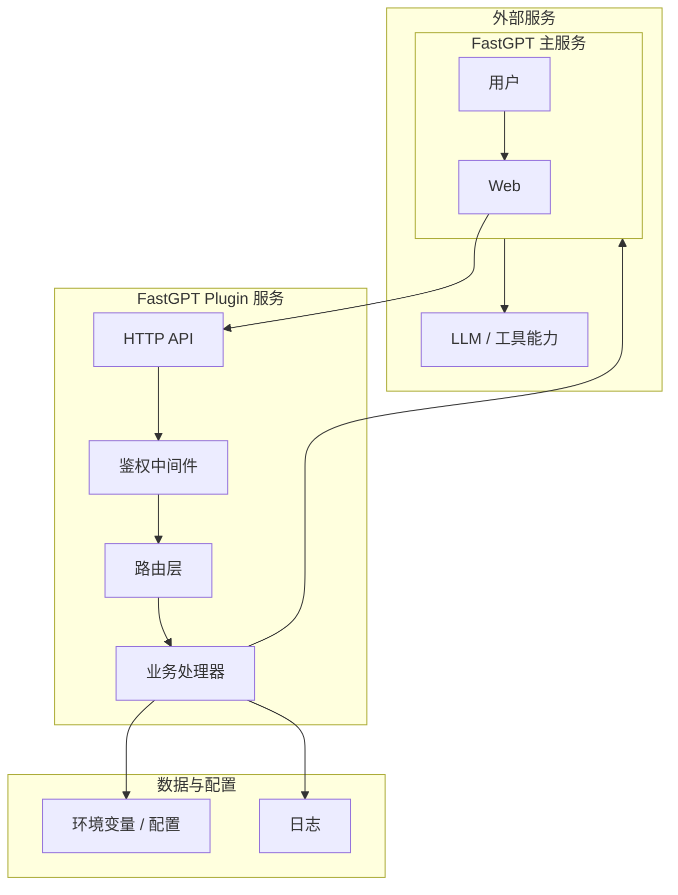

# FastGPT 插件系统设计文档

## 引言

FastGPT-Plugin v1.0.0 对整个插件项目进行了重构，主要变化如下：

1. 抽象 Plugin 包，使用统一的 .pkg 包协议，统一管理不同的插件类型，预留插件类型拓展位。
2. 引入进程池，提升插件运行性能和安全性。
3. 预留 Serverless 运行时拓展位点，以支持用户上传自定义的插件。
4. 插件服务依赖中间件与 FastGPT 完全解耦，方便运维。

## FastGPT 插件系统架构图

`

## FastGPT-Plugin 服务
