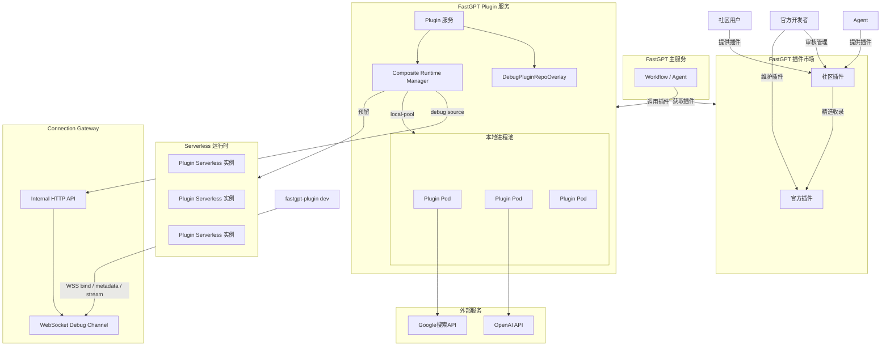
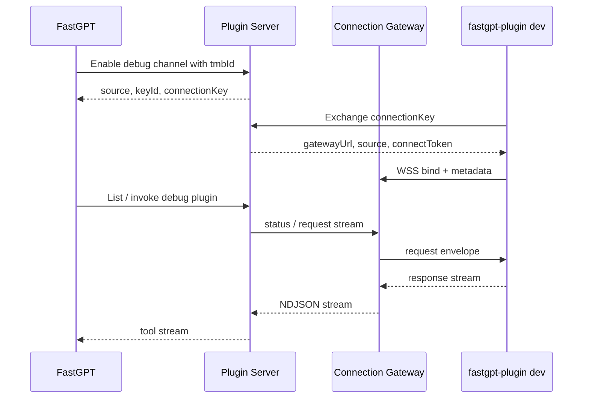

# FastGPT 插件系统设计文档

语言：[简体中文](./design.zh.md) | [English](./design.md)

## 引言

FastGPT-Plugin v1.0.0 对插件项目进行了系统性重构，目标是让插件的安装、版本管理、运行隔离和运维配置形成统一模型。主要变化如下：

1. 抽象插件包协议，使用统一的 `.pkg` 格式管理不同类型的插件，并为后续插件类型预留扩展位。
2. 引入本地进程池运行时，将插件执行隔离在独立进程中，提升稳定性、性能和安全边界。
3. 预留 Serverless 运行时扩展位，支持后续承载用户上传的自定义插件。
4. 插件服务依赖的中间件与 FastGPT 主服务解耦，降低部署和运维耦合度。

## 术语

**插件**：独立、可复用的功能模块，包含特定业务逻辑。插件可以有不同类型，例如工具、模型预设、知识库来源等。

**插件包**：插件打包后的 `.pkg` 文件。不同类型的插件都通过插件包完成安装、更新和管理。

**工具**：一类插件，通常封装第三方服务、内部接口或本地计算逻辑，可被工作流和 Agent 调用。

**插件市场**：集中管理插件的平台，用户可以在其中搜索、下载和安装插件。

**运行时**：负责执行插件代码的后端实现。当前默认生产运行时是本地进程池；Connection Gateway 调试运行时用于远程调试；Serverless 运行时为预留扩展。

**Pod / 工作节点**：本地进程池中的单个插件子进程。一个插件 service 可以拥有多个 Pod，每个 Pod 可按配置并发处理多个请求。

**调试通道**：FastGPT 用户基于 `tmbId` 开启的远程调试入口。Plugin Server 生成长期 `connectionKey`，CLI 用它兑换短期 WebSocket `connectToken`，并通过 Connection Gateway 接入本地插件。

**Source**：插件来源标识。系统插件通常使用普通 source；远程调试 source 使用 `debug:tmbId:{tmbId}`，用于把插件列表、详情和调用路由到对应 Gateway session。

## FastGPT 插件系统架构图

## FastGPT-Plugin 服务

FastGPT-Plugin 服务负责插件包管理、运行时注册、插件调用转发和系统级配置管理。FastGPT 主服务通过插件运行时接口调用插件，插件服务负责把调用分发到对应运行时。

FastGPT-Plugin 支持多种运行时：

1. `local-pool`：默认生产运行时，插件在本地子进程池中运行。
2. `connection-gateway-debug`：远程调试运行时，只在 debug source 下生效，通过 Connection Gateway 把调用转发给本地 CLI。
3. Serverless：预留运行时，保留接口和数据结构扩展位。

运行时由 `CompositePluginRuntimeManager` 统一选择。普通系统插件调用进入 `local-pool`；当调用上下文携带 debug source 时，调用进入 `ConnectionGatewayDebugRuntimeManager`。调试路径断连或 session 不存在时直接失败，不回退到生产运行时。

系统插件的安装有两种方式：

1. 系统级别安装：管理员在插件管理页面上传/从插件市场安装，全系统可见。
2. 团队级别安装（暂未实现）：团队管理员或有插件管理权限的成员可以上传，只有该团队内成员可见。

插件安装后会保存插件包文件、解析插件元信息，并在插件启用时注册到运行时。运行时配置按插件维度保存，没有配置记录时使用环境变量提供的默认值。

## 远程调试设计

远程调试用于让开发者在本地运行插件，并把它临时接入 FastGPT 测试环境。它是调试连接层，不是生产插件运行时。

现行流程：

1. FastGPT 基于当前用户鉴权解析 `tmbId`。
2. FastGPT 调用 Plugin Server 的 `POST /plugin/debug-sessions` 开启调试通道。
3. Plugin Server 创建 `debug:tmbId:{tmbId}` source，并生成长期 `connectionKey`。服务端只持久化 `connectionKeyHash`；明文 key 只在创建或刷新时返回。
4. 本地 CLI 运行 `fastgpt-plugin dev`，用 `connectionKey` 调用 `POST /plugin/debug-sessions/connection-key:exchange`。
5. Plugin Server 校验 connection key，签发短期 WebSocket `connectToken`，返回 `gatewayUrl`、`source`、`connectToken` 和 `expiresAt`。
6. CLI 连接 Connection Gateway，发送 `bind` 和本地插件 metadata。
7. Plugin Server 通过 Gateway status 读取 metadata，把本地插件临时合并进 debug source 下的插件列表和工具列表。
8. FastGPT 调用 debug 插件时，Plugin Server 通过 Gateway internal API 发布 request envelope，CLI 执行本地插件并流式回传结果。

调试相关 API：

| API | 说明 |
| --- | --- |
| `POST /plugin/debug-sessions` | 开启 `tmbId` 维度的调试通道。 |
| `POST /plugin/debug-sessions/key:refresh` | 刷新长期 connection key，并关闭旧 Gateway session。 |
| `POST /plugin/debug-sessions/connection-key:exchange` | 用长期 key 兑换短期 WebSocket 连接信息。 |
| `GET /plugin/debug-sessions/:tmbId` | 查询调试通道状态和已挂载的本地插件。 |
| `POST /plugin/debug-sessions/:tmbId/revoke` | 关闭当前调试 session，保留 key 语义由服务端状态控制。 |

调试 source 的插件查询由 `DebugPluginRepoOverlay` 处理。它会把请求中的 debug sources 与普通 sources 分桶：debug sources 从 Gateway session metadata 中读取本地插件，普通 sources 继续从持久化插件仓储读取，最后合并结果。

调试调用由 `ConnectionGatewayDebugRuntimeManager` 处理。它要求 Gateway session 处于 connected 且 ownerAlive，随后发送 `plugin-debug.run` envelope。CLI 只拿短期 connect token，不需要 `CONNECTION_GATEWAY_AUTH_TOKEN` 或 `JWT_SECRET`。

Connection Gateway 的长连接协议、session、mailbox、owner lease 和资源限制见 [Connection Gateway 设计文档](./connection-gateway-design.zh.md)。

## 系统级插件管理

系统管理员（root 用户）可以在系统内管理系统级插件的状态、密钥和运行时参数。

### 插件状态配置

插件有三个状态可供配置：

- 正常：插件正常使用的状态。
- 即将下线：插件被标记为即将下线，不影响已经搭建的工作流运行，但无法再被新增到工作流中。
- 已下线：插件无法正常使用。

### 系统密钥配置

系统级插件可以配置“系统密钥”，供系统内其他用户在调用插件时复用。密钥由插件服务托管，调用方通过插件配置引用，不直接接触明文密钥。

### 本地进程池参数配置

每个工具插件可以单独配置 4 个运行参数。

- 最小工作节点数：默认为 `0`。如果设置为大于 `0` 的值，插件注册或配置更新时会预热工作节点，并尽量维持不少于该数量的 Pod。适合高 IO、冷启动敏感的插件。
- 最大工作节点数：默认为 `5`。当没有可用 Pod 且当前 Pod 数未达到上限时，调度器会触发扩容。高 CPU 插件可以适当调高该值以利用多核能力，同时需要结合机器内存和 `POOL_MAX_TOTAL_PODS` 控制总量。
- 节点超时时间：默认为 `120000ms`。表示单次插件调用在 Pod 内执行的超时时间，适合为长耗时插件单独调高。
- 每节点最大并发数：默认为 `10`。表示单个 Pod 同时处理的最大并发请求数。高 IO、低 CPU 插件可以适当调高，高 CPU 插件应保持较低并发。

### 本地进程池调度机制

`local-pool` 按单插件 service 维度管理 Pod 和请求队列。一次调用进入 service 后，调度顺序如下：

1. 优先选择已有可用 Pod，立即派发请求。
2. 没有可用 Pod 且 `pods + pendingPods < maxPods` 时，先创建新 Pod，启动成功后直接派发当前请求。
3. 达到 `maxPods`、处于启动退避期或暂时无法创建 Pod 时，请求进入有界队列等待。
4. Pod 释放、创建成功、配置更新或崩溃恢复时，队列会继续被消费。
5. 队列长度达到 `maxQueueSize` 后，新请求会被拒绝；请求等待超过 `queueTimeout` 后会超时失败。

因此，队列是容量耗尽后的背压机制，扩容触发不依赖队列占满。`pendingPods` 会计入容量，避免并发冷启动超过 `maxPods`。

### 环境变量配置

环境变量提供默认运行参数和全局限制：

| 环境变量 | 说明 |
| --- | --- |
| `POOL_HEALTH_CHECK_INTERVAL` | 健康检查间隔，单位为毫秒。进程池按此间隔检查已注册插件 service。 |
| `POOL_MAX_TOTAL_PODS` | 当前 server 进程内所有插件 Pod 的总上限。插件注册和配置更新时会校验该配额。 |
| `POOL_SERVICE_MIN_PODS` | 单插件默认最小工作节点数。 |
| `POOL_SERVICE_MAX_PODS` | 单插件默认最大工作节点数。 |
| `POOL_SERVICE_IDLE_TIMEOUT` | Pod 空闲回收时间，单位为毫秒。 |
| `POOL_SERVICE_POD_TIMEOUT` | 单次插件调用执行超时时间，单位为毫秒。 |
| `POOL_SERVICE_MAX_CONCURRENT_REQUESTS_PER_POD` | 单个 Pod 默认最大并发请求数。 |
| `POOL_SERVICE_MAX_REQUESTS_PER_POD` | 单个 Pod 最大处理请求数；超过后自动替换，用于降低长期运行导致的内存泄露风险。 |
| `POOL_SERVICE_MAX_QUEUE_SIZE` | 单插件 service 请求队列最大容量；超过后拒绝新请求。 |
| `POOL_SERVICE_QUEUE_TIMEOUT` | 请求在队列中等待可用 Pod 的最长时间，单位为毫秒。 |
| `POOL_SERVICE_STARTUP_RETRY_BASE_DELAY` | Pod 启动超时后的指数退避基础延迟，单位为毫秒。 |
| `POOL_SERVICE_STARTUP_RETRY_MAX_DELAY` | Pod 启动超时后的指数退避最大延迟，单位为毫秒。 |
| `CONNECTION_GATEWAY_BASE_URL` | Plugin Server 调用 Connection Gateway internal HTTP API 的地址。 |
| `CONNECTION_GATEWAY_PUBLIC_URL` | 返回给 CLI 的 WebSocket 地址。 |
| `CONNECTION_GATEWAY_AUTH_TOKEN` | Plugin Server 调用 Gateway internal API 的 bearer token。 |
| `CONNECTION_GATEWAY_DEBUG_REQUEST_TIMEOUT_MS` | 远程调试调用等待 CLI 响应的超时时间。 |

Pod 启动错误会被记录并分类。连续非超时启动失败达到阈值后会触发启动熔断，阻止继续创建 Pod；启动超时按资源繁忙处理，会进入指数退避后重试。详细调度、回收和指标设计见 [进程池设计文档](./process-pool-design.zh.md)。
