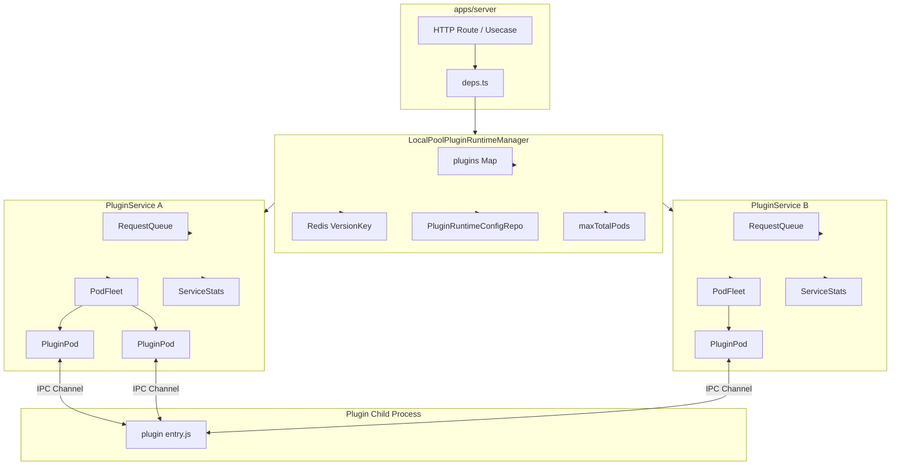
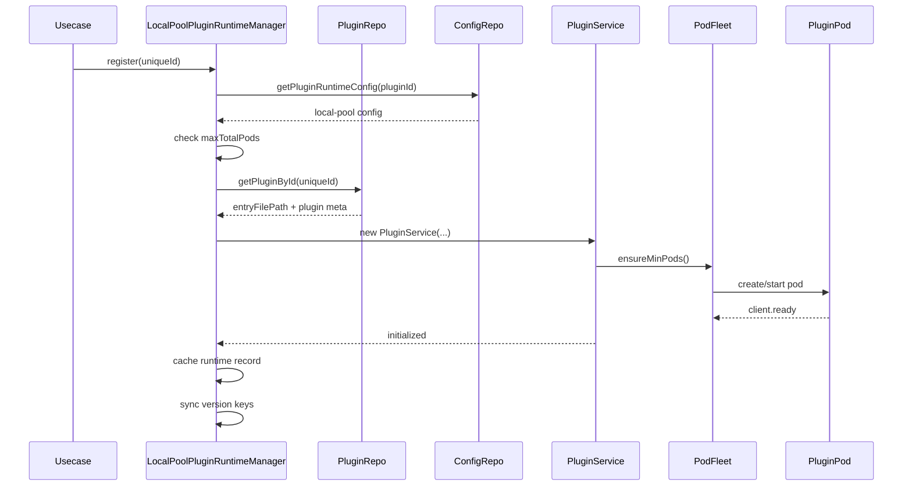
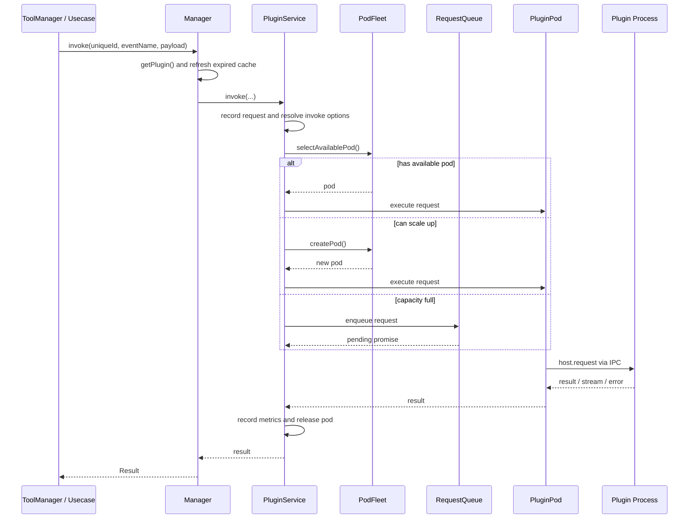
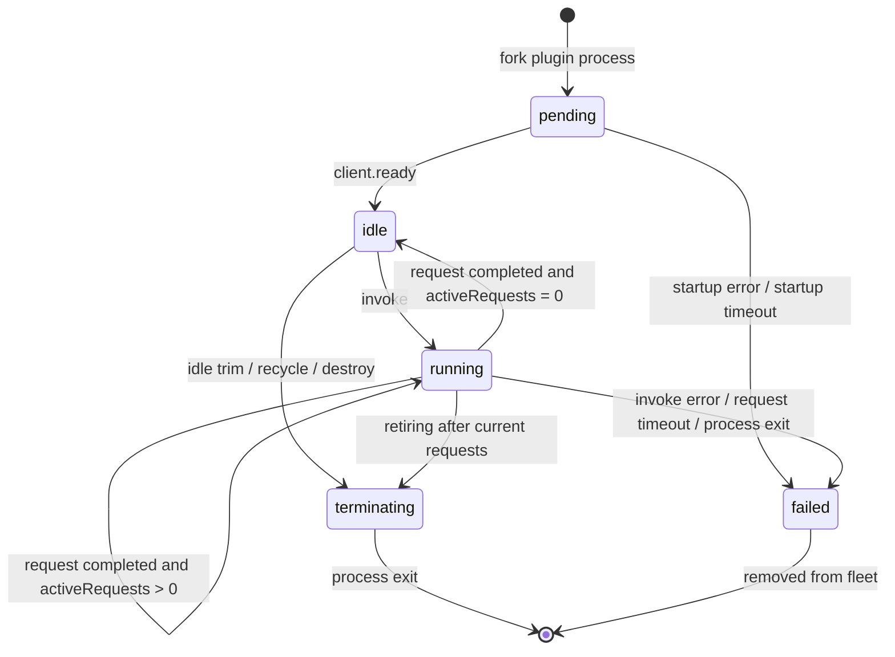

# FastGPT-Plugin Process Pool Design

Language: [简体中文](./process-pool-design.zh.md) | [English](./process-pool-design.md)

The process pool is the default plugin runtime. It borrows the service-pod model from Kubernetes and implements automatic scheduling for process lifecycle management.

The current implementation is in `packages/infrastructure/src/plugin/plugin-runtime/drivers/local-pool`. Externally, `LocalPoolPluginRuntimeManager` implements `PluginRuntimeManagerPort`. The server assembles this runtime manager in `apps/server/src/deps.ts`, and tool/plugin use cases call it indirectly.

## Design Goals

- **Low latency**: warm plugin processes with `minPods` to reduce first-call cold starts.
- **Isolation**: each plugin version has an independent `PluginService`, Pod pool, queue, and metrics.
- **Elastic scheduling**: scale out on demand when no idle Pod exists, then enter a bounded queue after reaching the limit.
- **Failure recovery**: handle startup failures, startup timeouts, request timeouts, process crashes, and configuration changes.
- **Resource protection**: control process count with per-plugin `maxPods` and global `maxTotalPods`.
- **Observability**: provide the `/api/runtime/metrics` single-node snapshot and report production metrics through OpenTelemetry.

## Core Concepts

### Manager

`LocalPoolPluginRuntimeManager` is the global manager for the local process-pool runtime. Its lifecycle follows the server process.

Responsibilities:

- Register and unregister plugin runtimes.
- Locate plugin services by `pluginId/version/etag`.
- Read and save plugin-level runtime configuration.
- Maintain global Pod quotas across plugins.
- Watch Redis version keys to refresh local caches after multi-node configuration or plugin package changes.
- Aggregate runtime metrics from all services.

Runtime id format:

```text
localPool@{pluginId}@{version}@{etag}
```

### Service

`PluginService` represents one plugin runtime instance and is similar to a Kubernetes Service.

Responsibilities:

- Hold the path to a plugin entry file.
- Manage that plugin's `PodFleet`, `RequestQueue`, and `ServiceStats`.
- Schedule requests, drain queues, hot-update configuration, perform rolling replacement, and shut down gracefully.
- Bind `invocationId` to the host-side `InvokePort` so plugin processes can call host capabilities.

### Pod

`PluginPod` represents one real child process and is similar to a Kubernetes Pod.

Responsibilities:

- Start the plugin entry file with `child_process.fork()`.
- Communicate with the plugin process through a Node.js IPC channel.
- Execute `host.request` and wait for normal or streaming results.
- Manage execution timeout, request count, concurrency, and process exit events.

When a Pod starts, it sets:

```text
RUNTIME_MODE=localPool
```

Only after the plugin process sends `client.ready` does the Pod move from `pending` to schedulable.

### Fleet

`PodFleet` manages the Pod set for one service.

Capacity is described by three states:

- `pods`: Pods that have started and joined scheduling.
- `pendingPods`: Pods that are starting and not ready yet. They reserve capacity early to prevent concurrent cold starts from exceeding `maxPods`.
- `retiringPods`: Pods being retired. They no longer accept new requests and are destroyed after becoming idle.

### Queue

`RequestQueue` is a bounded priority queue for one service.

Rules:

- `maxQueueSize` limits waiting queue length.
- `queueTimeout` limits time spent waiting.
- Higher `priority` goes first.
- Same `priority` keeps FIFO order.

Queue timeout only covers the phase waiting for a Pod. After a request is dispatched to a Pod, execution timeout is controlled by `podTimeout` or invocation-level `options.timeout`.

## Overall Architecture



## Registration Flow



Registration immediately creates `minPods` Pods. If the current global Pod count plus `minPods` exceeds `POOL_MAX_TOTAL_PODS`, registration fails with a quota error.

## Invocation Flow



Scheduling priority:

1. Choose the available Pod with the lowest load.
2. If no Pod is available and `maxPods` has not been reached, cold-start a new Pod and dispatch immediately.
3. If scale-out is unavailable, enqueue the request.
4. If the queue is full, waiting times out, or startup is circuit-broken, the request fails.

Pod selection sorts by:

1. Fewer active requests.
2. Fewer historical executed requests.
3. Less recent activity.
4. Earlier creation.
5. `podId` lexical order.

## Pod Lifecycle



Notes:

- Pod ready timeout is fixed at 10 seconds.
- Request execution timeout is controlled by `podTimeout` and can be overridden by invocation-level `options.timeout`.
- After a normal request completes, the Pod is released immediately.
- After a streaming request returns `StreamData`, the Pod is released when the stream ends or errors.
- After reaching `maxRequestsPerPod`, the Pod is recycled on release and `minPods` is replenished.

## Scale-Out, Scale-In, And Rolling Replacement

Scale-out triggers:

- During initialization or configuration update, current capacity is below `minPods`.
- During invocation, no available Pod exists and `totalIncludingPending < maxPods`.
- The queue still has requests and the fleet can continue to scale out.

Scale-in triggers:

- Pod idle time exceeds `idleTimeout`.
- Current Pod count is greater than `minPods`.
- After configuration update, current Pod count exceeds the new `maxPods`.

Rolling replacement triggers:

- `podTimeout` changes.
- `maxRequestsPerPod` changes.

`maxConcurrentRequestsPerPod` supports hot updates on existing Pods. `podTimeout` and `maxRequestsPerPod` affect internal Pod execution constraints and require rolling replacement.

## Startup Failures And Circuit Breaking

Pod startup failures are split into two classes:

- **Startup timeout**: usually means host resource pressure or scheduling delay. The system retries with exponential backoff controlled by `startupRetryBaseDelay` and `startupRetryMaxDelay`.
- **Startup error**: usually means the plugin entry, dependencies, or runtime environment is broken. After 3 consecutive failures, the fleet sets a startup circuit-breaker error.

Behavior after startup circuit breaking:

- If existing Pods or pending Pods remain, the service continues to use existing capacity to process the queue.
- If there are no Pods at all, new requests and queued requests fail directly.
- The next successful Pod creation clears the consecutive failure count and circuit-breaker error.

## Configuration Model

### Plugin-Level Configuration

| Field | Default environment variable | Default | Description |
| --- | --- | --- | --- |
| `minPods` | `POOL_SERVICE_MIN_PODS` | `0` | Minimum Pod count for one plugin service |
| `maxPods` | `POOL_SERVICE_MAX_PODS` | `5` | Maximum Pod count for one plugin service |
| `podTimeout` | `POOL_SERVICE_POD_TIMEOUT` | `120000` | Timeout for one Pod execution, in ms |
| `maxConcurrentRequestsPerPod` | `POOL_SERVICE_MAX_CONCURRENT_REQUESTS_PER_POD` | `10` | Maximum concurrent requests for one Pod |

Constraints:

- `minPods >= 0`
- `maxPods > 0`
- `minPods <= maxPods`
- `podTimeout > 0`
- `maxConcurrentRequestsPerPod > 0`

### Global Service Configuration

| Field | Default environment variable | Default | Description |
| --- | --- | --- | --- |
| `idleTimeout` | `POOL_SERVICE_IDLE_TIMEOUT` | `60000` | Pod idle recycle time in ms |
| `maxRequestsPerPod` | `POOL_SERVICE_MAX_REQUESTS_PER_POD` | `100` | Maximum requests one Pod can process; `0` disables count-based recycling |
| `maxQueueSize` | `POOL_SERVICE_MAX_QUEUE_SIZE` | `500` | Queue length limit for one service |
| `queueTimeout` | `POOL_SERVICE_QUEUE_TIMEOUT` | `60000` | Queue wait timeout in ms |
| `startupRetryBaseDelay` | `POOL_SERVICE_STARTUP_RETRY_BASE_DELAY` | `1000` | Startup timeout exponential backoff base time in ms |
| `startupRetryMaxDelay` | `POOL_SERVICE_STARTUP_RETRY_MAX_DELAY` | `10000` | Startup timeout exponential backoff max time in ms |

### Manager Global Configuration

| Field | Default environment variable | Default | Description |
| --- | --- | --- | --- |
| `maxTotalPods` | `POOL_MAX_TOTAL_PODS` | `100` | Total limit for all plugin Pods in the current server process |
| `healthCheckInterval` | `POOL_HEALTH_CHECK_INTERVAL` | `30000` | Manager health check interval in ms |

## Configuration Updates And Multi-Node Sync

Plugin runtime configuration is stored in `PluginRuntimeConfigRepo`. When updating configuration, the manager:

1. Validates the new configuration.
2. Writes it to the configuration repository.
3. Updates loaded runtimes with the same `pluginId` on the current node.
4. Refreshes the Redis version key.

Other nodes check the runtime version key and config version key when invoking plugins. If the local cache is expired, the node unregisters the old service, registers a new one, and syncs version keys.

## Replacement And Offline

Plugin unregistration has two paths:

- Normal unregistration: call `service.destroy()`, reject queued requests, wait for existing Pods to become idle and close, then force-kill after timeout.
- Replacement unregistration: the old service calls `drainTo(replacement)`, migrating queued requests and active invoke sessions to the new service. New requests are also forwarded to the replacement.

`drainTo` is used for plugin version replacement. Its goal is to switch to the new version without discarding queued requests.

## IPC Communication

local-pool uses a Node.js IPC channel. Host and plugin sides interact through `PluginRuntimeChannelPort`.

Direction rules:

- Host can send `host.request`, `host.ping`, and `host.shutdown`.
- Client can send `client.ready`, `client.stdio`, `client.fail`, and `client.request`.
- `channel.stream` is used for streaming input and output.

When invoking a plugin, the host sends:

```text
host.request(eventName, payload, returnStream)
```

When a plugin needs host capabilities, the client sends:

```text
client.request(method, args)
```

The host locates the corresponding `InvokePort` by `invocationId`. Current reverse host capabilities include:

- `uploadFile`
- `userInfo`
- `wecomCorpToken`

## Metrics And Observability

Service-level metrics:

- `pods.total`
- `pods.running`
- `pods.busy`
- `pods.idle`
- `pods.pending`
- `queueLength`
- `responseTime.avg`
- `responseTime.p95`
- `responseTime.p99`
- `rps`
- `errorRate`
- `crashCount`
- `totalRequests`
- `minPods`
- `maxPods`

Manager global metrics:

- `totalServices`
- `totalPods`
- `totalRequests`
- `services`

The runtime also records OpenTelemetry metrics, including invocation started, invocation completed, invocation failed, Pod crash, Pod startup outcome, and more. For production aggregation, see [Runtime Metrics OpenTelemetry](./runtime-metrics-otel.md).

## Health Check

The manager checks registered services periodically according to `POOL_HEALTH_CHECK_INTERVAL`:

- When `minPods > 0` and `pods.total === 0`, it logs an unhealthy message.
- When `errorRate > 0.5`, it logs a high error-rate message.

The health check timer uses `unref()`, so it does not block Node.js process exit.

## Failure Handling Matrix

| Scenario | Handling | Request impact |
| --- | --- | --- |
| Queue full | `RequestQueue.enqueue()` throws `Queue is full` | Current request fails and records `queue_overflow` |
| Queue wait timeout | Remove from queue and reject | Current request fails and records `queue_timeout` |
| Pod ready timeout | Kill child process and retry with exponential backoff | Request enters queue or fails when no Pod exists |
| Consecutive Pod startup errors | Circuit break after 3 failures | Requests fail when no existing Pod exists |
| Request execution timeout | Kill current Pod | Current request fails and Pod is recycled |
| Unexpected Pod exit | Remove from fleet and record crash | Replenish `minPods` and continue draining queue |
| stream error | Release Pod and clean invoke session | Current stream fails and failure metrics are recorded |
| server shutdown | Reject queue and wait for Pods to close when idle | Force-kill after timeout |

## Maintenance Conventions

- When modifying scheduling logic, also check `RequestQueue` timeout cleanup and `activeInvokeSessions` cleanup.
- When modifying Pod creation logic, keep `pendingPods` reserving capacity early to avoid concurrent cold starts exceeding `maxPods`.
- When modifying Pod recycling logic, keep `pods`, `pendingPods`, and `retiringPods` consistent.
- When adding configuration fields, decide whether hot update is supported. Fields that affect internal Pod constraints should use rolling replacement.
- When adding reverse host capabilities, update channel events, `PluginPod.routeClientRequest()`, and permission boundaries together.
- When adding runtime drivers, implement `PluginRuntimeManagerPort` and switch assembly in `apps/server/src/deps.ts`.
