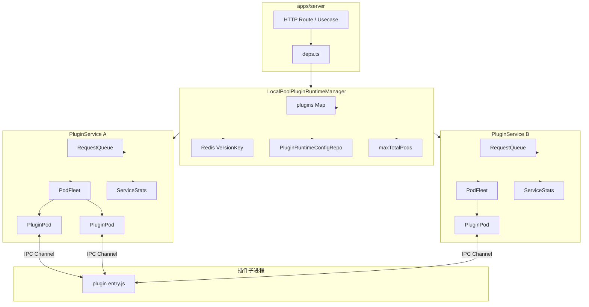
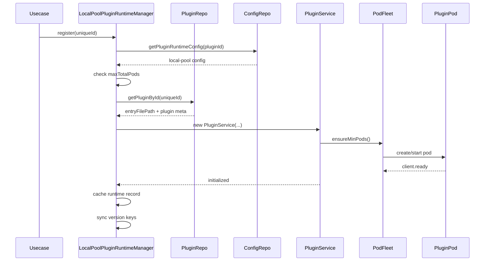
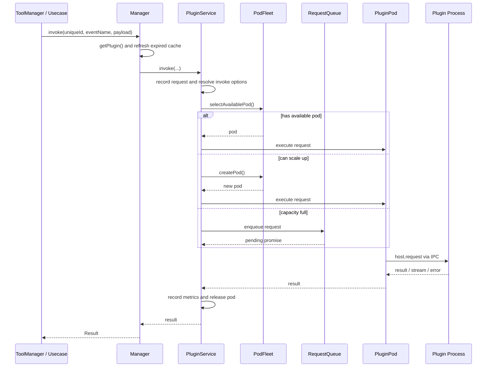
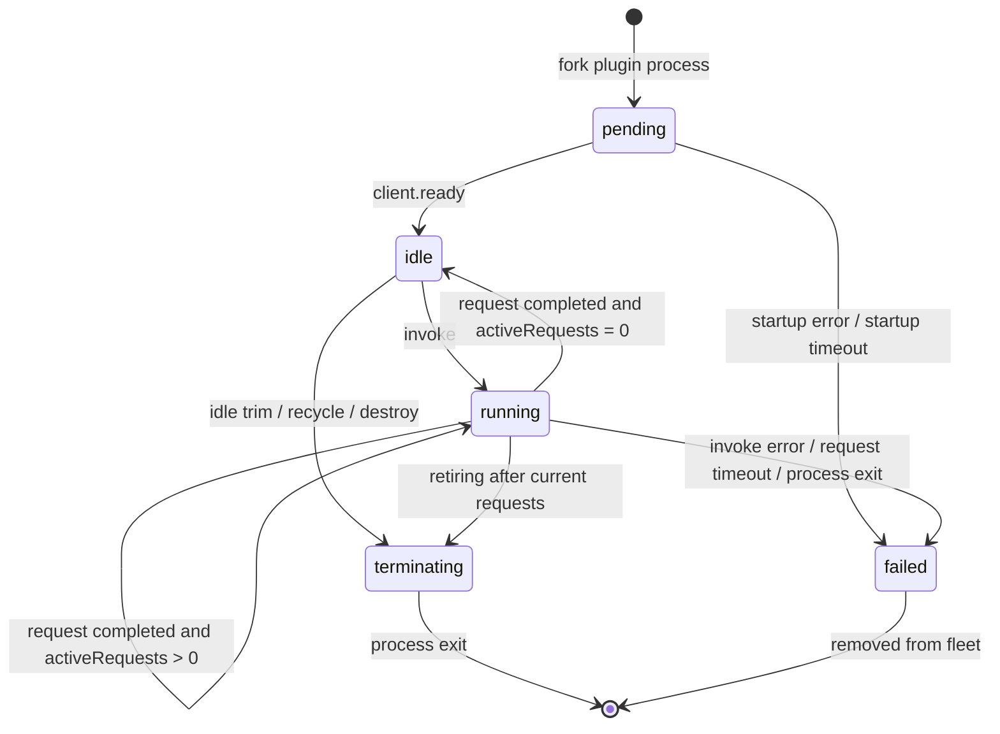

# FastGPT-Plugin 进程池设计文档

语言：[简体中文](./process-pool-design.zh.md) | [English](./process-pool-design.md)

进程池是插件的默认运行时，参考了 k8s 的 service - pod 设计，实现了进程的生命周期管理的自动调度。

当前实现位于 `packages/infrastructure/src/plugin/plugin-runtime/drivers/local-pool`，对外以 `LocalPoolPluginRuntimeManager` 实现 `PluginRuntimeManagerPort`。Server 通过 `apps/server/src/deps.ts` 装配该 runtime manager，再由 tool/plugin usecase 间接调用。

## 设计目标

- **低延迟**：通过 `minPods` 预热插件进程，减少首次调用冷启动。
- **隔离性**：每个插件版本拥有独立的 `PluginService`、Pod 池、队列和指标。
- **弹性调度**：没有空闲 Pod 时按需扩容，到达上限后进入有界队列。
- **故障恢复**：处理启动失败、启动超时、请求超时、进程崩溃和配置变更。
- **资源保护**：通过单插件 `maxPods` 和全局 `maxTotalPods` 控制进程总量。
- **可观测性**：提供 `/api/runtime/metrics` 单节点快照，并可通过 OpenTelemetry 上报生产指标。

## 核心概念

### Manager

`LocalPoolPluginRuntimeManager` 是本地进程池运行时的全局管理器，生命周期跟随 server 进程。

职责：

- 注册、注销插件运行时。
- 按 `pluginId/version/etag` 定位插件服务。
- 读取和保存插件级运行时配置。
- 维护跨插件的全局 Pod 配额。
- 监听 Redis version key，实现多节点配置和插件包变更后的本地缓存刷新。
- 汇总所有 service 的 runtime metrics。

runtime id 格式：

```text
localPool@{pluginId}@{version}@{etag}
```

### Service

`PluginService` 对应一个插件运行时实例，类似 k8s Service。

职责：

- 持有一个插件入口文件路径。
- 管理该插件的 `PodFleet`、`RequestQueue` 和 `ServiceStats`。
- 执行请求调度、队列消费、配置热更新、滚动替换和优雅关闭。
- 绑定 `invocationId` 与宿主侧 `InvokePort`，支持插件进程反向调用宿主能力。

### Pod

`PluginPod` 对应一个真实子进程，类似 k8s Pod。

职责：

- 通过 `child_process.fork()` 启动插件入口文件。
- 使用 Node.js IPC channel 与插件进程通信。
- 执行 `host.request`，等待普通结果或流式结果。
- 管理执行超时、请求计数、并发数和进程退出事件。

Pod 启动时会设置：

```text
RUNTIME_MODE=localPool
```

插件进程发送 `client.ready` 后，Pod 才从 `pending` 进入可调度状态。

### Fleet

`PodFleet` 管理单个 service 的 Pod 集合。

内部容量由三类状态共同决定：

- `pods`：已经启动并纳入调度的 Pod。
- `pendingPods`：正在启动、尚未 ready 的 Pod，提前占用容量，防止并发冷启动冲破 `maxPods`。
- `retiringPods`：准备退役的 Pod，不再接新请求，空闲后销毁。

### Queue

`RequestQueue` 是单个 service 的有界优先级队列。

规则：

- `maxQueueSize` 限制等待队列长度。
- `queueTimeout` 限制等待阶段耗时。
- `priority` 越高越靠前。
- 相同 `priority` 保持 FIFO。

队列超时只覆盖等待 Pod 的阶段。请求被派发给 Pod 后，执行阶段由 `podTimeout` 或调用级 `options.timeout` 控制。

## 总体架构



## 注册流程



注册会立即创建 `minPods` 个 Pod。若当前全局 Pod 数加上 `minPods` 超过 `POOL_MAX_TOTAL_PODS`，注册会失败并返回配额错误。

## 调用流程



调度优先级：

1. 选择负载最低的可用 Pod。
2. 没有可用 Pod 且未达到 `maxPods` 时，冷启动新 Pod 并立即派发。
3. 无法扩容时进入队列。
4. 队列满、等待超时或启动熔断时，请求失败。

Pod 选择规则按以下维度排序：

1. 当前活跃请求数更少。
2. 历史执行请求数更少。
3. 更久未活跃。
4. 更早创建。
5. `podId` 字典序。

## Pod 生命周期



说明：

- Pod ready 超时时间固定为 10 秒。
- 请求执行超时由 `podTimeout` 控制，也可通过调用级 `options.timeout` 覆盖。
- 普通请求完成后立即释放 Pod。
- 流式请求返回 `StreamData` 后，Pod 会在 stream `end/error` 后释放。
- 达到 `maxRequestsPerPod` 后，Pod 会在释放时被回收，随后补齐 `minPods`。

## 扩缩容策略

扩容触发条件：

- 初始化或配置更新时，当前容量低于 `minPods`。
- 调用时没有可用 Pod，且 `totalIncludingPending < maxPods`。
- 队列中仍有请求，且 fleet 可以继续扩容。

缩容触发条件：

- Pod 空闲时间超过 `idleTimeout`。
- 当前 Pod 数大于 `minPods`。
- 配置更新后当前 Pod 数超过新的 `maxPods`。

滚动替换触发条件：

- `podTimeout` 变化。
- `maxRequestsPerPod` 变化。

`maxConcurrentRequestsPerPod` 支持热更新到已有 Pod；`podTimeout` 和 `maxRequestsPerPod` 影响 Pod 内部执行约束，需要滚动替换。

## 启动失败与熔断

Pod 启动失败分为两类：

- **启动超时**：通常表示宿主资源紧张或调度延迟。系统会按指数退避重试，退避区间由 `startupRetryBaseDelay` 和 `startupRetryMaxDelay` 控制。
- **启动错误**：通常表示插件入口、依赖或运行环境损坏。连续 3 次失败后，fleet 会设置启动熔断错误。

启动熔断后的行为：

- 仍有存量 Pod 或 pending Pod 时，继续用存量能力处理队列。
- 完全没有 Pod 时，新请求和队列请求会直接失败。
- 下次成功创建 Pod 后，会清空连续失败计数和熔断错误。

## 配置模型

### 插件级配置

| 字段 | 默认环境变量 | 默认值 | 说明 |
| --- | --- | --- | --- |
| `minPods` | `POOL_SERVICE_MIN_PODS` | `0` | 单个插件 service 最小 Pod 数 |
| `maxPods` | `POOL_SERVICE_MAX_PODS` | `5` | 单个插件 service 最大 Pod 数 |
| `podTimeout` | `POOL_SERVICE_POD_TIMEOUT` | `120000` | 单次 Pod 执行超时时间，单位 ms |
| `maxConcurrentRequestsPerPod` | `POOL_SERVICE_MAX_CONCURRENT_REQUESTS_PER_POD` | `10` | 单个 Pod 最大并发请求数 |

约束：

- `minPods >= 0`
- `maxPods > 0`
- `minPods <= maxPods`
- `podTimeout > 0`
- `maxConcurrentRequestsPerPod > 0`

### 全局 service 配置

| 字段 | 默认环境变量 | 默认值 | 说明 |
| --- | --- | --- | --- |
| `idleTimeout` | `POOL_SERVICE_IDLE_TIMEOUT` | `60000` | Pod 空闲回收时间，单位 ms |
| `maxRequestsPerPod` | `POOL_SERVICE_MAX_REQUESTS_PER_POD` | `100` | 单个 Pod 最大处理请求数，`0` 表示不按次数回收 |
| `maxQueueSize` | `POOL_SERVICE_MAX_QUEUE_SIZE` | `500` | 单个 service 队列长度上限 |
| `queueTimeout` | `POOL_SERVICE_QUEUE_TIMEOUT` | `60000` | 队列等待超时时间，单位 ms |
| `startupRetryBaseDelay` | `POOL_SERVICE_STARTUP_RETRY_BASE_DELAY` | `1000` | 启动超时指数退避基础时间，单位 ms |
| `startupRetryMaxDelay` | `POOL_SERVICE_STARTUP_RETRY_MAX_DELAY` | `10000` | 启动超时指数退避最大时间，单位 ms |

### Manager 全局配置

| 字段 | 默认环境变量 | 默认值 | 说明 |
| --- | --- | --- | --- |
| `maxTotalPods` | `POOL_MAX_TOTAL_PODS` | `100` | 当前 server 进程内所有插件 Pod 总上限 |
| `healthCheckInterval` | `POOL_HEALTH_CHECK_INTERVAL` | `30000` | manager 健康检查间隔，单位 ms |

## 配置更新与多节点同步

插件运行时配置保存在 `PluginRuntimeConfigRepo` 中。更新配置时，manager 会：

1. 校验新配置。
2. 写入配置仓储。
3. 更新当前节点已加载的同 `pluginId` runtime。
4. 刷新 Redis version key。

其他节点在调用插件时会检查 runtime version key 和 config version key。若本地缓存过期，节点会注销旧 service，重新注册并同步 version key。

## 替换与下线

注销插件时有两种路径：

- 普通注销：调用 `service.destroy()`，拒绝队列请求，等待存量 Pod 空闲后关闭，超时后强杀。
- 带 replacement 注销：旧 service 调用 `drainTo(replacement)`，队列请求和 active invoke session 会迁移到新 service，新请求也会转发到 replacement。

`drainTo` 用于插件版本替换，目标是在不丢弃队列请求的前提下切换到新版本。

## IPC 通信

local-pool 使用 Node.js IPC channel。宿主侧和插件侧通过 `PluginRuntimeChannelPort` 交互。

方向规则：

- Host 可以发送 `host.request`、`host.ping`、`host.shutdown`。
- Client 可以发送 `client.ready`、`client.stdio`、`client.fail`、`client.request`。
- `channel.stream` 用于流式输入输出。

调用插件时，host 发送：

```text
host.request(eventName, payload, returnStream)
```

插件需要宿主能力时，client 发送：

```text
client.request(method, args)
```

宿主通过 `invocationId` 找到对应 `InvokePort`，目前支持的反向能力包括：

- `uploadFile`
- `userInfo`
- `wecomCorpToken`

## 指标与观测

Service 级指标：

- `pods.total`
- `pods.running`
- `pods.busy`
- `pods.idle`
- `pods.pending`
- `queueLength`
- `responseTime.avg`
- `responseTime.p95`
- `responseTime.p99`
- `rps`
- `errorRate`
- `crashCount`
- `totalRequests`
- `minPods`
- `maxPods`

Manager 全局指标：

- `totalServices`
- `totalPods`
- `totalRequests`
- `services`

运行时还会记录 OpenTelemetry 指标，包括调用开始、调用完成、调用失败、Pod crash、Pod startup outcome 等。生产环境聚合方式见 `docs/dev/runtime-metrics-otel.zh.md`。

## 健康检查

Manager 会按 `POOL_HEALTH_CHECK_INTERVAL` 周期检查已注册 service：

- 当 `minPods > 0` 且 `pods.total === 0` 时记录 unhealthy 日志。
- 当 `errorRate > 0.5` 时记录错误率过高日志。

健康检查定时器使用 `unref()`，不会阻塞 Node.js 进程退出。

## 失败处理矩阵

| 场景 | 处理方式 | 对请求的影响 |
| --- | --- | --- |
| 队列满 | `RequestQueue.enqueue()` 抛出 `Queue is full` | 当前请求失败，记录 `queue_overflow` |
| 队列等待超时 | 从队列移除并 reject | 当前请求失败，记录 `queue_timeout` |
| Pod ready 超时 | kill 子进程，指数退避重试 | 请求进入队列或在无 Pod 时失败 |
| Pod 连续启动错误 | 3 次后启动熔断 | 无存量 Pod 时请求失败 |
| 请求执行超时 | kill 当前 Pod | 当前请求失败，Pod 被回收 |
| Pod 非预期退出 | 从 fleet 移除，记录 crash | 补齐 `minPods`，继续消费队列 |
| stream error | 释放 Pod，清理 invoke session | 当前流失败，记录失败指标 |
| server shutdown | reject 队列，等待 Pod 空闲关闭 | 超时后强杀 |

## 维护约定

- 修改调度逻辑时，同时检查 `RequestQueue` 超时清理和 `activeInvokeSessions` 清理。
- 修改 Pod 创建逻辑时，保持 `pendingPods` 提前占位，避免并发冷启动超过 `maxPods`。
- 修改 Pod 回收逻辑时，保持 `pods`、`pendingPods`、`retiringPods` 一致。
- 新增配置字段时，判断是否支持热更新；影响 Pod 内部约束的字段应走滚动替换。
- 新增反向宿主能力时，需要同步更新 channel event、`PluginPod.routeClientRequest()` 和权限边界。
- 新增运行时驱动时，实现 `PluginRuntimeManagerPort`，并在 `apps/server/src/deps.ts` 切换装配。
