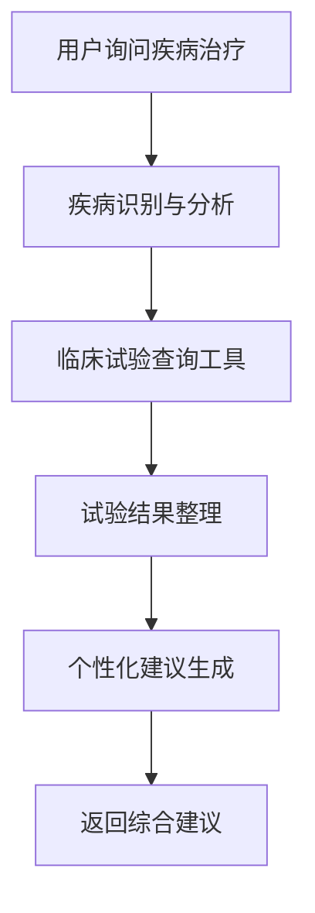
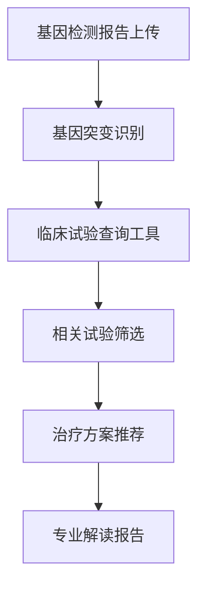
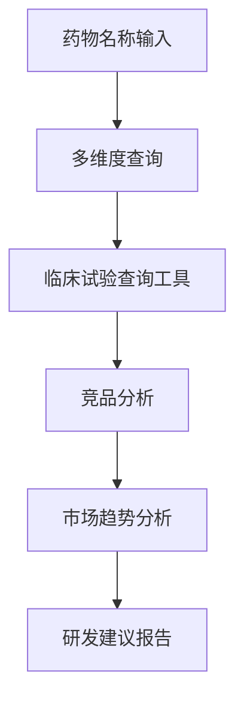

# 临床试验查询工具 (Clinical Trials Search Tool)

## 📋 项目概述

这是一个基于 ClinicalTrials.gov API v2.0 的智能临床试验查询工具，支持自然语言查询和结构化数据输出。

**官方API文档**：https://clinicaltrials.gov/data-api/api  
**新版API测试地址**：https://beta-ut.clinicaltrials.gov/api/oas/v2.html

## ✨ 核心功能

### 🔍 智能查询解析
- **自然语言支持**：支持中英文自然语言查询（如"KRAS基因相关的临床试验"）
- **智能参数提取**：自动识别试验阶段、状态、地理位置、时间范围等筛选条件
- **灵活查询格式**：支持基因名称、疾病名称、药物名称等多种查询方式
- **基因查询优化**：针对KRAS、BRCA1等基因名称进行了专门优化

### 📊 结构化输出
工具提供三层结构化输出：

1. **概述部分**：查询摘要和关键统计信息
2. **统计分析**：
   - 试验阶段分布（Phase I/II/III/IV）
   - 试验状态统计（招募中、已完成、暂停等）
   - 地理分布分析
3. **详细信息**：每个试验的完整信息，包括：
   - 试验标题和描述
   - 主要/次要终点
   - 入组标准
   - 联系方式和地点
   - ClinicalTrials.gov链接

### 🎯 高级筛选
- **试验阶段**：Phase I, II, III, IV, Early Phase 1
- **试验状态**：招募中、即将开始、已完成、暂停、终止等
- **地理位置**：支持国家、州/省、城市级别筛选
- **时间范围**：支持开始日期和完成日期筛选
- **结果数量**：可自定义返回结果数量

## 🚀 使用方法

### 基础查询
```
查询KRAS基因相关的临床试验
```

### 高级查询示例
```
查找胰腺癌的III期临床试验，状态为招募中，在美国进行
```

```
搜索乳腺癌免疫治疗试验，2023年后开始的，返回20个结果
```

### 查询参数说明
- **基因/疾病名称**：KRAS, BRCA1, 胰腺癌, 乳腺癌等
- **试验阶段**："I期", "II期", "III期", "IV期", "早期I期"
- **试验状态**："招募中", "即将开始", "已完成", "暂停", "终止"
- **地理位置**："美国", "中国", "加州", "北京"等
- **时间范围**："2023年后", "2020-2023年", "最近5年"等
- **结果数量**："返回10个结果", "显示前20个"等

## 🔧 技术实现

### API集成
- **数据源**：ClinicalTrials.gov API v2.0
- **查询参数**：使用 `query.cond` 进行疾病条件搜索
- **过滤器**：支持状态、阶段、地理位置、日期等多维度过滤
- **参数格式**：查询词空格自动转换为加号格式

### 核心模块
- `parseNaturalLanguageQuery()`: 自然语言解析
- `buildQueryParams()`: API查询参数构建
- `formatStudy()`: 试验数据格式化
- `tool()`: 主要工具函数

### 技术特色
- **TypeScript**：完整的类型安全
- **模块化设计**：清晰的函数分离
- **错误处理**：完善的异常捕获
- **性能优化**：高效的数据处理

## 📁 文件结构

```
clinicalTrials/
├── src/
│   └── index.ts          # 主要实现文件
├── README.md             # 项目文档
├── DEVELOPMENT_LOG.md    # 开发日志
└── package.json          # 依赖配置
```

## 🔄 API响应格式

工具返回结构化的JSON数据，包含：

```json
{
  "overview": {
    "query": "查询内容",
    "totalResults": 123,
    "displayedResults": 20
  },
  "statistics": {
    "phases": {...},
    "statuses": {...},
    "locations": {...}
  },
  "trials": [
    {
      "title": "试验标题",
      "nctId": "NCT12345678",
      "status": "招募中",
      "phase": "III期",
      "description": "试验描述",
      "primaryOutcome": "主要终点",
      "eligibility": "入组标准",
      "contacts": [...],
      "locations": [...],
      "url": "https://clinicaltrials.gov/study/NCT12345678"
    }
  ]
}
```

## 📝 输入参数详解

### 必填参数

- **疾病或关键词** (`query`): 要查询的疾病名称或关键词
  - 支持中文：胰腺癌、乳腺癌、肺癌等
  - 支持英文：pancreatic cancer, breast cancer, lung cancer等
  - 支持基因名称：KRAS, BRCA1, TP53等

### 可选参数

- **试验阶段** (`phases`): 选择感兴趣的试验阶段，多个阶段用逗号分隔
  - 可选值：`PHASE1`, `PHASE2`, `PHASE3`, `PHASE4`, `EARLY_PHASE1`
  - 示例：`PHASE2,PHASE3`

- **试验状态** (`status`): 选择试验状态，多个状态用逗号分隔
  - 可选值：`RECRUITING`, `ACTIVE_NOT_RECRUITING`, `NOT_YET_RECRUITING`, `COMPLETED`, `SUSPENDED`, `TERMINATED`, `WITHDRAWN`
  - 默认：`RECRUITING`（仅查询招募中的试验）
  - 示例：`RECRUITING,ACTIVE_NOT_RECRUITING`

- **地理位置** (`location`): 筛选试验所在地区或国家
  - 示例：`china`, `united states`, `japan`, `united kingdom`

- **开始日期** (`startDate`): 查询此日期之后发布或更新的试验
  - 格式：`YYYY-MM-DD`
  - 示例：`2024-01-01`

- **返回数量** (`pageSize`): 返回的试验数量
  - 范围：1-100
  - 默认：20

## 🔌 插件使用说明

### FastGPT 中的配置方法

#### 1. 插件安装

将本插件放置在 FastGPT 的插件目录中：
```
fastgpt/
├── modules/
│   └── tool/
│       └── packages/
│           └── clinicalTrials/  # 本插件目录
```

#### 2. 插件注册

在 FastGPT 的工具配置文件中注册本插件：

```json
{
  "name": "临床试验查询",
  "description": "查询全球临床试验信息，支持疾病、基因、药物等多维度搜索",
  "avatar": "/imgs/tools/clinicalTrials.svg",
  "toolType": "custom",
  "id": "clinicalTrials",
  "author": "FastGPT",
  "inputs": [
    {
      "key": "query",
      "description": "疾病或关键词",
      "type": "string",
      "required": true,
      "placeholder": "请输入疾病名称、基因名称或关键词，如：胰腺癌、KRAS、免疫治疗"
    },
    {
      "key": "phases",
      "description": "试验阶段（可选）",
      "type": "string",
      "required": false,
      "placeholder": "如：PHASE2,PHASE3"
    },
    {
      "key": "status",
      "description": "试验状态（可选）",
      "type": "string",
      "required": false,
      "placeholder": "默认：RECRUITING"
    },
    {
      "key": "location",
      "description": "地理位置（可选）",
      "type": "string",
      "required": false,
      "placeholder": "如：china, united states"
    },
    {
      "key": "startDate",
      "description": "开始日期（可选）",
      "type": "string",
      "required": false,
      "placeholder": "格式：YYYY-MM-DD"
    },
    {
      "key": "pageSize",
      "description": "返回数量（可选）",
      "type": "number",
      "required": false,
      "placeholder": "默认：20，最大：100"
    }
  ],
  "outputs": [
    {
      "key": "result",
      "description": "查询结果",
      "type": "string"
    }
  ]
}
```

#### 3. 环境配置

确保 FastGPT 环境支持：
- Node.js 18+
- 网络访问 ClinicalTrials.gov API
- 适当的超时设置（建议30秒以上）

### 工作流嵌入场景

#### 场景1：医疗咨询助手



**工作流配置示例**：
1. **用户输入节点**：接收疾病相关问题
2. **文本处理节点**：提取疾病关键词
3. **临床试验查询节点**：调用本插件
4. **结果整理节点**：格式化试验信息
5. **回答生成节点**：生成个性化建议

#### 场景2：基因检测结果解读



**工作流配置示例**：
1. **文件上传节点**：接收基因检测报告
2. **文档解析节点**：提取基因突变信息
3. **临床试验查询节点**：查询相关试验
   - 输入：基因名称（如KRAS、BRCA1）
   - 筛选：RECRUITING状态
   - 地区：用户所在地区
4. **数据分析节点**：分析试验可行性
5. **报告生成节点**：生成解读报告

#### 场景3：药物研发信息收集



**工作流配置示例**：
1. **参数设置节点**：配置查询参数
   - 药物名称或机制
   - 多个试验阶段：PHASE1,PHASE2,PHASE3
   - 状态：RECRUITING,ACTIVE_NOT_RECRUITING
2. **临床试验查询节点**：执行查询
3. **数据聚合节点**：统计分析
4. **趋势分析节点**：分析发展趋势
5. **报告输出节点**：生成分析报告

### 高级配置技巧

#### 1. 条件查询配置

```javascript
// 根据用户地区自动设置location参数
if (userLocation === '中国') {
  queryParams.location = 'china';
} else if (userLocation === '美国') {
  queryParams.location = 'united states';
}
```

#### 2. 结果后处理

```javascript
// 根据用户需求筛选结果
const filteredTrials = results.trials.filter(trial => {
  // 只返回特定阶段的试验
  return trial.phase.includes('PHASE3');
});
```

#### 3. 缓存优化

```javascript
// 为常见查询设置缓存
const cacheKey = `clinical_${query}_${location}_${status}`;
const cachedResult = await cache.get(cacheKey);
if (cachedResult) {
  return cachedResult;
}
```

### 最佳实践建议

1. **查询优化**：
   - 使用具体的疾病名称而非泛泛的症状
   - 结合地理位置筛选提高相关性
   - 根据患者情况选择合适的试验阶段

2. **结果处理**：
   - 对试验结果进行相关性排序
   - 提取关键信息如入组标准、联系方式
   - 提供试验详情页面链接

3. **用户体验**：
   - 提供查询进度提示
   - 设置合理的超时时间
   - 对空结果提供替代建议

4. **错误处理**：
   - 网络异常时提供重试机制
   - API限制时给出友好提示
   - 参数错误时提供修正建议

## 🛠️ 开发环境

### 启动开发服务器
```bash
bun run dev
```

### 构建项目
```bash
bun run build
```

### 测试查询
访问 http://localhost:5100 进行测试

## 📊 支持的疾病类型

### 常见癌症类型（支持中英文）
- 胰腺癌 / pancreatic cancer
- 乳腺癌 / breast cancer
- 肺癌 / lung cancer
- 肝癌 / liver cancer
- 胃癌 / gastric cancer
- 结直肠癌 / colorectal cancer
- 前列腺癌 / prostate cancer
- 卵巢癌 / ovarian cancer
- 宫颈癌 / cervical cancer
- 白血病 / leukemia
- 淋巴瘤 / lymphoma
- 黑色素瘤 / melanoma

### 基因相关查询
- KRAS基因突变
- BRCA1/BRCA2基因
- TP53基因
- EGFR基因
- HER2基因

## 📋 试验状态说明

- **RECRUITING**: 正在招募参与者
- **ACTIVE_NOT_RECRUITING**: 试验进行中但不再招募
- **NOT_YET_RECRUITING**: 尚未开始招募
- **COMPLETED**: 已完成
- **SUSPENDED**: 暂停
- **TERMINATED**: 终止
- **WITHDRAWN**: 撤回

## 🔬 试验阶段说明

- **EARLY_PHASE1**: 早期I期
- **PHASE1**: I期 - 主要评估安全性
- **PHASE2**: II期 - 评估有效性和进一步的安全性
- **PHASE3**: III期 - 大规模对照试验
- **PHASE4**: IV期 - 上市后监测

## 🌍 地区代码

常用地区代码：
- `china` - 中国
- `united states` - 美国
- `japan` - 日本
- `united kingdom` - 英国
- `canada` - 加拿大
- `australia` - 澳大利亚
- `germany` - 德国
- `france` - 法国

## ⚠️ 注意事项

1. **数据来源**: 数据来源于ClinicalTrials.gov官方数据库
2. **更新频率**: 数据实时从官方API获取
3. **网络要求**: 需要稳定的网络连接
4. **查询限制**: 单次查询最多返回100个结果
5. **语言支持**: 支持中英文查询，结果以英文为主
6. **医疗免责**: 本工具仅用于信息查询，不构成医疗建议

## 🔧 错误处理

工具包含完善的错误处理机制：
- 网络请求超时处理（30秒）
- API响应格式验证
- 参数格式检查
- 友好的错误提示
- 400错误自动重试机制

## 📝 更新日志

详细的开发历程和版本更新请查看 [DEVELOPMENT_LOG.md](./DEVELOPMENT_LOG.md)

## 🤝 贡献指南

1. Fork 项目
2. 创建功能分支
3. 提交更改
4. 推送到分支
5. 创建 Pull Request

## 📄 许可证

本项目采用 MIT 许可证

## 🔗 相关链接

- [ClinicalTrials.gov API 文档](https://clinicaltrials.gov/api/)
- [FastGPT 插件开发指南](../../../README.md)
- [新版API测试地址](https://beta-ut.clinicaltrials.gov/api/oas/v2.html)

---

**免责声明**：本工具仅用于信息查询，不构成医疗建议。请在专业医生指导下做出医疗决策。