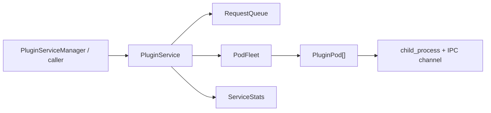
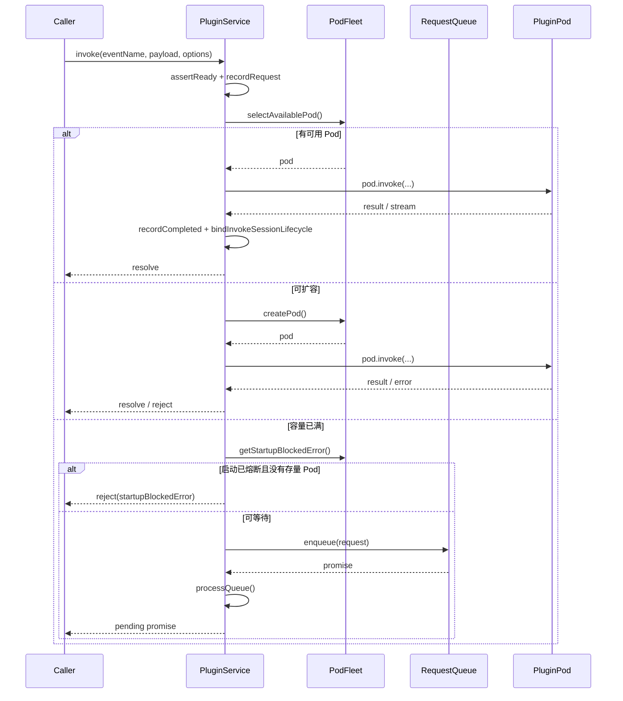
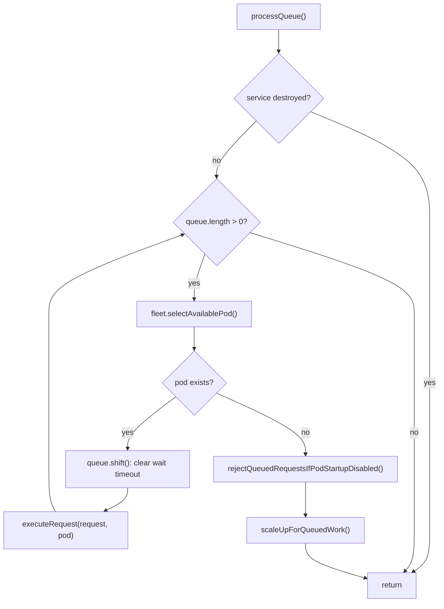
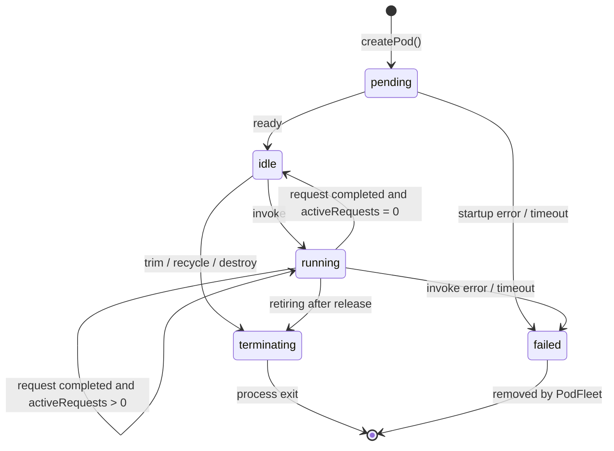
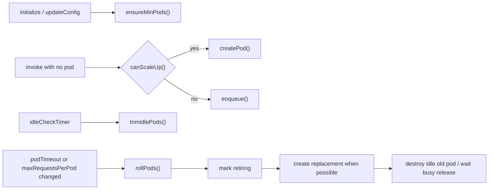
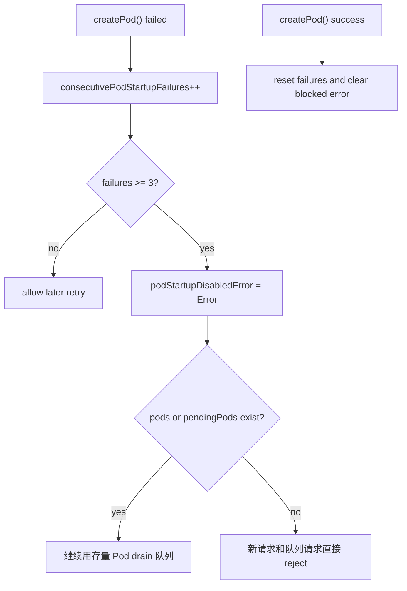
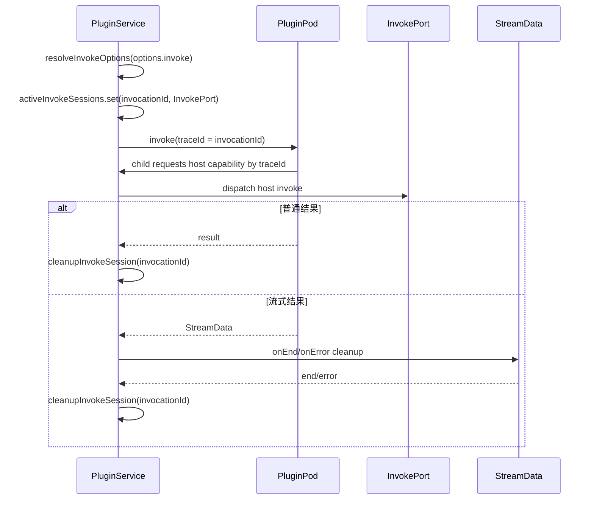

# Local Pool Service 设计说明

`service/` 是单个插件的本地进程池调度层。它不负责插件注册和全局配额，也不直接处理 IPC 协议细节；它负责把一次 `invoke` 调度到合适的 `PluginPod`，在容量不足时排队，在 Pod 变化时继续 drain 队列，并维护服务级指标。

## 模块边界

| 文件 | 职责 |
| --- | --- |
| `index.ts` | 服务入口，串联请求调度、队列消费、配置更新、销毁和 invoke session 生命周期 |
| `pod-fleet.ts` | 管理 Pod 集合，负责创建、选择、回收、滚动替换、空闲缩容和启动熔断 |
| `request-queue.ts` | 有界优先级队列，负责排队等待超时和同优先级 FIFO |
| `request.ts` | 把一次调用包装成 `ServiceRequest + Promise` |
| `stats.ts` | 维护请求量、失败率、崩溃数和响应时间窗口 |
| `types.ts` | service 内部运行时契约 |

## 请求调度流程

调度入口优先走快路径：能拿到 Pod 就立刻执行，能冷启动就先创建 Pod。只有容量到达 `maxPods` 或暂时没有可用 Pod 时，请求才进入队列。

## 队列消费流程

`processQueue()` 是事件驱动的：Pod 创建成功、请求释放、配置更新、Pod 退出恢复都会触发它。队列只负责等待阶段，派发到 Pod 后由 `podTimeout` 和 IPC channel 负责执行阶段超时。

## Pod Fleet 状态流

`PodFleet` 用三个集合/计数描述容量：

- `pods`：已启动并纳入调度的 Pod。
- `pendingPods`：正在 `start()` 的 Pod，提前占用额度，防止并发冷启动超过 `maxPods`。
- `retiringPods`：等待退役的 Pod，不再接新请求；空闲时被销毁，繁忙时等当前请求完成后回收。

## 扩缩容和滚动替换

配置更新分两类：

- `maxConcurrentRequestsPerPod` 可以直接更新到存量 Pod。
- `podTimeout` 和 `maxRequestsPerPod` 影响 Pod 内部执行约束，需要滚动替换。

`rollPods()` 采用先补后退策略，尽量保持容量稳定。若无法补充新 Pod，会标记启动熔断并保留现有 Pod 继续处理已有能力范围内的请求。

## 启动熔断

连续启动失败通常说明插件入口、依赖或运行环境已经损坏。熔断后停止继续拉起新 Pod，避免请求永久排队和反复刷启动错误。只要还有存量 Pod，服务会继续降级处理；完全无 Pod 时才把熔断错误暴露给调用方。

## Invoke Session 生命周期

`options.invoke` 是插件子进程反向调用宿主能力的通道。普通请求完成后可立即清理；流式请求会把清理动作挂到 `StreamData.onEnd/onError`，保证流读取期间反向调用仍能找到对应的 `InvokePort`。

## 指标与失败计数

- `recordRequest()` 在 `invoke()` 入口计数，包含后续排队失败和执行失败。
- `recordCompleted(duration)` 只统计成功完成的请求，并把响应时间放进最近 1000 条窗口。
- `recordFailed()` 覆盖队列满、队列等待超时、启动熔断、Pod 执行失败等路径。
- `recordCrash()` 由 `PodFleet` 在运行中过的 Pod 非预期退出时触发。

## 维护注意事项

- 新增调度分支时，同时检查 `cleanupInvokeSession()`，避免失败路径泄漏 `activeInvokeSessions`。
- 修改队列语义时，保持高优先级优先、同优先级 FIFO，以及派发时清理等待超时。
- 修改 Pod 创建/销毁时，保持 `pendingPods`、`pods`、`retiringPods` 三者一致，否则容易出现超配或队列不再被唤醒。
- 修改配置字段时，判断它能否热更新；不能热更新的字段应走滚动替换。
