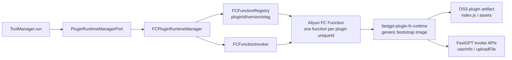

# 阿里云 FC Serverless Runtime 接入方案

## 结论

本方案的目标是新增一个与 `packages/infrastructure/src/plugin/plugin-runtime/drivers/local-pool/` 同级的运行时：

```text
packages/infrastructure/src/plugin/plugin-runtime/drivers/serverless/FC/
```

它实现同一个 `PluginRuntimeManagerPort`，通过 `PLUGIN_RUNTIME_MODE=serverless` 接入 `apps/server/src/deps.ts`，在语义上替代 `LocalPoolPluginRuntimeManager`，负责插件注册、配置、状态、调用、注销和关闭。API server 本身的部署方式保持独立。

推荐落地路径：

1. 第一阶段实现 `FCPluginRuntimeManager` + 通用 FC runtime image，每个 `pluginId/version/etag` 对应一个 FC 函数。
2. 第一阶段的流式返回先支持“HTTP 触发器/自定义域名 NDJSON/SSE 流式通道”；如 FC 调用链路不满足流式要求，则降级为同步 buffered frames，再由 API server 重放为 `StreamData`。
3. 第二阶段再补齐分布式队列、预留实例、函数级别成本治理、OpenAPI/Serverless Devs 编排和更完整的 channel 协议。

## 当前项目边界

- 统一接口：`packages/domain/src/ports/plugin/plugin-runtime-manager.port.ts` 定义 `register / unregister / getConfig / updateConfig / resetConfig / status / globalStatus / shutdown / invoke`。
- local-pool 实现：`packages/infrastructure/src/plugin/plugin-runtime/drivers/local-pool/local-pool-runtime.driver.ts` 管理插件 runtime item、配置仓储、版本失效、注册、调用和指标。
- local-pool service：`packages/infrastructure/src/plugin/plugin-runtime/drivers/local-pool/service/index.ts` 管理单个插件的队列、pod fleet、并发、超时和指标。
- local-pool pod：`packages/infrastructure/src/plugin/plugin-runtime/drivers/local-pool/pod/index.ts` 通过 `child_process.fork` 启动插件 `index.js`，以 IPC channel 调用 `host.request`。
- 现有 serverless 占位：`packages/infrastructure/src/plugin/plugin-runtime/drivers/serverless/FC/fc.plugin-runtime.driver.ts` 目前只有 TODO。
- 运行时选择点：`apps/server/src/deps.ts` 当前固定导出 `LocalPoolPluginRuntimeManager`，后续需要按 `env.PLUGIN_RUNTIME_MODE` 分支。
- SDK 现状：`sdk/factory/src/plugin-factory.ts` 只对 `localPool` 和 `dev` 初始化 channel；FC runtime 第一阶段不复用 IPC channel，直接 import 插件 factory 并执行 handler。

## 目标架构



核心设计：

- `FCPluginRuntimeManager` 对上保持 `PluginRuntimeManagerPort` 行为。
- FC 函数对应 local-pool 的 `PluginService`，FC 实例对应 local-pool 的 `PluginPod`。
- 插件 artifact 存在 OSS 或当前 private remote storage，FC runtime 冷启动时下载到本地临时目录。
- 通用 runtime image 内置 Node.js、`@fastgpt-plugin/sdk-factory`、runtime bootstrap 和必要的依赖桥接逻辑。
- 每个插件版本/etag 独立 FC 函数，函数名稳定可推导，便于灰度、回滚、隔离、指标和清理。

## 运行时职责映射

| local-pool 职责 | FC runtime 对应实现 |
| --- | --- |
| `getRuntimeId()` | `fc@<pluginId>@<version>@<etag>`，函数名使用安全编码 |
| `PluginRuntimeConfigRepo` | 复用同一配置仓储，新增 FC config schema |
| `register()` | 获取插件信息和 artifact，确保 FC 函数存在且配置正确 |
| `unregister()` | 删除函数、禁用函数或标记待清理 |
| `invoke()` | 通过 FC HTTP endpoint 或 InvokeFunction 调用目标函数 |
| `status()` | 返回函数配置、最近调用指标、本地统计、FC 查询结果 |
| `globalStatus()` | 汇总已注册函数和本地调用统计 |
| `shutdown()` | 停止接收新请求，等待 active invocations 完成 |
| queue | 第一阶段本地轻量队列；第二阶段 Redis 分布式队列或直接依赖 FC 限流 |
| pod metrics | 映射为 function metrics、instance concurrency、错误率、冷启动统计 |

## 目录规划

建议后续代码目录：

```text
packages/infrastructure/src/plugin/plugin-runtime/drivers/serverless/FC/
  fc.plugin-runtime.driver.ts
  fc-function-registry.ts
  fc-function-invoker.ts
  fc-runtime-config.repo.ts
  types.ts
  const.ts
  function-name.ts
  metrics.ts

apps/fc-plugin-runtime/
  src/bootstrap.ts
  src/plugin-loader.ts
  src/handler.ts
  src/invoke-context.ts
  Dockerfile
  package.json
```

`FCPluginRuntimeManager` 所属模块只做宿主侧管理；`apps/fc-plugin-runtime` 是运行在 FC 函数里的通用插件执行器。

## 配置模型

新增 `FCPluginConfigType`，保持对 local-pool 概念的可迁移性：

```ts
type FCPluginConfigType = {
  minInstances: number;
  maxConcurrency: number;
  timeoutMs: number;
  memorySize: number;
  cpu: number;
  reservedConcurrency?: number;
  provisionedConcurrency?: number;
  maxQueueSize: number;
  queueTimeoutMs: number;
  invocationMode: 'http-stream' | 'openapi-buffered';
};
```

推荐默认值：

```text
minInstances=0
maxConcurrency=10
timeoutMs=120000
memorySize=512 或 1024
cpu=0.5 或 1
maxQueueSize=500
queueTimeoutMs=60000
invocationMode=http-stream
```

与 local-pool 配置的对应关系：

- `minPods` -> `provisionedConcurrency` 或最小预留实例策略。
- `maxPods` -> `reservedConcurrency / 最大实例数策略`。
- `podTimeout` -> FC function timeout。
- `maxConcurrentRequestsPerPod` -> FC instanceConcurrency。
- `maxQueueSize / queueTimeout` -> driver 本地队列，第二阶段升级到 Redis 分布式队列。
- `idleTimeout / maxRequestsPerPod` -> 第一阶段不做强映射，由 FC 平台管理实例生命周期。

## 注册流程

`register(uniqueId)` 的建议流程：

1. 读取运行时配置：`PluginRuntimeConfigRepo<FCPluginConfigType>.getPluginRuntimeConfig(pluginId)`。
2. 读取插件：`pluginRepo.getPluginById(uniqueId)`，拿到 `info`、`indexFile`、`entryFilePath`。
3. 生成 runtime id 与函数名：`fc@pluginId@version@etag`，函数名长度和字符集做安全编码。
4. 确认 artifact：
   - 第一阶段复用 `index.js` 和私有对象存储中的插件文件。
   - 如需要完整目录，新增一个 artifact 打包步骤，把插件 `index.js/assets/manifest` 打成 zip 上传 OSS。
5. 调用 FC OpenAPI 创建或更新函数：
   - runtime 使用 `custom-container`。
   - image 使用通用 `fastgpt-plugin-fc-runtime:<version>`。
   - env 注入 `PLUGIN_ID / PLUGIN_VERSION / PLUGIN_ETAG / PLUGIN_ARTIFACT_* / FASTGPT_BASE_URL`。
   - function role 授予读取 artifact bucket 的最小权限。
6. 配置并发、超时、内存、CPU、VPC、日志。
7. 缓存 runtime item：函数名、配置、插件 meta、本地 metrics、mutex。
8. 写入版本 key 或刷新本地 registry。

函数创建建议采用幂等 `ensureFunction()`：

- 函数不存在：create。
- 函数存在且 image/env/config 不一致：update。
- 函数存在且配置一致：跳过。

## 调用流程

`invoke({ uniqueId, eventName, payload, returnStream, options })` 的建议流程：

1. 检查 manager 是否 shutdown。
2. 通过 version key 检查函数是否过期，过期时执行 unregister + register。
3. 获取 runtime item。
4. 校验事件：
   - 当前项目插件类型只有 `tool`，`eventName=run` 允许调用。
5. 生成请求：

```json
{
  "protocol": "fastgpt-plugin-fc/v1",
  "invocationId": "uuid",
  "eventName": "run",
  "returnStream": true,
  "payload": {
    "input": {},
    "systemVar": {},
    "childId": "optional",
    "secrets": {}
  }
}
```

6. 发起调用：
   - `http-stream`：请求 FC HTTP trigger 或自定义域名，读取 response body 中的 NDJSON/SSE frames，边读边写入 `StreamData`。
   - `openapi-buffered`：调用 FC `InvokeFunction`，等待函数完成后解析 frames，再重放到 `StreamData`。
7. 统计 request duration、errorRate、totalRequests。
8. 返回 `Result<StreamData<ToolStreamMessageType>>`。

第一阶段建议把 `http-stream` 作为主路径，因为 `apps/server/src/routes/tool.route.ts` 已把 `StreamData` 持续写给客户端；`openapi-buffered` 用作兼容和排障路径。

## FC Runtime Bootstrap

通用 runtime image 的职责：

1. 启动 HTTP server，监听 FC 配置的端口，建议沿用 FC Custom Runtime 默认 `9000` 或在函数配置中显式指定。
2. 冷启动时下载插件 artifact 到 `/tmp/fastgpt-plugin-runtime/<runtimeId>/`。
3. 准备模块解析：
   - 插件构建产物中的 `@fastgpt-plugin/sdk-factory` 是 external。
   - runtime image 需要内置该包。
   - 下载插件后创建 `node_modules/@fastgpt-plugin/sdk-factory` 指向 image 内置包，或调整 import 解析策略。
4. 动态 import 插件 `index.js`，读取 default export。
5. 从 factory 获取 handler：
   - `childId` 存在时调用 `getToolHandler(childId)`。
   - 否则调用 `getToolHandler()`。
6. 构造 handler context：
   - `systemVar`、`secrets` 原样透传。
   - `streamResponse` 写入输出 frames。
   - `invoke` 使用 `InvokeManager({ token: systemVar.invokeToken, fastgptBaseUrl })`。
7. 执行 handler，把中间流和最终响应编码为 NDJSON/SSE：

```json
{"type":"stream","data":{}}
{"type":"response","data":{}}
{"type":"error","data":"message"}
```

8. handler 抛错时返回 error frame，并设置 `x-fc-status` 或 HTTP status 方便 FC 侧观测。

第一阶段 runtime bootstrap 直接调用 factory handler。后续如果需要复用完整 `PluginRuntimeChannelPort`，再实现 HTTP channel，让 `sdk/factory/src/plugin-factory.ts` 支持 `RUNTIME_MODE=serverless`。

## 反向调用设计

local-pool 里插件通过 IPC channel 调 host 的 `uploadFile / userInfo`。FC runtime 跨进程后，第一阶段直接在 runtime 内构造 `InvokeManager`：

- `userInfo()`：使用 `systemVar.invokeToken` 请求 `${FASTGPT_BASE_URL}/api/invoke/userInfo`。
- `uploadFile()`：由 FC runtime 直接 multipart 上传到 `${FASTGPT_BASE_URL}/api/invoke/fileUpload`。

这样可以保持插件 handler 的 `ctx.invoke` 行为，不需要第一阶段实现 host callback channel。

后续需要支持更多 host 能力时，再增加签名回调：

```text
FC runtime -> fastgpt-plugin-server /api/runtime/fc/callback
```

回调请求需要包含 `invocationId`、签名、过期时间和方法名，由 API server 找回 invocation session 并执行对应能力。

## 函数形态选择

推荐第一阶段采用“每个插件 uniqueId 一个 FC 函数”。

优点：

- 与 local-pool 的“每个插件一个 service”语义一致。
- 插件版本和 etag 隔离，回滚简单。
- 可以按插件单独配置并发、预留、超时、内存。
- 故障和日志定位清晰。

代价：

- 函数数量随插件版本增长，需要清理策略。
- 冷启动和镜像拉取需要通过镜像加速、预留实例和 artifact 缓存优化。

备选方案是“共享一个 FC 函数，payload 中携带 pluginId/version/etag”。它适合插件数量非常多、隔离诉求较低的场景，可作为第二阶段成本优化选项。

## 环境变量

API server 侧新增：

```env
PLUGIN_RUNTIME_MODE=serverless
FC_REGION=cn-hangzhou
FC_RUNTIME_IMAGE=registry.cn-hangzhou.aliyuncs.com/<ns>/fastgpt-plugin-fc-runtime:<tag>
FC_FUNCTION_NAME_PREFIX=fastgpt-plugin
FC_INVOCATION_MODE=http-stream
FC_HTTP_BASE_URL=<可选，HTTP trigger/custom domain base url>
FC_ACCESS_KEY_ID=<或使用 RAM Role/STS>
FC_ACCESS_KEY_SECRET=<或使用 RAM Role/STS>
FC_ROLE_ARN=<函数执行 role>
FC_VPC_ID=<可选>
FC_VSWITCH_IDS=<可选，逗号分隔>
FC_SECURITY_GROUP_ID=<可选>
FC_ARTIFACT_BUCKET=<插件 artifact bucket>
FC_ARTIFACT_PREFIX=plugin-runtime
FC_DEFAULT_TIMEOUT_MS=120000
FC_DEFAULT_INSTANCE_CONCURRENCY=10
FC_DEFAULT_MEMORY_SIZE=1024
FC_DEFAULT_CPU=1
```

FC runtime 函数侧注入：

```env
NODE_ENV=production
PORT=9000
PLUGIN_ID=<pluginId>
PLUGIN_VERSION=<version>
PLUGIN_ETAG=<etag>
PLUGIN_ARTIFACT_BUCKET=<bucket>
PLUGIN_ARTIFACT_KEY=<object key>
FASTGPT_BASE_URL=<FastGPT base url>
LOG_LEVEL=info
```

敏感配置通过 RAM Role、STS 或云端 Secret 注入，仓库内只保存非敏感模板。

## 权限模型

API server 所在身份需要：

- `fc:CreateFunction`
- `fc:UpdateFunction`
- `fc:GetFunction`
- `fc:DeleteFunction`
- `fc:InvokeFunction`
- `fc:PutConcurrencyConfig`
- `fc:GetConcurrencyConfig`
- `ram:PassRole`，仅允许传递指定 FC execution role
- `oss:PutObject / oss:GetObject / oss:DeleteObject`，限定 artifact bucket/prefix

FC function execution role 需要：

- `oss:GetObject`，限定插件 artifact bucket/prefix。
- 写日志权限。
- 如果 FastGPT 或依赖服务在 VPC 内，配置对应 VPC、vSwitch、安全组。

插件代码默认只通过 `ctx.invoke` 访问 FastGPT 能力；额外公网访问继续受现有 SSRF、安装源白名单和云侧网络策略约束。

## 与阿里云 FC 能力的对应

调研到的 FC 能力与本方案关系：

- FC Custom Runtime / Custom Container 可运行 HTTP server，默认端口为 `9000`，也可在函数配置中设置监听端口。
- Custom Container 函数可配置 `customContainerConfig.image`、`port`、health check 等字段，适合作为通用 plugin runtime image。
- Web 函数可通过 HTTP 触发器或自定义域名调用，也可由 `InvokeFunction` 转换成 HTTP 请求传给用户 HTTP Server。
- FC 支持单实例多并发 `InstanceConcurrency`，可映射 local-pool 的 `maxConcurrentRequestsPerPod`。
- FC 支持函数并发度/预留并发配置，适合做插件级别的总并发保护。
- FC 可配置 VPC 网络访问能力，用于访问私网 FastGPT、Mongo、Redis、OSS 内网 endpoint 或其他内网资源。

## 风险与取舍

- 流式返回需要实测：HTTP trigger/custom domain 路径优先；OpenAPI InvokeFunction 作为 buffered fallback。
- SDK 当前缺少 `serverless` channel：第一阶段 runtime bootstrap 直接调用 factory handler；完整 HTTP channel 留到第二阶段。
- Node 模块解析需要处理：插件产物 external 了 `@fastgpt-plugin/sdk-factory`，runtime image 必须提供依赖并为插件目录建立可解析路径。
- 多 API server 实例会重复 register：`ensureFunction()` 需要幂等；必要时使用 Redis lock。
- 队列语义与 local-pool 不完全一致：第一阶段提供单进程轻量队列；生产多实例下依赖 FC 限流和 Redis 分布式限流。
- 函数数量会增长：unregister、插件替换、disabled prune 需要清理 FC 函数和 artifact。
- 冷启动影响首 token 延迟：高频插件配置 provisioned concurrency，低频插件按量。

## 实施步骤

1. 定义 FC runtime 类型和默认配置：
   - `types.ts`
   - `const.ts`
   - env schema
2. 实现函数名、runtime id、配置解析和 metrics。
3. 实现 `FCFunctionRegistry`：
   - create/update/get/delete function
   - configure concurrency
   - upload or resolve artifact
4. 实现 `FCFunctionInvoker`：
   - `http-stream`
   - `openapi-buffered`
   - error mapping
5. 实现 `FCPluginRuntimeManager`：
   - 完整 `PluginRuntimeManagerPort`
   - config repo
   - version key
   - register/unregister/status/globalStatus/shutdown/invoke
6. 新增 `apps/fc-plugin-runtime`：
   - bootstrap HTTP server
   - plugin loader
   - SDK factory dependency bridge
   - handler context + `InvokeManager`
   - NDJSON/SSE output
7. 修改 `apps/server/src/deps.ts`：
   - `PLUGIN_RUNTIME_MODE=localPool` 使用现有实现
   - `PLUGIN_RUNTIME_MODE=serverless` 使用 FC 实现
8. 增加测试：
   - config parse
   - function name
   - register ensure 幂等
   - invoke buffered
   - stream frame parse
   - reverse invoke userInfo/uploadFile
9. 增加部署模板：
   - runtime image Dockerfile
   - Serverless Devs 或 Terraform/ROS 示例
   - RAM policy 示例

## 验收标准

- `PLUGIN_RUNTIME_MODE=localPool` 行为保持兼容。
- `PLUGIN_RUNTIME_MODE=serverless` 启动后 active plugins 可以注册为 FC 函数。
- `/api/runtime/metrics` 能展示 FC runtime 的全局状态。
- `/api/tools/run` 可以通过 FC runtime 执行工具。
- `ctx.streamResponse` 能被客户端持续收到；buffered fallback 有明确标识。
- `ctx.invoke.userInfo()` 和 `ctx.invoke.uploadFile()` 可用。
- 插件 version/etag 更新后，新函数生效，旧函数可按策略清理。
- FC 函数权限最小化，artifact bucket 只授予必要 prefix。
- 超时、函数不存在、鉴权失败、OSS artifact 不存在、handler 抛错都有可读错误。

## 官方参考

- 阿里云函数计算 Custom Runtime 基本原理：https://www.alibabacloud.com/help/zh/doc-detail/425055.html
- 阿里云函数计算 HTTP Handler / Custom Container HTTP 请求处理：https://www.alibabacloud.com/help/zh/doc-detail/179371.html
- 阿里云函数计算 CreateFunction API：https://www.alibabacloud.com/help/zh/functioncompute/fc-3-0/developer-reference/api-fc-2023-03-30-createfunction
- 阿里云函数计算 Web 函数：https://www.alibabacloud.com/help/zh/functioncompute/fc-3-0/user-guide/web-functions
- 阿里云函数计算实例并发度：https://www.alibabacloud.com/help/zh/doc-detail/181603.html
- 阿里云函数计算 VPC 网络配置：https://help.aliyun.com/zh/functioncompute/fc-3-0/user-guide/configure-network-settings-3/
