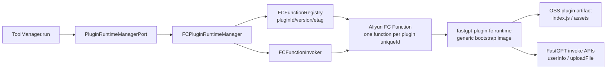

# 阿里云 FC Serverless Runtime 接入方案

## 结论

本方案的目标是新增一个与 `packages/infrastructure/src/plugin/plugin-runtime/drivers/local-pool/` 同级的运行时：

```text
packages/infrastructure/src/plugin/plugin-runtime/drivers/serverless/FC/
```

它实现同一个 `PluginRuntimeManagerPort`，通过 `PLUGIN_RUNTIME_MODE=serverless-fc` 接入 `apps/server/src/deps.ts`，在语义上替代 `LocalPoolPluginRuntimeManager`，负责插件注册、配置、状态、调用、注销和关闭。API server 本身的部署方式保持独立。

推荐落地路径：

1. 选择 **B：Complete FC Driver Platform**。v0 功能面保持窄，但一次性放对与 `local-pool` 同级的 driver 骨架、artifact repo、函数注册/调用、权限、观测、清理和测试边界。
2. 第一阶段实现 `FCPluginRuntimeManager` + 通用 FC runtime image，每个 `pluginId/version/etag` 对应一个 FC 函数。
3. 第一阶段的流式返回先支持“HTTP 触发器/自定义域名 NDJSON/SSE 流式通道”；如 FC 调用链路不满足流式要求，则降级为同步 buffered frames，再由 API server 重放为 `StreamData`。
4. 第二阶段再补齐分布式队列、预留实例、函数级别成本治理、OpenAPI/Serverless Devs 编排和更完整的 channel 协议。

## CEO / Office-hours 决策记录

问题已经发生：线上旧版插件直接在主线程运行，没有隔离、资源限制、CPU/内存约束和可扩展性；`local-pool` 虽然能把插件挪到子进程，但安全隔离、资源限制和 CPU 管控仍然不足。继续维持现状会阻塞用户上传和运行自己的插件，插件生态无法构建，并继续把风险和维护成本压回主系统。

目标用户是负责插件运行时和插件生态建设的内部工程负责人。v0 让团队能判断“终于可以开放插件生态”的标准是：serverless 能稳定正常运行现有官方插件，非系统管理员能安装团队级插件并跑通流程。

v0 范围：

- 支持现有所有官方 JS 插件。
- 支持安装新的团队级插件。
- 以 `getTime` 作为最小 demo 插件。
- 保留 `ctx.invoke.userInfo()` 和 `ctx.invoke.uploadFile()` 两个现有反向调用能力。
- 保持 `PLUGIN_RUNTIME_MODE=localPool` 兼容，新增 canonical `PLUGIN_RUNTIME_MODE=serverless-fc`；env 入口继续接受旧值 `serverless` 并归一化为 `serverless-fc`。

v0 明确不做：

- 不支持 native addon、系统二进制、浏览器/字体/OCR/音视频等高阶依赖插件。
- 不支持其他 serverless provider。
- 不把 dedicated image 作为默认路径。
- 不在第一阶段实现完整 host callback channel；先由 FC runtime 直接使用 `InvokeManager` 调 FastGPT invoke API。

方案对比结论：

| 方案 | 定位 | 完整度 | 结论 |
| --- | --- | --- | --- |
| A. Minimal FC Runner | 最小 happy path：通用 image + artifact + 直接 import handler | 7/10 | 可最快验证，但权限、生命周期、错误、观测和清理边界偏薄 |
| B. Complete FC Driver Platform | 完整 driver 平台骨架：artifact repo、function registry、invoker、runtime image、指标、错误类型、权限模型和测试矩阵 | 9/10 | **选定方案**，v0 能窄，底座要完整 |
| C. Dedicated Image Per Plugin | 每个 `plugin/version/etag` 构建独立 image | 8/10 | 隔离和供应链审计最好，但构建队列、ACR 推送、镜像清理和升级重建会拖慢 v0 |

因此本 plan 以 B 为主线：按完整 driver 平台拆模块，按 v0 验收收功能面。默认 image 策略仍是“base image + artifact 注入”，dedicated image 只作为后续特殊插件路径。

## Eng Review Scope Decision

`/plan-eng-review` 的复杂度检查触发：本方案会引入 FC driver、artifact repo、function registry、function invoker、FC runtime app、Docker/ACR 分发、OSS artifact 发布、RAM 权限和部署模板，超过单个小改动的复杂度阈值。

决策：保留 **B：Complete FC Driver Platform** 作为架构方向，但第一轮实现收窄为 **v0 FC vertical slice**。v0 只承诺证明端到端链路：

```text
team plugin install / active plugin
  -> PluginRepo business storage index.js
  -> FCRuntimeArtifactRepo copies index.js to FC artifact OSS
  -> FCFunctionRegistry ensures one function for plugin/version/etag
  -> FC runtime downloads artifact and imports handler
  -> getTime / official JS plugin run succeeds
  -> userInfo and uploadFile reverse calls work
```

v0 必须包含：

- `FCPluginRuntimeManager` 的 `register / unregister / invoke / status / globalStatus / shutdown` 最小实现。
- `FCRuntimeArtifactRepo` 的 `exists / putFromFileObject / getObjectInfo / deletePrefix` 能力。
- `FCFunctionRegistry.ensureFunction()` 幂等 create/update。
- `FCFunctionInvoker` 的首选 `http-stream` 与 `openapi-buffered` fallback 框架；真实生产默认值在 staging 结果后确定。
- API server 调 FC runtime 的请求签名校验：包含 `invocationId`、timestamp、body hash、runtime id，FC runtime 拒绝过期、重放和签名不匹配请求。
- `packages/infrastructure/src/plugin/plugin-runtime/drivers/serverless/FC/runtime` 的最小 HTTP bootstrap、artifact 下载、动态 import、handler context、NDJSON/SSE frame 输出。
- `PLUGIN_RUNTIME_MODE=serverless-fc` 选择路径。
- `getTime` staging 验收脚本或手册。

v0 明确延后：

- dedicated image per plugin。
- Redis 分布式队列和跨 API server 的全局 queue 语义。
- 完整 host callback channel。
- 自动 ACR 发布流水线；v0 可以使用手动镜像发布加模板化步骤。
- 成本治理、自动 provisioned concurrency 策略和复杂 rollout。
- 历史 artifact 批量迁移工具；v0 只做 register-time 补发布。

分层约束：

- `PluginRepo` 不直接依赖 FC driver，也不直接持有 FC artifact OSS 客户端。
- v0 artifact 发布触发点只放在 `FCPluginRuntimeManager.register()` 的 `ensureArtifact()` 中，用 register-time lazy publication 覆盖历史插件和新插件。
- 后续如果要在 `confirmPlugin()` 后主动发布 artifact，应通过应用层 orchestrator 或领域事件接入，避免把 FC 基础设施反向塞进 PluginRepo。

## 当前实现状态（2026-05-22）

当前工作区已完成 v0 FC vertical slice 的本地实现，并保留以下状态记录：

- [x] `FCPluginRuntimeManager` 实现 `PluginRuntimeManagerPort` 的 `register / unregister / getConfig / updateConfig / resetConfig / status / globalStatus / shutdown / invoke`。
- [x] `PLUGIN_RUNTIME_MODE=serverless-fc` 接入 `apps/server/src/deps.ts`，保留 `localPool` 兼容路径。
- [x] FC env schema、默认配置、生产 signing secret 强度校验已补齐。
- [x] `FCRuntimeArtifactRepo` 已支持 active `index.js` 发布到 FC 专用 OSS artifact key。
- [x] `FCFunctionProvider` 抽象已拆出，包含 in-memory 测试 provider、HTTP provider、Aliyun FC SDK provider。
- [x] `FCFunctionRegistry` 已实现函数 create/update/no-op/delete 的 driver 侧编排。
- [x] `FCFunctionInvoker` 已支持 NDJSON frame 解析、buffered frame 回放和基础错误映射。
- [x] request signature 已支持 timestamp、runtime id、invocation id、body hash、HMAC 签名和 replay 防护。
- [x] `packages/infrastructure/src/plugin/plugin-runtime/drivers/serverless/FC/runtime` 已提供 HTTP bootstrap、artifact 下载/cache、动态 import、handler 执行和 NDJSON frame 输出。
- [x] 已补齐 infrastructure 层 env、命名、签名、artifact、registry、invoker、manager 单元测试。
- [ ] `packages/infrastructure/src/plugin/plugin-runtime/drivers/serverless/FC/runtime` runtime app 单元测试仍待补齐。
- [ ] 真实阿里云 FC + OSS staging smoke test 仍待执行。
- [ ] runtime image 发布、RAM policy、FC/OSS 部署模板文档仍待补齐。
- [ ] artifact 历史版本保留与自动清理策略仍待补齐。

已通过验证命令：

```bash
pnpm exec tsc --noEmit
pnpm exec vitest run packages/infrastructure/src/plugin/plugin-runtime/drivers/serverless/FC packages/infrastructure/src/env/index.test.ts
pnpm exec vitest run packages/infrastructure/src/plugin/plugin-runtime/drivers/local-pool packages/infrastructure/src/plugin/plugin-runtime/drivers/serverless/FC packages/infrastructure/src/plugin/tool.impl.test.ts packages/infrastructure/src/env/index.test.ts
```

最后一次验证结果：

- TypeScript 编译通过。
- FC + env 单测：8 个测试文件，26 个用例通过。
- local-pool 兼容回归 + FC + ToolFactory 相关测试：14 个测试文件，46 个用例通过。

测试用例文档已拆到 `docs/dev/aliyun-fc-runtime-test-cases.zh.md`，后续 staging 和 runtime app 测试按该文档继续推进。

## 当前项目边界

- 统一接口：`packages/domain/src/ports/plugin/plugin-runtime-manager.port.ts` 定义 `register / unregister / getConfig / updateConfig / resetConfig / status / globalStatus / shutdown / invoke`。
- local-pool 实现：`packages/infrastructure/src/plugin/plugin-runtime/drivers/local-pool/local-pool-runtime.driver.ts` 管理插件 runtime item、配置仓储、版本失效、注册、调用和指标。
- local-pool service：`packages/infrastructure/src/plugin/plugin-runtime/drivers/local-pool/service/index.ts` 管理单个插件的队列、pod fleet、并发、超时和指标。
- local-pool pod：`packages/infrastructure/src/plugin/plugin-runtime/drivers/local-pool/pod/index.ts` 通过 `child_process.fork` 启动插件 `index.js`，以 IPC channel 调用 `host.request`。
- FC serverless 实现：`packages/infrastructure/src/plugin/plugin-runtime/drivers/serverless/FC/fc.plugin-runtime.driver.ts` 已替换原 TODO，实现 FC manager 主流程。
- 运行时选择点：`apps/server/src/deps.ts` 已按 `env.PLUGIN_RUNTIME_MODE` 分支导出 `localPool` 或 `serverless-fc` runtime manager。
- SDK 现状：`sdk/factory/src/plugin-factory.ts` 继续保持 `localPool` 和 `dev` channel；FC runtime 第一阶段直接 import 插件 factory 并执行 handler。

## What Already Exists

- `PluginRuntimeManagerPort`：FC driver 直接实现，避免改上层 `ToolManager` 调用模型。
- `LocalPoolPluginRuntimeManager`：复用 runtime id、version key、config repo、status/globalStatus/shutdown/invoke 的行为模式。
- `PluginRuntimeConfigRepo`：继续作为插件级 runtime config 存储，FC 只新增自己的 config schema 和默认值。
- `PluginRepo.getPluginById()`：已能从业务 remote storage 取 `index.js` 并缓存到本地 runtime 路径，`ensureArtifact()` 应复用它返回的 `indexFile`。
- `InvokeManager`：FC runtime 直接使用它实现 `userInfo` 和 `uploadFile` 反向调用。
- `sdk/factory` 的 `ToolFactory.getToolHandler()`：FC runtime 直接 import 插件 factory 后调用 handler。
- `local-pool/sdk-factory-runtime.ts`：已解决 `@fastgpt-plugin/sdk-factory` external 依赖解析，FC runtime 应复用或上移。
- Vitest 测试结构：已有 local-pool driver/service/pod 测试、env 测试、PluginRepo 测试和 ToolFactory streaming/reverse invoke 测试。

## NOT In Scope

- 其他 serverless provider：v0 只实现 Aliyun FC。
- dedicated image per plugin：保留为 native/system dependency 特殊路径。
- native addon、系统二进制、浏览器/字体/OCR/音视频等高阶依赖插件。
- Redis 分布式队列：v0 依赖 FC 并发限制和 API server 调用超时。
- 完整 host callback channel：v0 使用 `InvokeManager` 直连 FastGPT invoke API。
- 自动 ACR 发布流水线：v0 可手动发布 runtime image，并提供模板化步骤。
- 成本治理和自动预留实例策略：staging 记录指标后再定。
- 批量迁移历史 artifact：register-time lazy publication 覆盖 v0。

## 目标架构


```mermaid
flowchart LR
  ToolManager["ToolManager.run"] --> Port["PluginRuntimeManagerPort"]
  Port --> FCManager["FCPluginRuntimeManager"]
  FCManager --> Registry["FCFunctionRegistry<br/>pluginId/version/etag"]
  FCManager --> Invoker["FCFunctionInvoker"]
  Registry --> FC["Aliyun FC Function<br/>one function per plugin uniqueId"]
  Invoker --> FC
  FC --> Runtime["fastgpt-plugin-fc-runtime<br/>generic bootstrap image"]
  Runtime --> Artifact["OSS plugin artifact<br/>index.js / assets"]
  Runtime --> FastGPT["FastGPT invoke APIs<br/>userInfo / uploadFile"]
```

核心设计：

- `FCPluginRuntimeManager` 对上保持 `PluginRuntimeManagerPort` 行为。
- FC 函数对应 local-pool 的 `PluginService`，FC 实例对应 local-pool 的 `PluginPod`。
- 插件 artifact 存在 FC Driver 专用 OSS，FC runtime 冷启动时下载到本地临时目录。
- 通用 runtime image 内置 Node.js、`@fastgpt-plugin/sdk-factory`、runtime bootstrap 和必要的依赖桥接逻辑。
- 每个插件版本/etag 独立 FC 函数，函数名稳定可推导，便于灰度、回滚、隔离、指标和清理。

## Image 策略决策

结论：默认采用“通用 base image + 插件 artifact 加载”；保留“每个 `plugin + version + etag` 一个 dedicated image”作为特殊插件路径。

| 方案 | 优点 | 缺点 | 适用场景 |
| --- | --- | --- | --- |
| 通用 base image + artifact | 和当前 `.pkg / index.js / manifest` 模型贴合；`createPlugin()` 已经保存运行入口；插件升级只更新 artifact/env，无需重建镜像；base runtime 安全修复一次覆盖所有插件；镜像数量少、发布快 | 冷启动要加载 artifact；需要 `ensureArtifact()` 同步/校验机制；插件依赖最好是 JS bundle 或 runtime 内置公共依赖；native/system 依赖支持较弱 | 默认路径，适合大多数 JS/TS 插件 |
| 每个 `plugin + version + etag` 一个 image | 运行单元自包含；依赖、native 二进制、系统库隔离最好；镜像 digest 可审计、可回滚；冷启动少一次 OSS 下载；安全扫描可精确到插件镜像 | 每次安装/升级都要 build/push image；需要 ACR、构建队列、构建缓存、清理策略；插件多时镜像数量增长快；base image 安全补丁需要重建所有插件镜像；和当前插件上传流程差距更大 | 特殊路径，适合有 native/system 依赖或强隔离要求的插件 |

默认函数形态：

```text
FC function per plugin/version/etag
shared image: fastgpt-plugin-fc-runtime:<tag>
artifact: <fc artifact bucket>/plugin-runtime/<pluginId>/<version>/<etag>/index.js
```

特殊函数形态：

```text
FC function per plugin/version/etag
dedicated image: fastgpt-plugin-runtime-<pluginId>:<version>-<etag>
artifact: baked into image
```

后续可以在插件 manifest 或 runtime config 中加入策略字段：

```ts
type FCImagePolicy = 'base-image-artifact' | 'dedicated-image';
```

默认值为 `base-image-artifact`。当插件声明需要浏览器、字体、OCR、音视频、native addon、系统二进制或更强供应链隔离时，才走 `dedicated-image`。

## Artifact 加载策略

推荐一个通用 FC runtime image，多插件复用同一个镜像；每个插件以 artifact 形式存放在 FC Driver 专用 OSS，后续可扩展为 NAS。这里的 image 是可直接运行的通用执行器，包含 Node.js、HTTP server、插件 loader、`@fastgpt-plugin/sdk-factory`、`InvokeManager` 和日志/错误处理逻辑。

每个插件仍然对应独立 FC 函数，但这些函数可以指向同一个 runtime image。插件差异通过函数环境变量表达：

```env
PLUGIN_ID=<pluginId>
PLUGIN_VERSION=<version>
PLUGIN_ETAG=<etag>
PLUGIN_ARTIFACT_BUCKET=<bucket>
PLUGIN_ARTIFACT_KEY=<object key>
```

冷启动时 runtime 根据这些变量加载插件 artifact，动态 import `index.js`，再执行对应 handler。插件升级时主要更新 artifact key、etag 和函数 env，通常无需重新 build/push image。

这里的“加载 artifact”不是 FC 官方的独立功能名，而是 runtime 自己实现的插件加载流程。FC 支持实现它的基础能力：

- 环境变量：函数配置里保存 `PLUGIN_ARTIFACT_*`，runtime 读取后定位插件包。
- OSS 访问：函数执行角色授予 `oss:GetObject` 后，runtime 从 OSS 下载插件 artifact 到 `/tmp`。
- NAS 挂载：如果希望避免每次冷启动下载，也可以把插件目录挂载为 NAS 路径，runtime 直接从挂载目录加载。
- 层：适合放稳定公共依赖；插件频繁变更时不建议每个插件都发层。

本项目优先选 FC Driver 专用 OSS 下载到 `/tmp`：运行时存储与 `PluginRepo` 依赖的业务 `remoteFileStorage` 解耦，权限边界更清晰，插件按 `etag` 做版本隔离。NAS 挂载可以作为后续冷启动优化。

默认路线采用“通用 runtime image + 插件 artifact”，这样发布速度更快、镜像数量更少、函数创建更轻。每插件独立 image 作为 `dedicated-image` 策略保留，由 manifest 或 runtime config 显式启用。

## Artifact 发布与同步机制

FC runtime 能加载 artifact 的前提是插件运行文件已经发布到 FC Driver 专用 OSS。这个 OSS 与 `PluginRepo` 依赖的 `remoteFileStorage` 是不同层级的依赖：`remoteFileStorage` 服务插件仓储、安装、确认、展示；FC artifact OSS 服务 `serverless/FC` driver 的运行时加载。

当前 `PluginRepo.createPlugin()` 已经把插件运行入口 `index.js` 保存到 `privateRemoteFileStorageRepo`，把 `README.md`、logo、assets 保存到 `publicRemoteFileStorageRepo`；`confirmPlugin()` 会把 pending 路径从 `temp/<pluginId>/<version>/<etag>/...` 移动到 active 路径 `<pluginId>/<version>/<etag>/...`。启用 FC Serverless 后，`index.js` 会存两份：

```text
PluginRepo business storage:
  <pluginId>/<version>/<etag>/index.js

FC Driver artifact OSS:
  plugin-runtime/<pluginId>/<version>/<etag>/index.js
```

因此需要新增 `FCRuntimeArtifactRepo`，作为 FC Driver 同层级依赖，由 FC 专用环境变量配置，不复用 `RemoteFileStoragePort`。

```text
packages/infrastructure/src/plugin/plugin-runtime/drivers/serverless/FC/
  fc-runtime-artifact.repo.ts
```

`FCPluginRuntimeManager.register()` 需要增加一个 `ensureArtifact()` 步骤：

1. 从 `pluginRepo.getPluginById(uniqueId)` 取得业务存储中的 `indexFile` 或 `entryFilePath`。
2. 根据 `uniqueId` 推导 FC artifact key：`plugin-runtime/<pluginId>/<version>/<etag>/index.js`。
3. 调用 `FCRuntimeArtifactRepo.exists(key)` 校验 FC artifact 是否已存在。
4. 不存在时，把业务存储中的 `index.js` 复制/上传到 FC artifact OSS。
5. 如果 runtime 需要完整目录，生成 `artifact-manifest.json` 或 zip 包，同步到同一 prefix。
6. 写入函数环境变量：

```env
PLUGIN_ARTIFACT_BUCKET=<fc artifact bucket>
PLUGIN_ARTIFACT_KEY=plugin-runtime/<pluginId>/<version>/<etag>/index.js
PLUGIN_ARTIFACT_MANIFEST_KEY=<可选>
```

7. 给 FC function execution role 授权读取对应 FC artifact bucket/prefix。

FC artifact OSS 建议的 key 结构：

```text
plugin-runtime/<pluginId>/<version>/<etag>/index.js
plugin-runtime/<pluginId>/<version>/<etag>/manifest.json
plugin-runtime/<pluginId>/<version>/<etag>/assets/...
```

触发点建议放在两个位置：

- `confirmPlugin()` 后：插件从 pending 变 active 时发布 runtime artifact。
- `FCPluginRuntimeManager.register()` 前：兜底校验并补发布，保证历史插件也能迁移到 FC runtime。

清理策略：

- `deletePendingPlugin()` 清理 pending artifact。
- `pruneDisabled()` 或 `unregister()` 清理对应 runtime artifact。
- 保留最近 N 个 version/etag，支持回滚。

## 运行时职责映射

| local-pool 职责 | FC runtime 对应实现 |
| --- | --- |
| `getRuntimeId()` | `fc@<pluginId>@<version>@<etag>`，函数名使用安全编码 |
| `PluginRuntimeConfigRepo` | 复用同一配置仓储，新增 FC config schema |
| `register()` | 获取插件信息和 artifact，确保 FC 函数存在且配置正确 |
| `unregister()` | 删除函数、禁用函数或标记待清理 |
| `invoke()` | 通过 FC HTTP endpoint 或 InvokeFunction 调用目标函数 |
| `status()` | 返回函数配置、最近调用指标、本地统计、FC 查询结果 |
| `globalStatus()` | 汇总已注册函数和本地调用统计 |
| `shutdown()` | 停止接收新请求，等待 active invocations 完成 |
| queue | 第一阶段本地轻量队列；第二阶段 Redis 分布式队列或直接依赖 FC 限流 |
| pod metrics | 映射为 function metrics、instance concurrency、错误率、冷启动统计 |

## 目录规划

建议后续代码目录：

```text
packages/infrastructure/src/plugin/plugin-runtime/drivers/serverless/FC/
  fc.plugin-runtime.driver.ts
  fc-function-registry.ts
  fc-function-invoker.ts
  fc-runtime-config.repo.ts
  fc-runtime-artifact.repo.ts
  fc-runtime-errors.ts
  fc-request-signature.ts
  types.ts
  const.ts
  function-name.ts
  metrics.ts

packages/infrastructure/src/plugin/plugin-runtime/drivers/serverless/FC/runtime/
  src/bootstrap.ts
  src/plugin-loader.ts
  src/handler.ts
  src/invoke-context.ts
  Dockerfile
  package.json
```

`FCPluginRuntimeManager` 所属模块只做宿主侧管理；`packages/infrastructure/src/plugin/plugin-runtime/drivers/serverless/FC/runtime` 是运行在 FC 函数里的通用插件执行器。

## 配置模型

新增 `FCPluginConfigType`，保持对 local-pool 概念的可迁移性：

```ts
type FCPluginConfigType = {
  minInstances: number;
  maxConcurrency: number;
  timeoutMs: number;
  memorySize: number;
  diskSize: number;
  cpu: number;
  reservedConcurrency?: number;
  provisionedConcurrency?: number;
  maxQueueSize: number;
  queueTimeoutMs: number;
  invocationMode: 'http-stream' | 'openapi-buffered';
};
```

推荐默认值：

```text
minInstances=0
maxConcurrency=10
timeoutMs=120000
memorySize=512 或 1024
cpu=0.5 或 1
maxQueueSize=500
queueTimeoutMs=60000
invocationMode=http-stream
```

与 local-pool 配置的对应关系：

- `minPods` -> `provisionedConcurrency` 或最小预留实例策略。
- `maxPods` -> `reservedConcurrency / 最大实例数策略`。
- `podTimeout` -> FC function timeout。
- `maxConcurrentRequestsPerPod` -> FC instanceConcurrency。
- `maxQueueSize / queueTimeout` -> driver 本地队列，第二阶段升级到 Redis 分布式队列。
- `idleTimeout / maxRequestsPerPod` -> 第一阶段不做强映射，由 FC 平台管理实例生命周期。

## 注册流程

`register(uniqueId)` 的建议流程：

1. 读取运行时配置：`PluginRuntimeConfigRepo<FCPluginConfigType>.getPluginRuntimeConfig(pluginId)`。
2. 读取插件：`pluginRepo.getPluginById(uniqueId)`，拿到 `info`、`indexFile`、`entryFilePath`。
3. 生成 runtime id 与函数名：`fc@pluginId@version@etag`，函数名长度和字符集做安全编码。
4. 执行 `ensureArtifact()`：
   - 从 `pluginRepo.getPluginById()` 返回的 `indexFile` 读取业务存储中的运行入口。
   - 使用 `FCRuntimeArtifactRepo` 把第二份 `index.js` 上传到 FC artifact OSS。
   - 校验 FC artifact 已存在，必要时生成 `artifact-manifest.json` 或 zip 包。
   - 历史插件缺少 FC artifact 时，从 `PluginRepo` 业务存储补发布。
5. 调用 FC OpenAPI 创建或更新函数：
   - runtime 使用 `custom-container`。
   - image 使用通用 `fastgpt-plugin-fc-runtime:<version>`。
   - env 注入 `PLUGIN_ID / PLUGIN_VERSION / PLUGIN_ETAG / PLUGIN_ARTIFACT_* / FASTGPT_BASE_URL`。
   - function role 授予读取 artifact bucket 的最小权限。
6. 配置并发、超时、内存、CPU、VPC、日志。
7. 缓存 runtime item：函数名、配置、插件 meta、本地 metrics、mutex。
8. 写入版本 key 或刷新本地 registry。

函数创建建议采用幂等 `ensureFunction()`：

- 函数不存在：create。
- 函数存在且 image/env/config 不一致：update。
- 函数存在且配置一致：跳过。

## 调用流程

`invoke({ uniqueId, eventName, payload, returnStream, options })` 的建议流程：

1. 检查 manager 是否 shutdown。
2. 通过 version key 检查函数是否过期，过期时执行 unregister + register。
3. 获取 runtime item。
4. 校验事件：
   - 当前项目插件类型只有 `tool`，`eventName=run` 允许调用。
5. 生成请求：

```json
{
  "protocol": "fastgpt-plugin-fc/v1",
  "invocationId": "uuid",
  "eventName": "run",
  "returnStream": true,
  "payload": {
    "input": {},
    "systemVar": {},
    "childId": "optional",
    "secrets": {}
  }
}
```

6. 发起调用：
   - `http-stream`：请求 FC HTTP trigger 或自定义域名，读取 response body 中的 NDJSON/SSE frames，边读边写入 `StreamData`。
   - `openapi-buffered`：调用 FC `InvokeFunction`，等待函数完成后解析 frames，再重放到 `StreamData`。
7. 统计 request duration、errorRate、totalRequests。
8. 返回 `Result<StreamData<ToolStreamMessageType>>`。

第一阶段建议把 `http-stream` 作为主路径，因为 `apps/server/src/routes/tool.route.ts` 已把 `StreamData` 持续写给客户端；`openapi-buffered` 用作兼容和排障路径。

API server 调 FC runtime 时必须注入一次性请求签名：

```text
x-fastgpt-runtime-id: fc@<pluginId>@<version>@<etag>
x-fastgpt-invocation-id: <uuid>
x-fastgpt-timestamp: <unix ms>
x-fastgpt-body-sha256: <hex>
x-fastgpt-signature: hmac_sha256(FC_INVOKE_SIGNING_SECRET, method + path + timestamp + invocationId + bodyHash)
```

`http-stream` 通过请求 headers 传递以上字段。FC OpenAPI `InvokeFunction` 不保证把调用 API 的自定义 headers 转发给 custom container，因此 `openapi-buffered` 把原始请求 body 和签名字段封装进 `fastgpt-plugin-fc-signed/v1` body envelope；runtime 解包后使用同一套规则验签。

FC runtime 验证：

- timestamp 超过允许窗口则拒绝。
- `invocationId` 在短 TTL 内重复则拒绝。
- body hash 或 HMAC 不匹配则拒绝。
- runtime id 与函数环境变量中的 `PLUGIN_ID / PLUGIN_VERSION / PLUGIN_ETAG` 不匹配则拒绝。

## FC Runtime Bootstrap

通用 runtime image 的职责：

1. 启动 HTTP server，监听 FC 配置的端口，建议沿用 FC Custom Runtime 默认 `9000` 或在函数配置中显式指定。
2. 冷启动时下载插件 artifact 到 `/tmp/fastgpt-plugin-runtime/<runtimeId>/`。
3. 准备模块解析：
   - 插件构建产物中的 `@fastgpt-plugin/sdk-factory` 是 external。
   - runtime image 需要内置该包。
   - 复用或抽出 `local-pool/sdk-factory-runtime.ts` 中的 `ensureSdkFactoryRuntimeDependency()`，下载插件后创建 `node_modules/@fastgpt-plugin/sdk-factory` 指向 image 内置包。
4. 动态 import 插件 `index.js`，读取 default export。
5. 从 factory 获取 handler：
   - `childId` 存在时调用 `getToolHandler(childId)`。
   - 否则调用 `getToolHandler()`。
6. 构造 handler context：
   - `systemVar`、`secrets` 原样透传。
   - `streamResponse` 写入输出 frames。
   - `invoke` 使用 `InvokeManager({ token: systemVar.invokeToken, fastgptBaseUrl })`。
7. 执行 handler，把中间流和最终响应编码为 NDJSON/SSE：

```json
{"type":"stream","data":{}}
{"type":"response","data":{}}
{"type":"error","data":"message"}
```

8. handler 抛错时返回 error frame，并设置 `x-fc-status` 或 HTTP status 方便 FC 侧观测。

第一阶段 runtime bootstrap 直接调用 factory handler。后续如果需要复用完整 `PluginRuntimeChannelPort`，再实现 HTTP channel，让 `sdk/factory/src/plugin-factory.ts` 支持 `RUNTIME_MODE=serverless`。

## 反向调用设计

local-pool 里插件通过 IPC channel 调 host 的 `uploadFile / userInfo`。FC runtime 跨进程后，第一阶段直接在 runtime 内构造 `InvokeManager`：

- `userInfo()`：使用 `systemVar.invokeToken` 请求 `${FASTGPT_BASE_URL}/api/invoke/userInfo`。
- `uploadFile()`：由 FC runtime 直接 multipart 上传到 `${FASTGPT_BASE_URL}/api/invoke/fileUpload`。

这样可以保持插件 handler 的 `ctx.invoke` 行为，不需要第一阶段实现 host callback channel。

后续需要支持更多 host 能力时，再增加签名回调：

```text
FC runtime -> fastgpt-plugin-server /api/runtime/fc/callback
```

回调请求需要包含 `invocationId`、签名、过期时间和方法名，由 API server 找回 invocation session 并执行对应能力。

## 函数形态选择

推荐第一阶段采用“每个插件 uniqueId 一个 FC 函数”。

优点：

- 与 local-pool 的“每个插件一个 service”语义一致。
- 插件版本和 etag 隔离，回滚简单。
- 可以按插件单独配置并发、预留、超时、内存。
- 故障和日志定位清晰。

代价：

- 函数数量随插件版本增长，需要清理策略。
- 冷启动和镜像拉取需要通过镜像加速、预留实例和 artifact 缓存优化。

备选方案是“共享一个 FC 函数，payload 中携带 pluginId/version/etag”。它适合插件数量非常多、隔离诉求较低的场景，可作为第二阶段成本优化选项。

## 环境变量

API server 侧新增：

```env
PLUGIN_RUNTIME_MODE=serverless-fc
FC_REGION=cn-hangzhou
FC_RUNTIME_IMAGE=registry.cn-hangzhou.aliyuncs.com/<ns>/fastgpt-plugin-fc-runtime:<tag>
FC_FUNCTION_NAME_PREFIX=fastgpt-plugin
FC_INVOCATION_MODE=http-stream
FC_HTTP_BASE_URL=<可选，HTTP trigger/custom domain base url>
FC_ACCESS_KEY_ID=<或使用 RAM Role/STS>
FC_ACCESS_KEY_SECRET=<或使用 RAM Role/STS>
FC_ROLE_ARN=<函数执行 role>
FC_VPC_ID=<可选>
FC_VSWITCH_IDS=<可选，逗号分隔>
FC_SECURITY_GROUP_ID=<可选>
FC_ARTIFACT_REGION=<artifact OSS region，默认可同 FC_REGION>
FC_ARTIFACT_ENDPOINT=<artifact OSS endpoint>
FC_ARTIFACT_BUCKET=<FC Driver 专用 artifact bucket>
FC_ARTIFACT_PREFIX=plugin-runtime
FC_ARTIFACT_ACCESS_KEY_ID=<可选，优先使用 RAM Role/STS>
FC_ARTIFACT_ACCESS_KEY_SECRET=<可选，优先使用 RAM Role/STS>
FC_DEFAULT_TIMEOUT_MS=120000
FC_DEFAULT_INSTANCE_CONCURRENCY=10
FC_DEFAULT_MEMORY_SIZE=1024
FC_DEFAULT_DISK_SIZE=512
FC_DEFAULT_CPU=1
FC_INVOKE_SIGNING_SECRET=<server -> FC runtime HMAC secret>
```

这些变量必须进入 `packages/infrastructure/src/env/index.ts` 的 zod schema，避免运行到 `deps.ts` 才因为缺配置失败。生产环境下 `FC_INVOKE_SIGNING_SECRET` 需要和 `AUTH_TOKEN` 一样禁止默认弱值。

FC runtime 函数侧注入：

```env
NODE_ENV=production
PORT=9000
PLUGIN_ID=<pluginId>
PLUGIN_VERSION=<version>
PLUGIN_ETAG=<etag>
PLUGIN_ARTIFACT_ENDPOINT=<artifact OSS endpoint>
PLUGIN_ARTIFACT_BUCKET=<bucket>
PLUGIN_ARTIFACT_KEY=<object key>
FASTGPT_ARTIFACT_REGION=<由 API server 的 FC_ARTIFACT_REGION 或 FC_REGION 注入>
FASTGPT_ARTIFACT_ACCESS_KEY_ID=<由 API server 的 FC_ARTIFACT_ACCESS_KEY_ID 或 FC_ACCESS_KEY_ID 注入>
FASTGPT_ARTIFACT_ACCESS_KEY_SECRET=<由 API server 的 FC_ARTIFACT_ACCESS_KEY_SECRET 或 FC_ACCESS_KEY_SECRET 注入>
FASTGPT_BASE_URL=<FastGPT base url>
FASTGPT_INVOKE_SIGNING_SECRET=<由 API server 的 FC_INVOKE_SIGNING_SECRET 注入>
FASTGPT_RUNTIME_CACHE_DIR=<可选，默认使用系统临时目录>
LOG_LEVEL=info
```

API server 保留 `FC_ARTIFACT_*` 配置名；写入函数自定义环境变量时映射为 `FASTGPT_ARTIFACT_*`，避开阿里云 FC 保留的 `FC_*` 前缀。敏感配置通过最小权限 RAM 用户、STS 或云端 Secret 注入，仓库内只保存非敏感模板。

## 权限模型

API server 所在身份需要：

- `fc:CreateFunction`
- `fc:UpdateFunction`
- `fc:GetFunction`
- `fc:DeleteFunction`
- `fc:InvokeFunction`
- `fc:PutConcurrencyConfig`
- `fc:GetConcurrencyConfig`
- `ram:PassRole`，仅允许传递指定 FC execution role
- `oss:PutObject / oss:GetObject / oss:DeleteObject`，限定 FC artifact bucket/prefix，用于发布和清理第二份 runtime artifact

FC function execution role 需要：

- `oss:GetObject`，限定插件 artifact bucket/prefix。
- 写日志权限。
- 如果 FastGPT 或依赖服务在 VPC 内，配置对应 VPC、vSwitch、安全组。

插件代码默认只通过 `ctx.invoke` 访问 FastGPT 能力；额外公网访问继续受现有 SSRF、安装源白名单和云侧网络策略约束。

## 错误模型

FC driver v0 需要使用可测试的错误码，避免只返回 `Invoke failed`：

```ts
type FCRuntimeErrorCode =
  | 'FC_CONFIG_INVALID'
  | 'FC_ARTIFACT_NOT_FOUND'
  | 'FC_ARTIFACT_UPLOAD_FAILED'
  | 'FC_FUNCTION_ENSURE_FAILED'
  | 'FC_FUNCTION_NOT_FOUND'
  | 'FC_INVOKE_UNAUTHORIZED'
  | 'FC_INVOKE_TIMEOUT'
  | 'FC_INVOKE_NETWORK_ERROR'
  | 'FC_STREAM_PROTOCOL_ERROR'
  | 'FC_HANDLER_ERROR';
```

API server 侧把这些错误码映射为 `Result` 中可读的中英文 reason；FC runtime side 的 error frame 保留 `code`、`message`、`invocationId`，日志保留 stack。

## 与阿里云 FC 能力的对应

调研到的 FC 能力与本方案关系：

- FC Custom Runtime / Custom Container 可运行 HTTP server，默认端口为 `9000`，也可在函数配置中设置监听端口。
- Custom Container 函数可配置 `customContainerConfig.image`、`port`、health check 等字段，适合作为通用 plugin runtime image。
- Web 函数可通过 HTTP 触发器或自定义域名调用，也可由 `InvokeFunction` 转换成 HTTP 请求传给用户 HTTP Server。
- FC 支持单实例多并发 `InstanceConcurrency`，可映射 local-pool 的 `maxConcurrentRequestsPerPod`。
- FC 支持函数并发度/预留并发配置，适合做插件级别的总并发保护。
- FC 可配置 VPC 网络访问能力，用于访问私网 FastGPT、Mongo、Redis、OSS 内网 endpoint 或其他内网资源。

## 风险与取舍

- 流式返回需要实测：HTTP trigger/custom domain 路径优先；OpenAPI InvokeFunction 作为 buffered fallback。
- 生产 HTTP 入口需要自定义域名：FC 默认域名更适合测试，且会附加下载类响应头，不适合作为稳定生产流式入口。
- OpenAPI InvokeFunction 会把请求转换为 HTTP 请求并把响应体转回调用结果，HTTP status 和 headers 信息会丢失，因此只作为 buffered fallback。
- SDK 当前缺少 `serverless` channel：第一阶段 runtime bootstrap 直接调用 factory handler；完整 HTTP channel 留到第二阶段。
- Node 模块解析需要处理：插件产物 external 了 `@fastgpt-plugin/sdk-factory`，runtime image 必须提供依赖并为插件目录建立可解析路径。
- `sdk-factory-runtime.ts` 已在 local-pool 中解决 external dependency 解析，FC runtime 应复用或上移这个 helper，避免复制一套模块解析逻辑。
- artifact 发布需要幂等：`confirmPlugin()` 与 `register()` 都可能触发发布，使用 `pluginId/version/etag` 作为不可变 key，重复发布直接校验通过。
- 多 API server 实例会重复 register：`ensureFunction()` 需要幂等；必要时使用 Redis lock。
- 队列语义与 local-pool 不完全一致：第一阶段提供单进程轻量队列；生产多实例下依赖 FC 限流和 Redis 分布式限流。
- 函数数量会增长：unregister、插件替换、disabled prune 需要清理 FC 函数和 artifact。
- 冷启动影响首 token 延迟：高频插件配置 provisioned concurrency，低频插件按量。
- Custom Container 镜像需要符合 FC/ACR 约束：同账号同地域 ACR、`linux/amd64` 构建、镜像大小和拉取权限需要在部署模板中明确。

## 性能与容量边界

v0 需要显式记录以下指标，便于 staging 后调默认值：

- artifact 下载耗时、大小、etag、是否命中 warm cache。
- FC cold start 到 first frame 的耗时。
- handler 执行耗时、总响应耗时、error frame 数量。
- 单插件函数的 configured memory/cpu/instanceConcurrency/reservedConcurrency。
- register 阶段 create/update/no-op 次数和耗时。

runtime artifact 缓存策略：

- `/tmp/fastgpt-plugin-runtime/<pluginId>/<version>/<etag>/` 作为 warm instance cache。
- 启动时先比较 `PLUGIN_ETAG` 和本地 cache marker；一致则跳过 OSS 下载。
- 下载采用临时目录 + atomic rename，避免并发请求读到半成品。
- artifact 大小超过 v0 限制时拒绝注册，并返回 `FC_CONFIG_INVALID` 或专用错误码。

容量默认值先保守：

- `FC_DEFAULT_INSTANCE_CONCURRENCY=10` 作为初始值，staging 用 getTime 和一个带 uploadFile 的插件验证。
- v0 不实现本地 queue；优先依赖 FC instanceConcurrency、reservedConcurrency 和 API server 调用超时保护。
- 当函数数量增长到需要治理时，再引入 disabled prune、保留最近 N 个版本和定期清理任务。

## 实施步骤

1. 定义 FC runtime 类型和默认配置：
   - `types.ts`
   - `const.ts`
   - env schema
2. 实现函数名、runtime id、配置解析和 metrics。
3. 实现 `FCRuntimeArtifactRepo` 与 `ensureArtifact()`：
   - 使用 FC 专用 OSS 环境变量初始化，不依赖 `RemoteFileStoragePort`
   - 从 `PluginRepo` 业务存储读取 active 插件运行文件
   - 上传第二份 `index.js` 到 FC artifact OSS
   - 生成可选 `artifact-manifest.json` 或 zip 包
   - 支持历史插件补发布和 disabled 清理
4. 实现 `FCFunctionRegistry`：
   - create/update/get/delete function
   - configure concurrency
   - upload or resolve artifact
5. 实现 `FCFunctionInvoker`：
   - `http-stream`
   - `openapi-buffered`
   - error mapping
6. 实现 `FCPluginRuntimeManager`：
   - 完整 `PluginRuntimeManagerPort`
   - config repo
   - version key
   - register/unregister/status/globalStatus/shutdown/invoke
7. 新增 `packages/infrastructure/src/plugin/plugin-runtime/drivers/serverless/FC/runtime`：
   - bootstrap HTTP server
   - plugin loader
   - SDK factory dependency bridge
   - handler context + `InvokeManager`
   - NDJSON/SSE output
8. 修改 `apps/server/src/deps.ts`：
   - `PLUGIN_RUNTIME_MODE=localPool` 使用现有实现
   - `PLUGIN_RUNTIME_MODE=serverless-fc` 使用 FC 实现
9. 增加测试：
   - config parse
   - function name
   - request signature
   - artifact ensure 和补发布
   - register ensure 幂等
   - invoke buffered
   - stream frame parse
   - reverse invoke userInfo/uploadFile
10. 增加部署模板：
   - runtime image Dockerfile
   - Serverless Devs 或 Terraform/ROS 示例
   - RAM policy 示例

## Test Plan

测试框架：Vitest。现有 `local-pool` 已有 driver/service/pod/sdk-factory-runtime 测试，可作为 FC driver 测试风格参考。

```text
CODE PATH COVERAGE TARGET
=========================
[+] packages/infrastructure/src/env/index.ts
    ├── [GAP] FC env defaults parse in non-serverless mode
    ├── [GAP] PLUGIN_RUNTIME_MODE=serverless-fc requires FC_REGION / FC_RUNTIME_IMAGE / FC_ROLE_ARN
    └── [GAP] production rejects weak FC_INVOKE_SIGNING_SECRET

[+] function-name.ts
    ├── [GAP] encodes pluginId/version/etag into FC-safe function name
    ├── [GAP] handles long ids with stable hash suffix
    └── [GAP] rejects empty or invalid unique id parts

[+] fc-request-signature.ts
    ├── [GAP] signs method/path/timestamp/invocationId/bodyHash
    ├── [GAP] rejects expired timestamp
    ├── [GAP] rejects body tampering
    └── [GAP] rejects replayed invocationId

[+] fc-runtime-artifact.repo.ts
    ├── [GAP] maps pluginId/version/etag to immutable key
    ├── [GAP] no-op when object already exists with matching metadata
    ├── [GAP] uploads index.js from PluginRepo FileObject stream/buffer
    ├── [GAP] returns FC_ARTIFACT_UPLOAD_FAILED on OSS upload error
    └── [GAP] deletePrefix only deletes configured FC_ARTIFACT_PREFIX

[+] fc-function-registry.ts
    ├── [GAP] creates function when missing
    ├── [GAP] updates env/image/config when drift is detected
    ├── [GAP] no-op when function config already matches
    ├── [GAP] passes only configured FC_ROLE_ARN
    └── [GAP] maps FC SDK/OpenAPI errors to FCRuntimeErrorCode

[+] fc-function-invoker.ts
    ├── [GAP] http-stream parses stream/response/error frames
    ├── [GAP] malformed frame returns FC_STREAM_PROTOCOL_ERROR
    ├── [GAP] HTTP 401/403 maps to FC_INVOKE_UNAUTHORIZED
    ├── [GAP] timeout maps to FC_INVOKE_TIMEOUT
    └── [GAP] openapi-buffered replays frames into StreamData

[+] fc.plugin-runtime.driver.ts
    ├── [GAP] register performs config -> plugin -> artifact -> function flow
    ├── [GAP] register is idempotent for same plugin/version/etag
    ├── [GAP] unregister handles missing function without throwing
    ├── [GAP] invoke rejects unsupported eventName
    ├── [GAP] invoke refreshes expired version key
    └── [GAP] shutdown rejects new invokes and waits for active invokes

[+] packages/infrastructure/src/plugin/plugin-runtime/drivers/serverless/FC/runtime
    ├── [GAP] validates request signature before loading plugin
    ├── [GAP] downloads artifact once and reuses warm cache when etag matches
    ├── [GAP] reuses ensureSdkFactoryRuntimeDependency()
    ├── [GAP] dynamic import exposes getToolHandler(childId)
    ├── [GAP] streamResponse emits stream frame before handler completes
    ├── [GAP] handler return emits response frame
    ├── [GAP] handler throw emits error frame with invocationId
    └── [GAP] InvokeManager userInfo/uploadFile success and failure paths

STAGING / INTEGRATION TARGET
============================
[+] getTime FC vertical slice
    ├── [GAP] build/publish fastgpt-plugin-fc-runtime image manually
    ├── [GAP] configure FC_ARTIFACT_* and RAM roles
    ├── [GAP] register getTime creates/updates FC function
    ├── [GAP] artifact exists in PluginRepo storage and FC artifact OSS
    ├── [GAP] /api/tools/run returns getTime response through serverless runtime
    ├── [GAP] reverse invoke userInfo/uploadFile works from FC runtime
    └── [GAP] missing artifact and bad signature produce readable errors
```

Required test files:

- `packages/infrastructure/src/env/index.test.ts`：补 FC env 和 signing secret 测试。
- `packages/infrastructure/src/plugin/plugin-runtime/drivers/serverless/FC/types.test.ts`：配置 schema。
- `packages/infrastructure/src/plugin/plugin-runtime/drivers/serverless/FC/function-name.test.ts`：函数名编码。
- `packages/infrastructure/src/plugin/plugin-runtime/drivers/serverless/FC/fc-request-signature.test.ts`：签名、过期、重放、body tamper。
- `packages/infrastructure/src/plugin/plugin-runtime/drivers/serverless/FC/fc-runtime-artifact.repo.test.ts`：OSS artifact key、幂等、上传失败、prefix 防护。
- `packages/infrastructure/src/plugin/plugin-runtime/drivers/serverless/FC/fc-function-registry.test.ts`：create/update/no-op/error mapping。
- `packages/infrastructure/src/plugin/plugin-runtime/drivers/serverless/FC/fc-function-invoker.test.ts`：stream frame parser、buffered fallback、超时和鉴权错误。
- `packages/infrastructure/src/plugin/plugin-runtime/drivers/serverless/FC/fc.plugin-runtime.driver.test.ts`：register/invoke/unregister/shutdown 的 manager 行为。
- `packages/infrastructure/src/plugin/plugin-runtime/drivers/serverless/FC/runtime/src/*.test.ts`：bootstrap、loader、signature middleware、handler frame、reverse invoke。

Staging smoke test 可以先是手册或 `pnpm exec tsx scripts/fc/get-time-smoke.ts`，但必须记录命令、环境变量、预期输出和清理步骤。

## 验收标准

- `PLUGIN_RUNTIME_MODE=localPool` 行为保持兼容。
- active 插件确认后，`index.js` 同时存在于 `PluginRepo` 业务存储和 FC artifact OSS。
- `PLUGIN_RUNTIME_MODE=serverless-fc` 启动后 active plugins 可以注册为 FC 函数。
- `/api/runtime/metrics` 能展示 FC runtime 的全局状态。
- `/api/tools/run` 可以通过 FC runtime 执行工具。
- `ctx.streamResponse` 能被客户端持续收到；buffered fallback 有明确标识。
- `ctx.invoke.userInfo()` 和 `ctx.invoke.uploadFile()` 可用。
- 插件 version/etag 更新后，新函数生效，旧函数可按策略清理。
- FC 函数权限最小化，artifact bucket 只授予必要 prefix。
- 超时、函数不存在、鉴权失败、OSS artifact 不存在、handler 抛错都有可读错误。

## 官方参考

- 阿里云函数计算 Custom Runtime 基本原理：https://www.alibabacloud.com/help/zh/doc-detail/425055.html
- 阿里云函数计算 Custom Runtime 配置：https://www.alibabacloud.com/help/en/functioncompute/fc-3-0/developer-reference/api-fc-2023-03-30-struct-customruntimeconfig
- 阿里云函数计算 Custom Container 配置：https://www.alibabacloud.com/help/doc-detail/2618650.html
- 阿里云函数计算 Custom Container 概念和限制：https://www.alibabacloud.com/help/en/functioncompute/fc-3-0/user-guide/custom-container/
- 阿里云函数计算 CreateFunction API：https://www.alibabacloud.com/help/zh/functioncompute/fc-3-0/developer-reference/api-fc-2023-03-30-createfunction
- 阿里云函数计算 Web 函数：https://www.alibabacloud.com/help/en/functioncompute/fc/user-guide/web-functions
- 阿里云函数计算 HTTP 触发器限制：https://www.alibabacloud.com/help/en/functioncompute/fc-3-0/user-guide/http-triggers-overview
- 阿里云函数计算实例规格与单实例并发：https://www.alibabacloud.com/help/en/functioncompute/fc-3-0/product-overview/instance-types-and-usage-modes
- 阿里云函数计算函数预留并发参数：https://www.alibabacloud.com/help/en/functioncompute/fc/developer-reference/api-fc-2023-03-30-struct-putconcurrencyinput
- 阿里云函数计算服务关联角色与最小权限：https://www.alibabacloud.com/help/en/functioncompute/fc/service-linked-role-of-function-compute
- 阿里云函数计算 VPC 网络配置：https://help.aliyun.com/zh/functioncompute/fc-3-0/user-guide/configure-network-settings-3/

## GSTACK REVIEW REPORT

| Review | Trigger | Why | Runs | Status | Findings |
|--------|---------|-----|------|--------|----------|
| CEO Review | `/plan-ceo-review` | Scope & strategy | 1 | issues_open | B 方案已选定；scope 已按 Eng review 收窄为 v0 vertical slice |
| Codex Review | `/codex review` | Independent 2nd opinion | 0 | — | — |
| Eng Review | `/plan-eng-review` | Architecture & tests (required) | 1 | clean | 4 plan issues fixed, 0 critical gaps; test plan artifact written |
| Design Review | `/plan-design-review` | UI/UX gaps | 0 | — | 后端/基础设施方案，无 UI scope |

**UNRESOLVED:** 0
**VERDICT:** ENG CLEARED — ready to implement v0 FC vertical slice.
