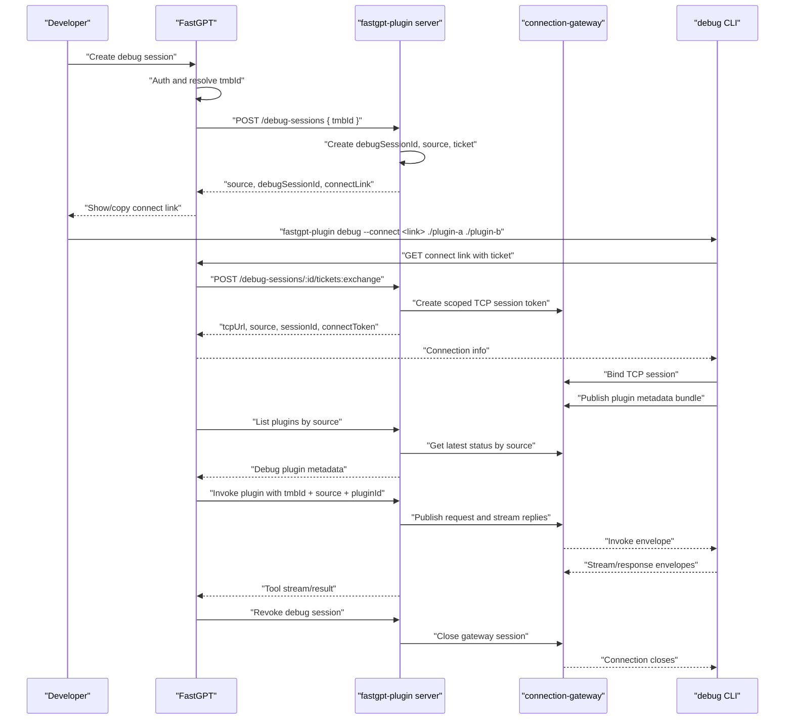

# FastGPT Debug Channel Integration

## 任务概述

本阶段把 TCP debug 从“手动传 gateway 参数的本地工具”升级为 FastGPT 可集成的调试通道控制面。

当前已经完成的底座：

- `connection-gateway` 可以维护 TCP 长链接、session、mailbox、owner lease、metrics。
- CLI 可以通过一个 TCP channel 挂载多个本地插件。
- `plugin-server` 已能通过 debug `source` 查询 gateway 中的本地插件 metadata，并把 invoke 转发到 CLI。

本计划聚焦 FastGPT 集成需要的 debug session、ticket 兑换、source 规范和断连控制。TUI、daemon、生产 runtime、渠道 WebSocket consumer adapter 保持后续独立 PR。

## 已确认契约

### Source

统一使用 `tmbId` 作为 FastGPT 侧身份边界：

```text
debug:tmbId:{tmbId}:session:{debugSessionId}
```

约束：

- `tmbId` 是 FastGPT 中 user + team 的唯一标识。
- `debugSessionId` 用于隔离同一个 `tmbId` 的新旧调试会话。
- 一个 source 对应一个 debug channel。
- 一个 debug channel 可以挂载多个本地插件。
- `pluginId` 只存在于插件 metadata 和 invoke payload 中，不参与 source 生成。

### Ticket

FastGPT 创建 debug session 后给 CLI 一个 opaque connect link。CLI 请求该链接，通过一次性 ticket 换取连接信息。

CLI 不接触以下全局 secret：

- `CONNECTION_GATEWAY_AUTH_TOKEN`
- `JWT_SECRET`
- gateway internal HTTP auth token

CLI 只能获得短期、单 session、可撤销的连接凭证。

### 控制面职责

FastGPT 负责：

- 用户鉴权。
- 解析当前用户的 `tmbId`。
- 创建/刷新/断开 debug session 的产品入口。
- 给 CLI 暴露公网 connect link。

fastgpt-plugin/plugin-server 负责：

- debug session 创建、ticket 兑换、revoke、status。
- 生成 `debug:tmbId:{tmbId}:session:{debugSessionId}`。
- 调用 connection-gateway internal API 创建 scoped connect token。
- 查询 debug source 下的插件列表和插件详情。
- invoke 时按 debug source 走 gateway runtime，断连时 fail closed。

connection-gateway 负责：

- 维护长链接 session、mailbox、owner lease、metrics。
- 校验 scoped connection token。
- 不感知 FastGPT 用户模型，不直接处理 `tmbId` 鉴权。

CLI 负责：

- 加载本地一个或多个插件。
- 请求 connect link 并兑换连接信息。
- 用返回的 `tcpUrl`、`sessionId`、`connectToken` 建立 TCP channel。
- 上报多插件 metadata，处理远程 invoke。
- 收到 revoke/close 或连接失效后退出或重连失败。

## 推荐端到端流程



## API 设计草案

### 创建 debug session

面向 FastGPT 后端调用。

```http
POST /api/plugins/debug-sessions
Authorization: Bearer <plugin-server internal auth>
Content-Type: application/json
```

Request:

```json
{
  "tmbId": "tmb_xxx",
  "ttlMs": 1800000
}
```

Response:

```json
{
  "debugSessionId": "dbg_xxx",
  "source": "debug:tmbId:tmb_xxx:session:dbg_xxx",
  "ticket": "opaque-one-time-ticket",
  "ticketExpiresAt": 1781500000000
}
```

实现约束：

- 同一个 `tmbId` 默认只保留一个 active debug session。
- 创建新 session 时可以 revoke 旧 session。
- ticket 必须短 TTL、一次性使用。
- ticket 存储需要可横向扩展，优先复用 Redis。

### 兑换 ticket

面向 FastGPT 后端代理调用，CLI 访问 FastGPT 公网 link，FastGPT 再请求 plugin-server。

```http
POST /api/plugins/debug-sessions/tickets:exchange
Authorization: Bearer <plugin-server internal auth>
Content-Type: application/json
```

Request:

```json
{
  "ticket": "opaque-one-time-ticket"
}
```

Response:

```json
{
  "tcpUrl": "tcp://tcp.example.com:39430",
  "source": "debug:tmbId:tmb_xxx:session:dbg_xxx",
  "sessionId": "gateway-session-id",
  "connectToken": "scoped-connection-token",
  "expiresAt": 1781500000000
}
```

实现约束：

- 兑换成功后 ticket 立即失效。
- `connectToken` 的 claims 绑定 `consumerType=plugin-debug`、`transport=tcp`、`subject=tmbId`、`sessionScope.source`。
- 返回的 `tcpUrl` 来自 plugin-server 配置，不由 CLI 拼接。

### 查询 debug session 状态

面向 FastGPT 后端调用。

```http
GET /api/plugins/debug-sessions/{debugSessionId}?tmbId={tmbId}
```

Response:

```json
{
  "debugSessionId": "dbg_xxx",
  "tmbId": "tmb_xxx",
  "source": "debug:tmbId:tmb_xxx:session:dbg_xxx",
  "status": "pending|connected|disconnected|revoked|expired",
  "plugins": [
    {
      "pluginId": "getTime",
      "version": "0.1.0",
      "name": "Get Time",
      "isToolSet": false
    }
  ],
  "gateway": {
    "sessionId": "gateway-session-id",
    "ownerAlive": true,
    "mailboxLag": 0
  }
}
```

### 断开 debug session

面向 FastGPT 后端调用。

```http
POST /api/plugins/debug-sessions/{debugSessionId}:revoke
Authorization: Bearer <plugin-server internal auth>
Content-Type: application/json
```

Request:

```json
{
  "tmbId": "tmb_xxx",
  "reason": "user-disconnect"
}
```

实现约束：

- revoke 幂等。
- revoke 后 ticket、pending reconnect、gateway session 均不可继续使用。
- 已断开的 session 查询应返回 `revoked` 或 `disconnected`，不能 fallback 到生产插件。

## 代码实施计划

### 1. Domain contract

新增 debug session value object 和端口：

- `DebugSessionId`
- `DebugSessionSource`
- `DebugSessionTicket`
- `PluginDebugSessionPort`

关键函数：

- `makeDebugSessionSource({ tmbId, debugSessionId })`
- `parseDebugSessionSource(source)`
- `isDebugSessionSource(source)`

向后兼容策略：

- 旧的 `debug:user:{userId}` 测试 source 可以保留到当前 PR 内部测试迁移完成。
- 新增逻辑默认使用 `debug:tmbId:{tmbId}:session:{debugSessionId}`。

### 2. Infrastructure session store

优先实现 Redis store：

- `create({ tmbId, ttlMs })`
- `exchangeTicket(ticket)`
- `get({ tmbId, debugSessionId })`
- `revoke({ tmbId, debugSessionId })`
- `getActiveByTmbId(tmbId)`

Redis key 建议：

```text
plugin-debug:session:{debugSessionId}
plugin-debug:ticket:{ticketHash}
plugin-debug:active-by-tmb:{tmbId}
```

注意事项：

- ticket 存 hash，不存明文。
- exchange 使用原子 delete/consume，避免并发重复兑换。
- active session index 需要 TTL 同步。

### 3. Gateway token minting

plugin-server 侧增加只给 debug session 使用的 gateway token minting 封装：

- 输入：`tmbId`、`source`、`debugSessionId`、`ttlMs`
- 输出：`sessionId`、`connectToken`、`expiresAt`

token claims：

```json
{
  "consumerType": "plugin-debug",
  "subject": "tmb_xxx",
  "sessionScope": {
    "userId": "tmb_xxx",
    "source": "debug:tmbId:tmb_xxx:session:dbg_xxx"
  },
  "transport": "tcp",
  "capabilities": ["gateway.bind", "plugin-debug.invoke"],
  "expiresAt": 1781500000000
}
```

当前 `ConnectionGatewaySessionScopeSchema` 仍要求 `userId`。本阶段可把 `userId` 填为 `tmbId` 来保持向后兼容；后续再单独把 gateway scope 字段泛化为 `subjectId` 或 `principalId`。

### 4. Server routes

在 `apps/server` 增加 debug session route，建议单独文件：

- `apps/server/src/routes/debug-session.route.ts`

并在 app 初始化中挂载。

路由只暴露给 FastGPT 后端或受信内部调用方；鉴权沿用现有 server auth middleware，不增加公网裸接口。

### 5. Runtime invoke options 改造

把 debug invoke 选项从 `userId` 迁到 `tmbId/source`：

```ts
debug?: {
  tmbId: string;
  source: string;
}
```

兼容策略：

- 当前内部可短期接受 `userId`，但新调用路径使用 `tmbId`。
- `ConnectionGatewayDebugRuntimeManager` 优先使用显式 `source`。
- 缺少 `source` 时使用 `sourceForTmbId` 生成 active source，或直接 fail，避免误路由。

### 6. Debug plugin metadata 查询

`DebugPluginRepoOverlay` 已按 source 查询 gateway metadata。需要补齐：

- source 格式测试覆盖 `debug:tmbId:{tmbId}:session:{debugSessionId}`。
- status API 输出多插件 bundle。
- session missing、owner dead、closed 时保持 fail closed。

### 7. CLI connect link

当前 CLI 支持手动传：

- `--gateway-base-url`
- `--gateway-auth-token`
- `--gateway-jwt-secret`
- `--gateway-tcp-url`
- `--gateway-user-id`
- `--gateway-source`

本 PR 先新增非 TUI 的 agent-friendly 入口：

```bash
fastgpt-plugin debug ./plugin-a ./plugin-b --connect <url>
```

行为：

- CLI 请求 `<url>` 获取 connection info。
- 使用返回的 `tcpUrl`、`source`、`sessionId`、`connectToken` 建立 TCP session。
- 保留旧参数用于本地开发和回归测试。
- 新文档推荐 `--connect`，不推荐暴露 gateway global secret。

## 测试计划

### Unit

- `makeDebugSessionSource` 和 parser。
- ticket TTL、一次性兑换、重复兑换失败。
- 同一 `tmbId` 创建新 session 时旧 session revoke。
- revoke 幂等。
- gateway token claims 正确绑定 `tmbId/source/session`。
- debug runtime 使用显式 source 调用。
- debug repo 查询多插件 bundle。

### Integration

- 创建 debug session -> 兑换 ticket -> CLI bind -> list plugins -> invoke -> revoke。
- 一个 CLI channel 挂载两个 plugin，FastGPT 侧能分别 list/detail/invoke。
- 断连后 list/detail/invoke fail closed。
- ticket 过期、重复使用、错误 `tmbId` 均失败。

### Manual smoke

本地：

```bash
pnpm build:connection-gateway
pnpm dev:connection-gateway
pnpm dev:server
fastgpt-plugin debug ./examples/get-time ./examples/other --connect <connect-link>
```

远程测试环境：

- gateway TCP 只提供给 CLI。
- gateway HTTP 只需要 plugin-server 内网可达。
- FastGPT 公网只暴露 connect link。

## 风险与注意事项

- 不能把 gateway global auth token 或 JWT secret 返回给 CLI。
- `tmbId` 需要由 FastGPT 鉴权后传入，plugin-server 默认信任内部调用方。
- ticket store 必须支持多节点；内存 store 只能用于测试。
- debug route 一旦选中，断连时必须 fail closed。
- source 不包含 pluginId，避免多插件同时 debug 时路由错误。
- CLI reconnect 需要尊重 revoke；revoke 后重连必须失败。
- gateway scope 当前字段名仍是 `userId`，短期填 `tmbId`，避免把 gateway schema 泛化混入本 PR。

## PR 边界

本 PR 建议包含：

- debug session source/ticket/session store。
- plugin-server debug session API。
- CLI `--connect` 非交互入口。
- `tmbId` debug invoke option 和相关测试。
- 文档更新。

本 PR 不包含：

- CLI TUI。
- CLI daemon。
- FastGPT 主仓 UI。
- WebSocket channel consumer adapter。
- gateway scope schema 大改名。
- 生产 runtime 切换或 fallback 策略变更。

## 参考文件

- `apps/cli/src/commands/debug.ts`
- `apps/cli/src/debug/gateway.ts`
- `apps/server/src/deps.ts`
- `apps/server/src/routes/plugin.route.ts`
- `packages/domain/src/ports/plugin/plugin-runtime-manager.port.ts`
- `packages/domain/src/value-objects/connection-gateway.vo.ts`
- `packages/infrastructure/src/connection-gateway/service.ts`
- `packages/infrastructure/src/connection-gateway/token.ts`
- `packages/infrastructure/src/plugin/debug-plugin.repo.ts`
- `packages/infrastructure/src/plugin/plugin-runtime/drivers/connection-gateway/debug-runtime.driver.ts`
